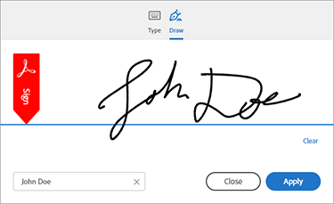

# Guida introduttiva all’API di Adobe Sign


[API Acrobat Sign](https://www.adobe.io/apis/documentcloud/sign.html) è un ottimo modo per migliorare il modo in cui gestisci gli accordi firmati. Gli sviluppatori possono integrare facilmente i loro sistemi con l&#39;API Sign, che offre un modo semplice e affidabile per caricare i documenti, inviarli per la firma, inviare promemoria e raccogliere firme elettroniche.

## Cosa puoi imparare

Questa esercitazione pratica spiega come gli sviluppatori possono utilizzare l’API Sign per ottimizzare le applicazioni e i flussi di lavoro creati con [!DNL Adobe Acrobat Services]. [!DNL Acrobat Services] include [API dei servizi Adobe PDF](https://www.adobe.io/apis/documentcloud/dcsdk/pdf-tools.html), [API di incorporamento di Adobe PDF](https://www.adobe.io/apis/documentcloud/viesdk) (gratuito) e [Adobe API di generazione documenti](https://www.adobe.io/apis/documentcloud/dcsdk/doc-generation.html).

In particolare, scopri come includere l’API Acrobat Sign nell’applicazione per raccogliere firme e altre informazioni, ad esempio informazioni sui dipendenti in un modulo assicurativo. Vengono utilizzati passaggi generici con richieste e risposte HTTP semplificate. Puoi implementare queste richieste nella tua lingua preferita. Potete creare un PDF utilizzando una combinazione di [[!DNL Acrobat Services] API](https://www.adobe.io/apis/documentcloud/dcsdk/), caricalo nell&#39;API Sign come un [passeggero](https://www.adobe.io/apis/documentcloud/sign/docs.html#!adobedocs/adobe-sign/master/overview/terminology.md) e richiedere le firme degli utenti finali utilizzando l&#39;accordo o [widget](https://www.adobe.io/apis/documentcloud/sign/docs.html#!adobedocs/adobe-sign/master/overview/terminology.md) flusso di lavoro.

## Creazione di un documento PDF

Iniziate creando un modello Microsoft Word e salvandolo come PDF. In alternativa, puoi automatizzare la pipeline utilizzando l’API di generazione del documento per caricare un modello creato in Word e generare quindi un documento di PDF. L’API di generazione dei documenti fa parte di [!DNL Acrobat Services], [gratis per sei mesi, poi pagali come vuoi per soli o 0,05 dollari per transazione documento](https://www.adobe.io/apis/documentcloud/dcsdk/pdf-pricing.html).

In questo esempio, il modello è solo un documento semplice con alcuni campi del firmatario da compilare. Assegna un nome ai campi per ora, quindi inserisci i campi effettivi in questa esercitazione.


## Individuazione del punto di accesso API valido

Prima di utilizzare l’API Sign, [creare un account sviluppatore gratuito](https://acrobat.adobe.com/ca/en/sign/developer-form.html) per accedere all&#39;API, prova lo scambio e l&#39;esecuzione dei documenti e prova la funzione di e-mail.

Adobe distribuisce le API Acrobat Sign in tutto il mondo in molte unità di distribuzione chiamate &quot;shards&quot;. Ogni partizione serve l&#39;account di un cliente, come NA1, NA2, NA3, EU1, JP1, AU1, IN1 e altri. I nomi dei frammenti corrispondono alle posizioni geografiche. Queste shard compongono l&#39;URI di base (punti di accesso) degli endpoint API.

Per accedere all’API Sign, devi innanzitutto scoprire il punto di accesso corretto per il tuo account, che può essere api.na1.adobesign.com, api.na4.adobesign.com, api.eu1.adobesign.com o altri, a seconda della tua posizione.

```
  GET /api/rest/v6/baseUris HTTP/1.1
  Host: https://api.adobesign.com
  Authorization: Bearer {YOUR-INTEGRATION-KEY-HERE}
  Accept: application/json

  Response Body (example):

  {
    "apiAccessPoint": "https://api.na4.adobesign.com/", 
    "webAccessPoint": "https://secure.na4.adobesign.com/" 
  }
```

Nell&#39;esempio precedente, è una risposta con il valore come punto di accesso.

>[!IMPORTANT]
>
>In questo caso, tutte le richieste successive effettuate all’API Sign devono utilizzare tale punto di accesso. Se si utilizza un punto di accesso che non serve l&#39;area geografica, si verifica un errore.

## Caricamento di un documento transitorio

Adobe Sign consente di creare flussi diversi che preparano i documenti per la firma o la raccolta dei dati. Indipendentemente dal flusso dell&#39;applicazione, è necessario prima caricare un documento, che rimane disponibile solo per sette giorni. Le successive chiamate API devono quindi fare riferimento a questo documento temporaneo.

Il documento viene caricato mediante una richiesta POST sul `/transientDocuments` endpoint. La richiesta multipunto è costituita dal nome del file, da un flusso di file e dal tipo MIME (media) del file del documento. La risposta dell&#39;endpoint contiene un ID che identifica il documento.

Inoltre, l&#39;applicazione può specificare un URL di callback per l&#39;Acrobat Sign al ping, notificando all&#39;app il completamento del processo di firma.


```
  POST /api/rest/v6/transientDocuments HTTP/1.1
  Host: {YOUR-API-ACCESS-POINT}
  Authorization: Bearer {YOUR-INTEGRATION-KEY-HERE}
  x-api-user: email:your-api-user@your-domain.com
  Content-Type: multipart/form-data
  File-Name: "Insurance Form.pdf"
  File: "[path]\Insurance Form.pdf"
  Accept: application/json

  Response Body (example):

  {
     "transientDocumentId": "3AAA...BRZuM"
  }
```

## Creazione di un modulo Web

I moduli Web (precedentemente noti come widget di firma) sono documenti in hosting che possono essere firmati da chiunque abbia accesso. Esempi di moduli Web includono i fogli di registrazione, le liberatorie e altri documenti a cui molti utenti accedono e firmano online.

Per creare un nuovo modulo Web utilizzando l’API Sign, è necessario prima caricare un documento transitorio. La richiesta POST al metodo `/widgets` endpoint utilizza il parametro restituito `transientDocumentId` .

In questo esempio, il modulo Web è `ACTIVE`, ma puoi crearlo in uno dei tre stati seguenti:

* BOZZA: per creare in modo incrementale il modulo Web

* AUTHORING - per aggiungere o modificare i campi modulo nel modulo Web

* ATTIVO - per ospitare immediatamente il modulo Web

Devono essere definite anche le informazioni sui partecipanti al modulo. Il `memberInfos` contiene i dati sui partecipanti, ad esempio l&#39;e-mail. Attualmente, questo set non supporta più di un membro. Tuttavia, poiché l’e-mail del firmatario del modulo Web è sconosciuta al momento della creazione del modulo Web, l’e-mail deve essere lasciata vuota, come nell’esempio seguente. Il `role` definisce il ruolo assunto dai membri in `memberInfos` (ad esempio, FIRMATARIO e APPROVATORE).

```
  POST /api/rest/v6/widgets HTTP/1.1
  Host: {YOUR-API-ACCESS-POINT}
  Authorization: Bearer {YOUR-INTEGRATION-KEY-HERE}
  x-api-user: email:your-api-user@your-domain.com
  Content-Type: application/json

  Request Body:

  {
    "fileInfos": [
      {
      "transientDocumentId": "YOUR-TRANSIENT-DOCUMENT-ID"
      }
     ],
    "name": "Insurance Form",
      "widgetParticipantSetInfo": {
          "memberInfos": [{
              "email": ""
          }],
      "role": "SIGNER"
      },
      "state": "ACTIVE"
  }

  Response Body (example):

  {
     "id": "CBJ...PXoK2o"
  }
```

È possibile creare un modulo Web come `DRAFT` o `AUTHORING`, quindi modificarne lo stato mentre il modulo passa attraverso la pipeline dell&#39;applicazione. Per modificare lo stato di un modulo Web, fare riferimento alla [PUT /widgets/{widgetId}/state](https://secure.na4.adobesign.com/public/docs/restapi/v6#!/widgets/updateWidgetState) endpoint.

## Lettura dell’URL di hosting del modulo Web

Il passaggio successivo consiste nell’individuare l’URL che ospita il modulo Web. L’endpoint /widgets recupera un elenco di dati dei moduli Web, compreso l’URL in hosting del modulo Web che viene inviato agli utenti, per raccogliere firme e altri dati.

Questo estremo restituisce un elenco, in modo da poter individuare il modulo specifico in base al relativo ID nella `userWidgetList` prima di ottenere l’URL che ospita il modulo Web:

```
  GET /api/rest/v6/widgets HTTP/1.1
  Host: {YOUR-API-ACCESS-POINT}
  Authorization: Bearer {YOUR-INTEGRATION-KEY-HERE}
  Accept: application/json

  Response Body:

  {
    "userWidgetList": [
      {
        "id": "CBJCHB...FGf",
        "name": "Insurance Form",
        "groupId": "CBJCHB...W86",
        "javascript": "<script type='text/javascript' ...
        "modifiedDate": "2021-03-13T15:52:41Z",
        "status": "ACTIVE",
        "Url":
        "https://secure.na4.adobesign.com/public/esignWidget?wid=CBFCIB...Rag*",
        "hidden": false
      },
      {
        "id": "CBJCHB...I8_",
        "name": "Insurance Form",
        "groupId": "CBJCHBCAABAAyhgaehdJ9GTzvNRchxQEGH_H1ya0xW86",
        "javascript": "<script type='text/javascript' language='JavaScript'
        src='https://sec
        "modifiedDate": "2021-03-13T02:47:32Z",
        "status": "ACTIVE",
        "Url":
        "https://secure.na4.adobesign.com/public/esignWidget?wid=CBFCIB...AAB",
        "hidden": false
      },
      {
        "id": "CBJCHB...Wmc",
```

## Gestione del modulo Web

Questo modulo è un documento di PDF da compilare per gli utenti. Tuttavia, è comunque necessario indicare all’editor del modulo quali campi gli utenti devono compilare e dove si trovano nel documento:


Il documento precedente non mostra i campi, ma. Vengono aggiunti durante la definizione dei campi che raccolgono le informazioni del firmatario, nonché la loro dimensione e posizione.

Ora, vai alla pagina [Moduli Web](https://secure.na4.adobesign.com/public/agreements/#agreement_type=webform) nella pagina &quot;I tuoi accordi&quot; e trova il modulo che hai creato.


Fai clic su **Modifica** per aprire la pagina di modifica del documento. I campi predefiniti disponibili si trovano nel pannello a destra.


L’editor consente di trascinare e rilasciare il testo e i campi firma. Dopo aver aggiunto tutti i campi necessari, puoi ridimensionarli e allinearli per rifinire il modulo. Infine, fai clic su **Salva** per creare il modulo.


## Invio di un modulo Web per la firma

Al termine del modulo Web, è necessario inviarlo affinché gli utenti possano compilarlo e firmarlo. Una volta salvato il modulo, è possibile visualizzare e copiare l’URL e il codice incorporato.

**Copia URL modulo Web**: utilizza questo URL per inviare gli utenti a una versione in hosting di questo accordo per la revisione e la firma. Esempio:

[https://secure.na4.adobesign.com/public/esignWidget?wid=CBFCIBAA3...babw\*](https://secure.na4.adobesign.com/public/esignWidget?wid=CBFCIBAA3AAABLblqZhCndYscuKcDMPiVfQlpaGPb-5D7ebE9NUTQ6x6jK7PIs8HCtTzr3HOx8U6D5qqbabw*)

**Copia codice di incorporamento modulo Web**: aggiungi l’accordo al tuo sito web copiando questo codice e incollandolo nel tuo HTML.

Esempio:

```
<iframe
src="https://secure.na4.adobesign.com/public/esignWidget?wid=CBFC
...yx8*&hosted=false" width="100%" height="100%" frameborder="0"
style="border: 0;
overflow: hidden; min-height: 500px; min-width: 600px;"></iframe>
```


Quando gli utenti accedono alla versione in hosting del modulo, esaminano il documento transitorio caricato con i campi posizionati come specificato.


L&#39;utente quindi compila i campi e firma il modulo.


Successivamente, l&#39;utente firma il documento con una firma già memorizzata o con una nuova firma.




Quando l&#39;utente fa clic su **Applica**, Adobe indica agli utenti di aprire il messaggio e-mail e di confermare la firma. La firma rimane in attesa fino all&#39;arrivo della conferma.


Questa autenticazione aggiunge l’autenticazione a più fattori e rafforza la sicurezza del processo di firma.


## Lettura di moduli Web completati

Ora è il momento di ottenere i dati del modulo compilati dagli utenti. Il `/widgets/{widgetId}/formData` endpoint recupera i dati immessi dall&#39;utente in un modulo interattivo quando ha firmato il modulo.

```
GET /api/rest/v6/widgets/{widgetId}/formData HTTP/1.1
Host: {YOUR-API-ACCESS-POINT}
Authorization: Bearer {YOUR-INTEGRATION-KEY-HERE}
Accept: text/csv
```

Il flusso di file CSV risultante contiene i dati del modulo.

```
Response Body:
"Agreement
name","completed","email","role","first","last","title","company","agreementId",
"email verified","web form signed/approved"
"Insurance Form","","myemail@email.com","SIGNER","John","Doe","My Job Title","My
Company Name","","","2021-03-07 19:32:59"
```

## Creazione di un accordo

In alternativa ai moduli Web, è possibile creare accordi. Nelle sezioni seguenti vengono illustrati alcuni semplici passaggi per gestire gli accordi tramite l’API Sign.

L’invio di un documento ai destinatari specificati per la firma o l’approvazione crea un accordo. Puoi monitorare lo stato e il completamento di un accordo utilizzando le API.

Puoi creare un accordo utilizzando un [documento transitorio](https://helpx.adobe.com/sign/kb/how-to-send-an-agreement-through-REST-API.html), [documento libreria](https://www.adobe.io/apis/documentcloud/sign/docs.html#!adobedocs/adobe-sign/master/samples/send_using_library_doc.md)o URL. In questo esempio, l&#39;accordo si basa sulla proprietà `transientDocumentId`, proprio come il modulo Web creato in precedenza.

```
POST /api/rest/v6/agreements HTTP/1.1
Host: {YOUR-API-ACCESS-POINT}
Authorization: Bearer {YOUR-INTEGRATION-KEY-HERE}
x-api-user: email:your-api-user@your-domain.com
Content-Type: application/json
Accept: application/json
Request Body:
{
    "fileInfos": [
      {
      "transientDocumentId": "{transientDocumentId}"
      }
     ],
    "name": "{agreementName}",
    "participantSetsInfo": [
      {
      "memberInfos": [
          {
          "email": "{signerEmail}"
          }
        ],
        "order": 1,
        "role": "SIGNER"
      }
    ],
    "signatureType": "ESIGN",
    "state": "IN_PROCESS"
  }
```

In questo esempio, l&#39;accordo viene creato come IN_PROCESS, ma è possibile crearlo in uno dei tre stati seguenti:

* BOZZA: per creare in modo incrementale l’accordo prima di inviarlo

* CREAZIONE: per aggiungere o modificare i campi modulo nell’accordo.

* IN_PROCESS - per inviare immediatamente l’accordo

Per modificare lo stato di un accordo, utilizzare il metodo `PUT /agreements/{agreementId}/state` endpoint per eseguire una delle transizioni di stato consentite di seguito:

* DA BOZZA A CREAZIONE

* AUTHORING in IN_PROCESS

* IN_PROCESS to CANCELED

Il `participantSetsInfo` la proprietà precedente fornisce e-mail di persone che si prevede partecipino all’accordo e quali azioni eseguono (firma, approvazione, conferma e così via). Nell&#39;esempio precedente, è presente un solo partecipante: il firmatario. Le firme scritte sono limitate a quattro per documento.

A differenza dei moduli Web, quando create un accordo, Adobe lo invia automaticamente per la firma. L&#39;endpoint restituisce l&#39;identificatore univoco dell&#39;accordo.


```
  Response Body:

  {
     id (string): The unique identifier of the agreement
  }
```

## Recupero delle informazioni sugli iscritti all’accordo

Una volta creato un accordo, puoi utilizzare il metodo `/agreements/{agreementId}/members` endpoint per recuperare le informazioni sui membri dell’accordo. Ad esempio, puoi verificare se un partecipante ha firmato l’accordo.

```
GET /api/rest/v6/agreements/{agreementId}/members HTTP/1.1
Host: {YOUR-API-ACCESS-POINT}
Authorization: Bearer {YOUR-INTEGRATION-KEY-HERE}
Accept: application/json
```

Il risultante corpo di risposta JSON contiene informazioni sui partecipanti.

```
  Response Body:

  {
     "participantSets":[
        {
           "memberInfos":[
              {
                 "id":"CBJ...xvM",
                 "email":"participant@email.com",
                 "self":false,
                 "securityOption":{
                    "authenticationMethod":"NONE"
                 },
                 "name":"John Doe",
                 "status":"ACTIVE",
                 "createdDate":"2021-03-16T03:48:39Z",
                 "userId":"CBJ...vPv"
              }
           ],
           "id":"CBJ...81x",
           "role":"SIGNER",
           "status":"WAITING_FOR_MY_SIGNATURE",
           "order":1
        }
     ],
```

## Invio di promemoria per l’accordo

A seconda delle regole aziendali, una scadenza può impedire ai partecipanti di firmare l’accordo dopo una data specifica. Se l’accordo ha una data di scadenza, puoi ricordarlo ai partecipanti quando tale data si avvicina.

In base alle informazioni dei membri dell&#39;accordo ricevute dopo la chiamata al metodo `/agreements/{agreementId}/members` endpoint nell’ultima sezione, puoi inviare promemoria e-mail a tutti i partecipanti che non hanno ancora firmato l’accordo.

Una richiesta POST al metodo `/agreements/{agreementId}/reminders` endpoint crea un promemoria per i partecipanti specificati di un accordo identificato dal `agreementId` .

```
POST /agreements/{agreementId}/reminders HTTP/1.1
Host: {YOUR-API-ACCESS-POINT}
Authorization: Bearer {YOUR-INTEGRATION-KEY-HERE}
x-api-user: email:your-api-user@your-domain.com
Content-Type: application/json
Accept: application/json
  Request Body:

  {
    "recipientParticipantIds": [{agreementMemberIdList}],
    "agreementId": "{agreementId}",
    "note": "This is a reminder that you haven't signed the agreement yet.",
    "status": "ACTIVE"
  }

  Response Body:

  {
     id (string, optional): An identifier of the reminder resource created on the
     server. If provided in POST or PUT, it will be ignored
  }
```

Una volta pubblicato il promemoria, gli utenti ricevono un messaggio e-mail con i dettagli dell’accordo e un collegamento all’accordo.


## Lettura degli accordi completati

Analogamente ai moduli Web, puoi leggere i dettagli degli accordi firmati dai destinatari. Il `/agreements/{agreementId}/formData` endpoint recupera i dati immessi dall’utente quando questi ha firmato il modulo Web.

```
GET /api/rest/v6/agreements/{agreementId}/formData HTTP/1.1
Host: {YOUR-API-ACCESS-POINT}
Authorization: Bearer {YOUR-INTEGRATION-KEY-HERE}
Accept: text/csv
Response Body:
"completed","email","role","first","last","title","company","agreementId"
"2021-03-16 18:11:45","myemail@email.com","SIGNER","John","Doe","My Job Title","My
Company Name","CBJCHBCAABAA5Z84zy69q_Ilpuy5DzUAahVfcNZillDt"
```

## Fasi seguenti

L’API Acrobat Sign consente di gestire documenti, moduli Web e accordi. I flussi di lavoro semplificati ma completi creati utilizzando i moduli Web e gli accordi vengono eseguiti in modo generico e consentono agli sviluppatori di implementarli in qualsiasi lingua.

Per una panoramica del funzionamento dell’API Sign, puoi trovare esempi nella [Guida per sviluppatori sull’utilizzo delle API](https://www.adobe.io/apis/documentcloud/sign/docs.html#!adobedocs/adobe-sign/master/api_usage.md). Questa documentazione contiene brevi articoli su molti dei passaggi seguiti in tutto l&#39;articolo e altri argomenti correlati.

L&#39;API di Acrobat Sign è disponibile tramite diversi livelli di [piani di firma elettronica per singolo e multiutente](https://acrobat.adobe.com/it/it/sign/pricing/plans.html), quindi puoi scegliere un modello di prezzo che si adatta meglio alle tue esigenze. Ora che sai quanto è facile incorporare l’API Sign nelle tue app, potresti essere interessato ad altre funzionalità come [Webhook Acrobat Sign](https://www.adobe.io/apis/documentcloud/sign/docs.html#!adobedocs/adobe-sign/master/webhooks.md), un modello di programmazione basato su push. Anziché richiedere che l&#39;app esegua controlli frequenti negli eventi Acrobat Sign, i webhook consentono di registrare un URL HTTP per il quale l&#39;API Sign esegue una richiesta di callback POST ogni volta che si verifica un evento. I webhook consentono una programmazione affidabile alimentando l&#39;applicazione con aggiornamenti in tempo reale e istantanei.

Dai un&#39;occhiata alla [prezzi a pagamento](https://www.adobe.io/apis/documentcloud/dcsdk/pdf-pricing.html), ad esempio al termine della versione di prova gratuita dell&#39;API di Adobe PDF Services, della durata di sei mesi, e dell&#39;API gratuita di incorporamento di Adobe PDF.

Per aggiungere all&#39;app funzionalità entusiasmanti come la creazione automatica di documenti e la firma di documenti, inizia a usare [[!DNL Adobe Acrobat Services]](https://www.adobe.io/apis/documentcloud/dcsdk/gettingstarted.html).
