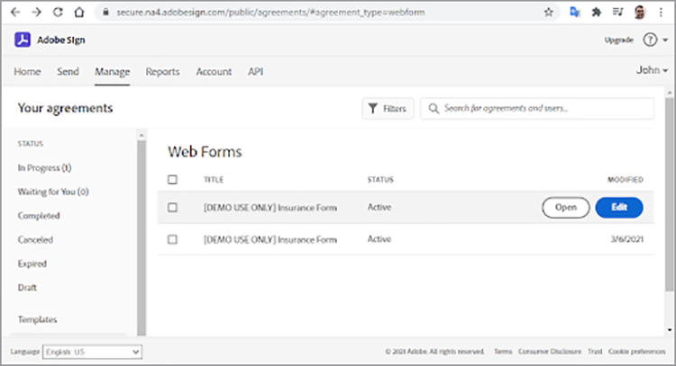

# Guida introduttiva all’API di Adobe Sign

[API ACROBAT SIGN](https://www.adobe.io/apis/documentcloud/sign.html) è un ottimo modo per migliorare il modo in cui gestisci gli accordi firmati. Gli sviluppatori possono integrare facilmente i propri sistemi con l’API Sign, che offre un modo semplice e affidabile per caricare i documenti, inviarli per la firma, inviare promemoria e raccogliere le firme elettroniche.

## Cosa puoi imparare

Questo tutorial pratico spiega come gli sviluppatori possono utilizzare l’API Sign per migliorare applicazioni e flussi di lavoro creati con [!DNL Adobe Acrobat Services]. [!DNL Acrobat Services] include [API dei servizi Adobe PDF](https://www.adobe.io/apis/documentcloud/dcsdk/pdf-tools.html), [API di Adobe PDF Embed](https://www.adobe.io/apis/documentcloud/viesdk) (gratuito), e [Adobe dell’API di Document Generation](https://www.adobe.io/apis/documentcloud/dcsdk/doc-generation.html).

Più specificamente, scopri come includere l’API di Acrobat Sign nell’applicazione per raccogliere firme e altre informazioni, ad esempio informazioni sui dipendenti in un modulo di assicurazione. Vengono utilizzati passaggi generici con richieste e risposte HTTP semplificate. Puoi implementare queste richieste nella tua lingua preferita. È possibile creare un PDF utilizzando una combinazione di [[!DNL Acrobat Services] API](https://www.adobe.io/apis/documentcloud/dcsdk/), caricalo nell’API di Sign come [transitorio](https://www.adobe.io/apis/documentcloud/sign/docs.html#!adobedocs/adobe-sign/master/overview/terminology.md) e richiedere le firme dell’utente finale utilizzando l’accordo o [widget](https://www.adobe.io/apis/documentcloud/sign/docs.html#!adobedocs/adobe-sign/master/overview/terminology.md) workflow.

## Creazione di un documento PDF

Per iniziare, crea un modello di Microsoft Word e salvalo come PDF. In alternativa, puoi automatizzare la pipeline utilizzando l’API di Document Generation per caricare un modello creato in Word e quindi generare un documento PDF. L’API di Document Generation fa parte di [!DNL Acrobat Services], [gratis per sei mesi, poi paga in base al consumo, a soli 0,05 dollari per transazione documento](https://www.adobe.io/apis/documentcloud/dcsdk/pdf-pricing.html).

In questo esempio, il modello è solo un semplice documento con alcuni campi firmatario da compilare. Assegna un nome ai campi per ora, quindi inserisci successivamente i campi effettivi in questo tutorial.


## Individuazione del punto di accesso API valido

Prima di lavorare con l’API di Sign, [crea un account sviluppatore gratuito](https://acrobat.adobe.com/ca/en/sign/developer-form.html) per accedere all’API, verifica lo scambio e l’esecuzione del documento, nonché la funzionalità di invio tramite e-mail.

Adobe distribuisce le API di Acrobat Sign in tutto il mondo in molte unità di distribuzione denominate &quot;frammenti&quot;. Ogni partizione serve l&#39;account di un cliente, come NA1, NA2, NA3, EU1, JP1, AU1, IN1 e altri. I nomi delle partizioni corrispondono a posizioni geografiche. Queste partizioni compongono l’URI di base (punti di accesso) degli endpoint API.

Per accedere all’API di Sign, devi prima scoprire il punto di accesso corretto per il tuo account, che può essere api.na1.adobesign.com, api.na4.adobesign.com, api.eu1.adobesign.com o altro, a seconda di dove ti trovi.

```
  GET /api/rest/v6/baseUris HTTP/1.1
  Host: https://api.adobesign.com
  Authorization: Bearer {YOUR-INTEGRATION-KEY-HERE}
  Accept: application/json

  Response Body (example):

  {
    "apiAccessPoint": "https://api.na4.adobesign.com/", 
    "webAccessPoint": "https://secure.na4.adobesign.com/" 
  }
```

Nell&#39;esempio precedente, è una risposta con il valore come punto di accesso.

>[!IMPORTANT]
>
>In questo caso, tutte le successive richieste all’API Sign dovranno utilizzare tale punto di accesso. Se utilizzi un punto di accesso che non serve la tua area geografica, riceverai un errore.

## Caricamento di un documento transitorio

Adobe Sign consente di creare diversi flussi per preparare i documenti per le firme o la raccolta dei dati. Indipendentemente dal flusso dell&#39;applicazione, è necessario prima caricare un documento, che rimane disponibile solo per sette giorni. Le successive chiamate API devono quindi fare riferimento a questo documento temporaneo.

Il documento viene caricato utilizzando una richiesta POST nel `/transientDocuments` punto finale. La richiesta multipart è costituita dal nome del file, da un flusso di file e dal tipo MIME (media) del file del documento. La risposta dell&#39;endpoint contiene un ID che identifica il documento.

Inoltre, l’applicazione può specificare un URL di richiamata da Acrobat Sign a ping, che viene notificato all’app al termine del processo di firma.


```
  POST /api/rest/v6/transientDocuments HTTP/1.1
  Host: {YOUR-API-ACCESS-POINT}
  Authorization: Bearer {YOUR-INTEGRATION-KEY-HERE}
  x-api-user: email:your-api-user@your-domain.com
  Content-Type: multipart/form-data
  File-Name: "Insurance Form.pdf"
  File: "[path]\Insurance Form.pdf"
  Accept: application/json

  Response Body (example):

  {
     "transientDocumentId": "3AAA...BRZuM"
  }
```

## Creazione di un modulo Web

I moduli Web (noti in precedenza come widget per la firma) sono documenti ospitati che chiunque abbia accesso può firmare. Esempi di moduli Web includono fogli di iscrizione, rinunce e altri documenti a cui molte persone hanno accesso e che firmano online.

Per creare un nuovo modulo Web utilizzando l’API di Sign, devi prima caricare un documento transitorio. La richiesta POST a `/widgets` l&#39;endpoint utilizza il valore restituito `transientDocumentId` .

In questo esempio, il modulo Web è `ACTIVE`, ma è possibile crearlo in uno dei tre stati seguenti:

* DRAFT - per creare in modo incrementale il modulo Web

* AUTHORING — per aggiungere o modificare campi modulo nel modulo Web

* ACTIVE - per ospitare immediatamente il modulo Web

È inoltre necessario definire le informazioni sui partecipanti del modulo. La `memberInfos` contiene dati sui partecipanti, ad esempio l’e-mail. Attualmente questo set non supporta più di un membro. Tuttavia, poiché l’indirizzo e-mail del firmatario del modulo Web è sconosciuto al momento della creazione del modulo Web, l’indirizzo e-mail deve essere lasciato vuoto, come nell’esempio seguente. La `role` proprietà definisce il ruolo assunto dai membri in `memberInfos` (ad esempio, FIRMATARIO e APPROVATORE).

```
  POST /api/rest/v6/widgets HTTP/1.1
  Host: {YOUR-API-ACCESS-POINT}
  Authorization: Bearer {YOUR-INTEGRATION-KEY-HERE}
  x-api-user: email:your-api-user@your-domain.com
  Content-Type: application/json

  Request Body:

  {
    "fileInfos": [
      {
      "transientDocumentId": "YOUR-TRANSIENT-DOCUMENT-ID"
      }
     ],
    "name": "Insurance Form",
      "widgetParticipantSetInfo": {
          "memberInfos": [{
              "email": ""
          }],
      "role": "SIGNER"
      },
      "state": "ACTIVE"
  }

  Response Body (example):

  {
     "id": "CBJ...PXoK2o"
  }
```

Puoi creare un modulo Web come `DRAFT` oppure `AUTHORING`, quindi modificarne lo stato durante il passaggio del modulo attraverso la pipeline dell&#39;applicazione. Per modificare lo stato di un modulo Web, consulta [PUT /widgets/{widgetId}/state](https://secure.na4.adobesign.com/public/docs/restapi/v6#!/widgets/updateWidgetState) punto finale.

## Lettura dell’URL di hosting del modulo Web

Il passaggio successivo consiste nell’individuare l’URL che ospita il modulo Web. L’endpoint /widgets recupera un elenco di dati del modulo Web, incluso l’URL ospitato del modulo Web che invii agli utenti, per raccogliere firme e altri dati del modulo.

Questo endpoint restituisce un elenco, in modo che sia possibile individuare il modulo specifico in base al relativo ID nel `userWidgetList` prima di ottenere l’URL che ospita il modulo Web:

```
  GET /api/rest/v6/widgets HTTP/1.1
  Host: {YOUR-API-ACCESS-POINT}
  Authorization: Bearer {YOUR-INTEGRATION-KEY-HERE}
  Accept: application/json

  Response Body:

  {
    "userWidgetList": [
      {
        "id": "CBJCHB...FGf",
        "name": "Insurance Form",
        "groupId": "CBJCHB...W86",
        "javascript": "<script type='text/javascript' ...
        "modifiedDate": "2021-03-13T15:52:41Z",
        "status": "ACTIVE",
        "Url":
        "https://secure.na4.adobesign.com/public/esignWidget?wid=CBFCIB...Rag*",
        "hidden": false
      },
      {
        "id": "CBJCHB...I8_",
        "name": "Insurance Form",
        "groupId": "CBJCHBCAABAAyhgaehdJ9GTzvNRchxQEGH_H1ya0xW86",
        "javascript": "<script type='text/javascript' language='JavaScript'
        src='https://sec
        "modifiedDate": "2021-03-13T02:47:32Z",
        "status": "ACTIVE",
        "Url":
        "https://secure.na4.adobesign.com/public/esignWidget?wid=CBFCIB...AAB",
        "hidden": false
      },
      {
        "id": "CBJCHB...Wmc",
```

## Gestione del modulo Web

Questo modulo è un documento PDF da compilare a cura degli utenti. Tuttavia, è comunque necessario comunicare all’editor del modulo quali campi devono essere compilati dagli utenti e dove si trovano all’interno del documento:


Il documento qui sopra non mostra ancora i campi. Vengono aggiunti durante la definizione dei campi che raccolgono le informazioni del firmatario, nonché delle loro dimensioni e posizione.

Passare al [Moduli Web](https://secure.na4.adobesign.com/public/agreements/#agreement_type=webform) nella pagina &quot;I tuoi accordi&quot; e trova il modulo creato.




Fai clic **Modifica** per aprire la pagina di modifica del documento. I campi predefiniti disponibili si trovano nel pannello a destra.


L’editor consente di trascinare campi di testo e firma. Dopo aver aggiunto tutti i campi necessari, è possibile ridimensionarli e allinearli per rifinire il modulo. Infine, fai clic su **Salva** per creare il modulo.


## Invio di un modulo Web da firmare

Una volta completato il modulo Web, è necessario inviarlo per consentire agli utenti di compilarlo e firmarlo. Una volta salvato il modulo, puoi visualizzare e copiare l’URL e il codice incorporato.

**Copia URL modulo Web**: utilizza questo URL per inviare gli utenti a una versione ospitata di questo accordo per la revisione e la firma. Esempio:

[https://secure.na4.adobesign.com/public/esignWidget?wid=CBFCIBAA3...babw\*](https://secure.na4.adobesign.com/public/esignWidget?wid=CBFCIBAA3AAABLblqZhCndYscuKcDMPiVfQlpaGPb-5D7ebE9NUTQ6x6jK7PIs8HCtTzr3HOx8U6D5qqbabw*)

**Copiare il codice di incorporamento del modulo Web**: aggiungi l’accordo al tuo sito Web copiando questo codice e incollandolo nel tuo HTML.

Esempio:

```
<iframe
src="https://secure.na4.adobesign.com/public/esignWidget?wid=CBFC
...yx8*&hosted=false" width="100%" height="100%" frameborder="0"
style="border: 0;
overflow: hidden; min-height: 500px; min-width: 600px;"></iframe>
```


Quando gli utenti accedono alla versione ospitata del modulo, esaminano il documento transitorio caricato per la prima volta con i campi posizionati come specificato.


L’utente compila i campi e firma il modulo.


Successivamente, l’utente firma il documento con una firma archiviata in precedenza o con una nuova firma.


Quando l’utente fa clic **Applica**, Adobe indica di aprire il messaggio e-mail e di confermare la firma. La firma rimane in sospeso fino all’arrivo della conferma.


Questa autenticazione aggiunge l’autenticazione a più fattori e rafforza la sicurezza del processo di firma.


## Lettura dei moduli Web completati

Ora è il momento di ottenere i dati del modulo compilati dagli utenti. La `/widgets/{widgetId}/formData` l&#39;endpoint recupera i dati immessi dall&#39;utente in un modulo interattivo al momento della firma del modulo.

```
GET /api/rest/v6/widgets/{widgetId}/formData HTTP/1.1
Host: {YOUR-API-ACCESS-POINT}
Authorization: Bearer {YOUR-INTEGRATION-KEY-HERE}
Accept: text/csv
```

Il flusso di file CSV risultante contiene i dati del modulo.

```
Response Body:
"Agreement
name","completed","email","role","first","last","title","company","agreementId",
"email verified","web form signed/approved"
"Insurance Form","","myemail@email.com","SIGNER","John","Doe","My Job Title","My
Company Name","","","2021-03-07 19:32:59"
```

## Creazione di un accordo

In alternativa ai moduli Web, puoi creare gli accordi. Nelle sezioni seguenti vengono illustrati alcuni semplici passaggi per gestire gli accordi utilizzando l’API Sign.

Quando si invia un documento a destinatari specificati per la firma o l’approvazione, viene creato un accordo. Puoi tenere traccia dello stato e del completamento di un accordo utilizzando le API.

Puoi creare un accordo utilizzando un [documento transitorio](https://helpx.adobe.com/sign/kb/how-to-send-an-agreement-through-REST-API.html), [documento libreria](https://www.adobe.io/apis/documentcloud/sign/docs.html#!adobedocs/adobe-sign/master/samples/send_using_library_doc.md)o URL. In questo esempio, l’accordo si basa sul `transientDocumentId`, come il modulo Web creato in precedenza.

```
POST /api/rest/v6/agreements HTTP/1.1
Host: {YOUR-API-ACCESS-POINT}
Authorization: Bearer {YOUR-INTEGRATION-KEY-HERE}
x-api-user: email:your-api-user@your-domain.com
Content-Type: application/json
Accept: application/json
Request Body:
{
    "fileInfos": [
      {
      "transientDocumentId": "{transientDocumentId}"
      }
     ],
    "name": "{agreementName}",
    "participantSetsInfo": [
      {
      "memberInfos": [
          {
          "email": "{signerEmail}"
          }
        ],
        "order": 1,
        "role": "SIGNER"
      }
    ],
    "signatureType": "ESIGN",
    "state": "IN_PROCESS"
  }
```

In questo esempio, l’accordo viene creato come IN_PROCESS, ma potete crearlo in uno dei tre stati seguenti:

* BOZZA: per creare l’accordo in modo incrementale prima di inviarlo.

* AUTHORING — per aggiungere o modificare campi modulo nell’accordo

* IN_PROCESS: per inviare immediatamente l’accordo

Per modificare lo stato di un accordo, utilizza il `PUT /agreements/{agreementId}/state` endpoint per eseguire una delle transizioni di stato consentite riportate di seguito:

* DRAFT to AUTHORING

* AUTHORING to IN_PROCESS

* IN_PROCESS to CANCELLED

La `participantSetsInfo` la proprietà precedente fornisce e-mail delle persone che dovrebbero partecipare all’accordo e l’azione da esse eseguita (firmare, approvare, confermare e così via). Nell’esempio precedente, è presente un solo partecipante: il firmatario. Le firme manuali sono limitate a quattro per documento.

A differenza dei moduli Web, quando crei un accordo, Adobe lo invia automaticamente per la firma. L’endpoint restituisce l’identificatore univoco dell’accordo.


```
  Response Body:

  {
     id (string): The unique identifier of the agreement
  }
```

## Recupero delle informazioni sui membri dell’accordo

Dopo aver creato un accordo, puoi utilizzare il `/agreements/{agreementId}/members` endpoint per recuperare informazioni sui membri dell’accordo. Ad esempio, puoi verificare se un partecipante ha firmato l’accordo.

```
GET /api/rest/v6/agreements/{agreementId}/members HTTP/1.1
Host: {YOUR-API-ACCESS-POINT}
Authorization: Bearer {YOUR-INTEGRATION-KEY-HERE}
Accept: application/json
```

Il corpo della risposta JSON risultante contiene informazioni sui partecipanti.

```
  Response Body:

  {
     "participantSets":[
        {
           "memberInfos":[
              {
                 "id":"CBJ...xvM",
                 "email":"participant@email.com",
                 "self":false,
                 "securityOption":{
                    "authenticationMethod":"NONE"
                 },
                 "name":"John Doe",
                 "status":"ACTIVE",
                 "createdDate":"2021-03-16T03:48:39Z",
                 "userId":"CBJ...vPv"
              }
           ],
           "id":"CBJ...81x",
           "role":"SIGNER",
           "status":"WAITING_FOR_MY_SIGNATURE",
           "order":1
        }
     ],
```

## Invio di promemoria dell’accordo

A seconda delle regole aziendali, una scadenza può impedire ai partecipanti di firmare l’accordo dopo una data specifica. Se l’accordo ha una data di scadenza, puoi ricordare ai partecipanti che tale data si avvicina.

In base alle informazioni sui membri dell’accordo ricevute dopo la chiamata al `/agreements/{agreementId}/members` endpoint nell’ultima sezione, puoi inviare promemoria e-mail a tutti i partecipanti che non hanno ancora firmato l’accordo.

Una richiesta POST a `/agreements/{agreementId}/reminders` un endpoint crea un promemoria per i partecipanti specificati di un accordo identificato dal `agreementId` parametro.

```
POST /agreements/{agreementId}/reminders HTTP/1.1
Host: {YOUR-API-ACCESS-POINT}
Authorization: Bearer {YOUR-INTEGRATION-KEY-HERE}
x-api-user: email:your-api-user@your-domain.com
Content-Type: application/json
Accept: application/json
  Request Body:

  {
    "recipientParticipantIds": [{agreementMemberIdList}],
    "agreementId": "{agreementId}",
    "note": "This is a reminder that you haven't signed the agreement yet.",
    "status": "ACTIVE"
  }

  Response Body:

  {
     id (string, optional): An identifier of the reminder resource created on the
     server. If provided in POST or PUT, it will be ignored
  }
```

Una volta pubblicato il promemoria, gli utenti ricevono un’e-mail con i dettagli dell’accordo e un collegamento all’accordo.


## Lettura degli accordi completati

Analogamente ai moduli Web, puoi leggere i dettagli degli accordi firmati dai destinatari. La `/agreements/{agreementId}/formData` L’endpoint recupera i dati immessi dall’utente al momento della firma del modulo Web.

```
GET /api/rest/v6/agreements/{agreementId}/formData HTTP/1.1
Host: {YOUR-API-ACCESS-POINT}
Authorization: Bearer {YOUR-INTEGRATION-KEY-HERE}
Accept: text/csv
Response Body:
"completed","email","role","first","last","title","company","agreementId"
"2021-03-16 18:11:45","myemail@email.com","SIGNER","John","Doe","My Job Title","My
Company Name","CBJCHBCAABAA5Z84zy69q_Ilpuy5DzUAahVfcNZillDt"
```

## Fasi seguenti

L’API Acrobat Sign consente di gestire documenti, moduli Web e accordi. I flussi di lavoro semplificati ma completi creati utilizzando moduli e accordi Web vengono eseguiti in modo generico che consente agli sviluppatori di implementarli utilizzando qualsiasi lingua.

Per una panoramica sul funzionamento dell’API di Sign, consulta alcuni esempi disponibili nella [Guida per gli sviluppatori sull’utilizzo delle API](https://www.adobe.io/apis/documentcloud/sign/docs.html#!adobedocs/adobe-sign/master/api_usage.md). Questa documentazione contiene brevi articoli su molti dei passaggi seguiti in tutto l&#39;articolo e altri argomenti correlati.

L’API di Acrobat Sign è disponibile per diversi livelli di [piani per firma elettronica per utente singolo e multiutente](https://acrobat.adobe.com/it/it/sign/pricing/plans.html), in modo da poter scegliere il modello di prezzo più adatto alle proprie esigenze. Ora che sai quanto è facile incorporare l’API di Sign nelle tue app, potresti essere interessato ad altre funzionalità come [Webhook di Acrobat Sign](https://www.adobe.io/apis/documentcloud/sign/docs.html#!adobedocs/adobe-sign/master/webhooks.md), un modello di programmazione basato su push. Anziché richiedere all’app di eseguire controlli frequenti negli eventi Acrobat Sign, i webhook consentono di registrare un URL HTTP per il quale l’API di Sign esegue una richiesta di richiamata POST ogni volta che si verifica un evento. I webhook consentono una programmazione affidabile alimentando l’applicazione con aggiornamenti in tempo reale e istantanei.

Consultate il [prezzo in base al consumo](https://www.adobe.io/apis/documentcloud/dcsdk/pdf-pricing.html), per quando termina la versione di prova gratuita di Adobe PDF Services API per sei mesi e di Adobe PDF Embed API gratuita.

Per aggiungere alla tua app funzionalità entusiasmanti, come la creazione automatica di documenti e la firma di documenti, inizia con [[!DNL Adobe Acrobat Services]](https://www.adobe.io/apis/documentcloud/dcsdk/gettingstarted.html).
