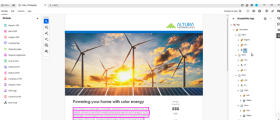

# Esercitazioni per l’API di assegnazione automatica dei tag di accessibilità di Adobe PDF

Questa API basata sull’IA assegna automaticamente tag a tabelle, paragrafi, elenchi, intestazioni e altro per migliorare l’esperienza di lettura dei PDF nativi o scansionati con le tecnologie di supporto. Identifica inoltre l’ordine di lettura per garantire il flusso logico delle informazioni con più colonne o elementi su più pagine. Applica questo metodo a backlog di documenti o flussi di lavoro di nuovi documenti e procedi più facilmente verso la conformità.

<table style="table-layout:fixed">
<tr>
  <td>
    
    

      <a href="automatically-add-tags.md"><strong>Applicare automaticamente i tag ai documenti per l'accessibilità</strong></a>
      

      Scopri come applicare automaticamente i tag per l’accessibilità su larga scala utilizzando l’IA
       
  </td>
 <td>
       
       

        
 </td>
 <td>
       
       

        
 </td>
 <td>
       
       

        
 </td>
</tr>
</table>