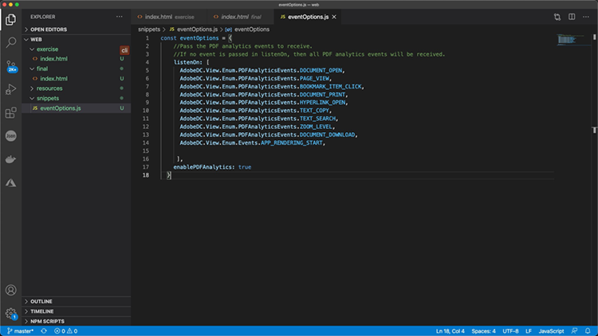

# Controlla la tua esperienza online di PDF e raccogli analisi

La tua organizzazione pubblica i PDF sul tuo sito web? Scoprite come utilizzare l&#39;API di incorporamento di Adobe PDF per controllare l&#39;aspetto, abilitare la collaborazione e raccogliere informazioni su come l&#39;utente interagisce con i PDF, compreso il tempo trascorso su una pagina e le ricerche. Per iniziare questo tutorial pratico in 4 parti, seleziona *Guida introduttiva all’API Incorpora PDF*.

<table style="table-layout:fixed">
<tr>
  <td>
    <a href="controlpdfexperience.md#part1">
        
    </a>
    <div>
    <a href="controlpdfexperience.md#part1"><strong>Parte 1: Guida introduttiva all’API Incorpora PDF</strong></a>
    </div>
  </td>
  <td>
    <a href="controlpdfexperience.md#part2">
        
    </a>
    <div>
    <a href="controlpdfexperience.md#part2"><strong>Parte 2: Aggiunta di API per l’incorporamento di PDF a una pagina Web</strong></a>
    </div>
  </td>
  <td>
   <a href="controlpdfexperience.md#part3">
      
   </a>
    <div>
    <a href="controlpdfexperience.md#part3"><strong>Parte 3: Accesso alle API di Analytics</strong></a>
    </div>
  </td>
  <td>
   <a href="controlpdfexperience.md#part4">
      
   </a>
    <div>
    <a href="controlpdfexperience.md#part4"><strong>Parte 4: Aggiunta di interattività in base agli eventi</strong></a>
    </div>
  </td>
</tr>
</table>

## Parte 1: Guida introduttiva all’API Incorpora PDF {#part1}

Nella parte 1, scopri come iniziare a utilizzare tutto quello che ti serve per le parti 1-3. Inizierai a ottenere le credenziali API.

**Cosa ti serve**

* Risorse di esercitazione [download](https://github.com/benvanderberg/adobe-pdf-embed-api-tutorial)
* Adobe ID [ne prenda uno qui](https://accounts.adobe.com/it)
* Server Web (Node JS, PHP, ecc.)
* Conoscenza operativa di HTML/JavaScript/CSS

**Cosa stiamo utilizzando**

* Un server Web di base (Node)
* Visual Studio Code
* GitHub

### Recupero delle credenziali

1. Vai alla [sito Web Adobe.io](https://www.adobe.io/).
1. Fai clic su **[!UICONTROL Ulteriori informazioni]** in Crea esperienze documento coinvolgenti.

   

   Questo ti porta al [!DNL Adobe Acrobat Services] home page.

1. Fai clic su **[!UICONTROL Introduzione]** nella barra di navigazione.

   Verrà visualizzata un&#39;opzione in **Guida introduttiva [!DNL Acrobat Services] API** a **Crea nuove credenziali** o **Gestire le credenziali esistenti**.

1. Fai clic su **[!UICONTROL Introduzione]** pulsante sotto **[!UICONTROL Crea nuove credenziali]**.

   

1. Scegliete **[!UICONTROL API di incorporamento PDF]** e aggiungere un nome di credenziale e un dominio applicazione nella finestra successiva.

   >[!NOTE]
   >
   >Queste credenziali possono essere utilizzate solo nel dominio dell&#39;applicazione elencato qui. Puoi utilizzare qualsiasi dominio scelto.

   

1. Fai clic su **[!UICONTROL Crea credenziali]**.

   La pagina finale della procedura guidata fornisce i dettagli delle credenziali dei clienti. Lascia aperta questa finestra in modo da poter tornare indietro e copiare l&#39;ID client (chiave API) per un uso successivo.

1. Fai clic su **[!UICONTROL Visualizza documentazione]** per accedere alla documentazione con informazioni dettagliate su come utilizzare questa API.

   

## Parte 2: Aggiunta di API per l’incorporamento di PDF a una pagina Web {#part2}

Nella parte 2, imparerai come incorporare facilmente l’API Incorpora PDF in una pagina Web. A tale scopo, è possibile utilizzare la demo online Adobe PDF Embed API per creare il codice.

### Ottenere il codice esercizio

Abbiamo creato il codice da utilizzare. Anche se è possibile utilizzare il proprio codice, le dimostrazioni verranno eseguite nel contesto delle risorse dell&#39;esercitazione. Scarica codice di esempio [qui](https://github.com/benvanderberg/adobe-pdf-embed-api-tutorial).

1. Vai a [[!DNL Adobe Acrobat Services] sito web](https://www.adobe.io/apis/documentcloud/dcsdk/).

   ![Screenshot di [!DNL Adobe Acrobat Services] sito web](assets/ControlPDF_6.png)

1. Fai clic su **[!UICONTROL API]** nella barra di navigazione, quindi andare alla **[!UICONTROL API di incorporamento PDF]** nel collegamento a discesa.

   

1. Fai clic su **[!UICONTROL Prova la demo]**.

   Viene visualizzata una nuova finestra con la sandbox dello sviluppatore per l&#39;API PDF Embed.

   

   Qui potete vedere le opzioni per le diverse modalità di visualizzazione.

1. Fate clic sulle diverse modalità di visualizzazione per Finestra completa, Contenitore ridimensionato, In linea e Casella luminosa.

   

1. Fai clic su **[!UICONTROL Finestra intera]** , quindi fare clic sul pulsante **[!UICONTROL Personalizza]** per attivare e disattivare le opzioni.

   

1. Disattiva **[!UICONTROL Scarica]** Opzione PDF.
1. Fai clic su **[!UICONTROL Genera codice]** per visualizzare l&#39;anteprima del codice.
1. Copia **[!UICONTROL ID client]** dalla finestra Credenziali client della parte 1.

   

1. Apri il **[!UICONTROL Web]** -> **[!UICONTROL risorse]** -> **[!UICONTROL js]** -> **[!UICONTROL dc-config.js]** nell&#39;editor di codice.

   La variabile clientID è presente.

1. Incolla le credenziali del client tra virgolette per impostare il clientID sulle credenziali.

1. Tornate all&#39;anteprima del codice sandbox per sviluppatori.

1. Copiare la seconda riga con lo script di Adobe:

   ```
   <script src=https://documentccloud.adobe.com/view-sdk/main.js></script>
   ```

   

1. Accedi all&#39;editor di codice e apri il **[!UICONTROL Web]** -> **[!UICONTROL esercizio]** -> **[!UICONTROL index.html]** file.

1. Incollare il codice dello script nella proprietà `<head>` del file alla riga 18 con il commento che dice: **TODO: ESERCIZIO 1: INSERIRE IL TAG SCRIPT API EMBED**.

   

1. Tornate all&#39;anteprima del codice della sandbox per sviluppatori e copiate la prima riga di codice che contiene:

   ```
   <div id="adobe-dc-view"></div>
   ```

   

1. Accedi all&#39;editor di codice e apri il **[!UICONTROL Web]** -> **[!UICONTROL esercizio]** -> **[!UICONTROL index.html]** di nuovo.

1. Incolla il `<div>` codificare nel `<body>` del file alla riga 67 sotto il commento che riporta **TODO: ESERCIZIO 1: INSERIRE IL CODICE API DI INCORPORAMENTO PDF**.

   

1. Tornate all&#39;anteprima del codice della sandbox per sviluppatori e copiate le righe di codice per il `<script>` di seguito:

   ```
   <script type="text/javascript">
       document.addEventListener("adobe_dc_view_sdk.ready",             function(){ 
           var adobeDCView = new AdobeDC.View({clientId:                     "<YOUR_CLIENT_ID>", divId: "adobe-dc-view"});
           adobeDCView.previewFile({
               content:{location: {url: "https://documentcloud.                adobe.com/view-sdk-demo/PDFs/Bodea Brochure.                    pdf"}},
               metaData:{fileName: "Bodea Brochure.pdf"}
           }, {showDownloadPDF: false});
       });
   </script>
   ```

1. Accedi all&#39;editor di codice e apri il **[!UICONTROL Web]** -> **[!UICONTROL esercizio]** -> **[!UICONTROL index.html]** di nuovo.

1. Incolla il `<script>` codificare nel `<body>` del file alla riga 68 sotto il `<div>` tag.

1. Modificare la riga 70 della stessa **index.html** per includere la variabile clientID creata in precedenza.

   

1. Modificare la riga 72 della stessa **index.html** per aggiornare il percorso del file PDF in modo che utilizzi un file locale.

   Ne è disponibile uno nei file delle esercitazioni in **/resources/pdfs/whitepaper.pdf**.

1. Salvare i file modificati e visualizzare in anteprima il sito Web **`<your domain>`/summit21/web/esercizio/**.

   Il rendering della documentazione tecnica deve essere visualizzato in modalità Finestra completa all’interno del browser.

## Parte 3: Accesso alle API di Analytics {#part3}

Ora che è stata creata una pagina Web con l&#39;API PDF Embed per il rendering di un PDF, nella parte 3 è ora possibile esplorare come utilizzare gli eventi JavaScript per misurare l&#39;analisi per comprendere come gli utenti utilizzano i PDF.

### Ricerca della documentazione

Sono disponibili molti eventi JavaScript diversi come parte dell&#39;API PDF Embed. Puoi accedervi da [!DNL Adobe Acrobat Services] documentazione.

1. Passa al [documentazione](https://www.adobe.io/apis/documentcloud/dcsdk/docs.html) sito.
1. Esamina i diversi tipi di eventi disponibili nell&#39;API. Questi sono utili come riferimento e saranno utili anche per i tuoi progetti futuri.

   

1. Copiate il codice di esempio elencato nel sito Web.

   Utilizzate questa opzione come base per il codice e modificatela.

   

   ```
   const eventOptions = {
     //Pass the PDF analytics events to receive.
      //If no event is passed in listenOn, then all PDF         analytics events will be received.
   listenOn: [ AdobeDC.View.Enum.PDFAnalyticsEvents.    PAGE_VIEW, AdobeDC.View.Enum.PDFAnalyticsEvents.DOCUMENT_DOWNLOAD],
     enablePDFAnalytics: true
   }
   
   
   adobeDCView.registerCallback(
     AdobeDC.View.Enum.CallbackType.EVENT_LISTENER,
     function(event) {
       console.log("Type " + event.type);
       console.log("Data " + event.data);
     }, eventOptions
   );
   ```

1. Individua la sezione di codice aggiunta in precedenza che appare come quella riportata di seguito e aggiungi il codice riportato sopra dopo questo codice **index.html**:

   

1. Carica la pagina nel browser Web e apri Console per visualizzare gli output della console dai diversi eventi mentre interagisci con il visualizzatore PDF.

   

   

### Aggiunta di switch per l’acquisizione di eventi

Ora che gli eventi sono stati trasmessi a console.log, modifichiamo il comportamento in base agli eventi. A tale scopo, verrà utilizzato un esempio di switch.

1. Passa a **snippets/eventsSwitch.js** e copiare il contenuto del file nel codice dell&#39;esercitazione.

   

1. Incollare il codice nella funzione listener di eventi.

   

1. Verificate che la console venga visualizzata correttamente quando la pagina viene caricata e interagite con il Visualizzatore PDF.

### Adobe Analytics

Se desiderate aggiungere il supporto Adobe Analytics al vostro visualizzatore, potete seguire le istruzioni documentate sul sito Web.

>[!IMPORTANT]
>
>La pagina Web deve avere già Adobe Analytics caricato sulla pagina nell&#39;intestazione.

Passa al [Documentazione di Adobe Analytics](https://www.adobe.com/devnet-docs/dcsdk_io/viewSDK/howtodata.html#adobe-analytics) e verifica se Adobe Analytics è già abilitato nella pagina web. Seguire le istruzioni per configurare reportSuite.

### Google Analytics


L’API di incorporamento di Adobe PDF fornisce un’integrazione immediata con Adobe Analytics. Tuttavia, poiché tutti gli eventi sono disponibili come eventi JavaScript, è possibile eseguire l&#39;integrazione con la Google Analytics catturando gli eventi PDF e utilizzando la funzione ga() per aggiungere l&#39;evento ad Adobe Analytics.

1. Passa a **snippets/eventsSwitchGA.js** per scoprire come integrare le Google Analytics.
1. Rivedere e utilizzare questo codice come esempio se la pagina Web viene monitorata mediante Adobe Analytics ed è già incorporata nella pagina Web.

   

## Parte 4: Aggiunta di interattività in base agli eventi {#part4}

Nella parte 4, vedrai come sovrapporre al tuo visualizzatore di PDF un paywall che viene visualizzato dopo lo scorrimento della seconda pagina.

### Esempio di paywall

Passa a questa [esempio di PDF dietro un paywall](https://www3.technologyevaluation.com/research/white-paper/the-forrester-wave-digital-decisioning-platforms-q4-2020.html). In questo esempio, imparerai ad aggiungere interattività a un&#39;esperienza di visualizzazione PDF.

### Aggiungere codice paywall

1. Accedi a snippets/paywallCode.html e copia il contenuto.
1. Cerca `<!-- TODO: EXERCISE 3: INSERT PAYWALL CODE -->` in exercise/index.html.

   

1. Incollare il codice copiato dopo il commento.
1. Vai a **snippets/paywallCode.js** e copia il contenuto.

   

1. Incollate il codice in tale posizione.

### Prova la demo con Paywall

Ora puoi vedere la demo.

1. Ricarica **index.html** sul tuo sito web.
1. Scorri verso il basso fino a una pagina > 2.
1. Mostra la finestra di dialogo per sfidare l’utente dopo la seconda pagina.

   

## Risorse aggiuntive

Risorse aggiuntive [qui](https://www.adobe.io/apis/documentcloud/dcsdk/docs.html).
