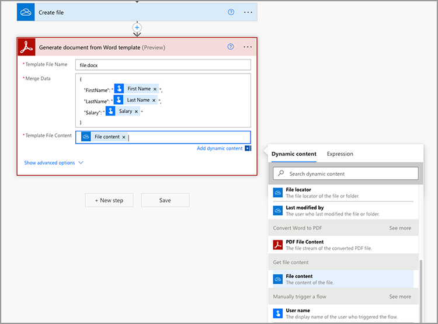

# Crea il tuo primo flusso in Microsoft Power Automate

Scopri come creare il primo flusso in [Microsoft Power Automate](https://flow.microsoft.com) utilizzando il connettore [Adobe PDF Services](https://us.flow.microsoft.com/en-us/connectors/shared_adobepdftools/adobe-pdf-services/).

In questo tutorial pratico scopri come:

* Convertire documenti di Word in PDF
* Combinare documenti PDF in un unico PDF
* Protect un documento PDF con una password

## Preparazione

### Cosa serve

* **Credenziali di prova o produzione per i servizi Adobe PDF**
Ulteriori informazioni su come ottenere e configurare le credenziali in Microsoft Power Automate [qui](https://experienceleague.adobe.com/it/docs/acrobat-services-learn/tutorials/pdfservices/getting-credentials-power-automate).
* **Microsoft Power Automate con connettori Premium**
Scopri come controllare il livello di licenza per Power Automate [qui](https://docs.microsoft.com/en-us/power-platform/admin/power-automate-licensing/types).
* **OneDrive**
In questo tutorial viene utilizzato il connettore di archiviazione OneDrive, ma è possibile sostituire qualsiasi connettore di archiviazione.

### File di esempio

Sono presenti due [file di esempio](assets/sample-assets.zip) che devi decomprimere e caricare in OneDrive:

* WordDocument01.docx
* WordDocument02.docx

### Recupero delle credenziali

Per completare questa esercitazione, è necessario che le credenziali siano già configurate in Microsoft Power Automate per i servizi Adobe PDF. Se non hai completato questo passaggio, consulta le [istruzioni qui](https://experienceleague.adobe.com/it/docs/acrobat-services-learn/tutorials/pdfservices/getting-credentials-power-automate).

## Parte 1: Creare un nuovo flusso e convertire Word in PDF

### Creare il flusso

In questa parte, puoi creare un nuovo flusso in [Microsoft Power Automate](https://flow.microsoft.com) utilizzando un flusso istantaneo, aggiungere parametri, ottenere i file da OneDrive e convertirli in PDF.

1. Accedi a [Microsoft Power Automate](https://flow.microsoft.com) con le tue credenziali.
1. Nella barra laterale, seleziona **[!UICONTROL Crea]**.

   

1. Selezionare **[!UICONTROL Flusso istantaneo]**.
1. Assegna un nome al flusso.
1. In *Scegli come attivare questo flusso*, seleziona **[!UICONTROL Attiva manualmente un flusso]**.
1. Seleziona **[!UICONTROL Create]** (Crea).

### Ottieni il contenuto dei file

Quindi, ottieni il contenuto dei file di esempio.

>[!PREREQUISITES]
>
>Se non hai caricato [file di esempio](assets/sample-assets.zip) in OneDrive, decomprimerli e caricarli.


1. In [Power Automate](https://flow.microsoft.com), seleziona **[!UICONTROL + Nuovo passaggio]**.
1. Cerca *OneDrive* nella barra di ricerca.
1. Scegli l&#39;account OneDrive personale o aziendale selezionando **[!UICONTROL OneDrive for Business]** o **[!UICONTROL OneDrive]**.
1. Cercare *il contenuto del file* nella barra di ricerca.
1. Nel campo **[!UICONTROL File]**, seleziona l&#39;icona Cartella per accedere al file *WordDocument01.docx* in OneDrive.

   

### Converti file in PDF

Ora che hai il contenuto del file, puoi convertire il documento in PDF.

1. In [Power Automate](https://flow.microsoft.com), seleziona **[!UICONTROL + Nuovo passaggio]**.
1. Cercare *Servizi Adobe PDF* nella barra di ricerca.
1. Seleziona **[!UICONTROL Servizi Adobe PDF]**.
1. Cerca *Converti da Word a PDF* nella barra di ricerca.
1. In **[!UICONTROL Nome file]**, assegna il nome desiderato al file, che però deve terminare con *.docx*. Questa estensione è necessaria per la conversione di documenti da Word a PDF.
1. Posizionare il cursore nel campo **[!UICONTROL Contenuto file]**.
1. Utilizzando il pannello **[!UICONTROL Contenuto dinamico]**, selezionare **[!UICONTROL Contenuto file]**.

   

### Salva il file in OneDrive

Una volta generato il documento, salva nuovamente il file in OneDrive.

1. In [Microsoft Power Automate](https://flow.microsoft.com), seleziona **[!UICONTROL + Nuovo passaggio]**.
1. Cerca *OneDrive* nella barra di ricerca.
1. Scegli l&#39;account OneDrive personale o aziendale selezionando **[!UICONTROL OneDrive for Business]** o **[!UICONTROL OneDrive]**.
1. Cercare *il contenuto del file* nella barra di ricerca.
1. Cercare *Crea file* nella barra di ricerca.
1. Selezionare **[!UICONTROL Crea file]**.
1. Nel campo **[!UICONTROL Percorso cartella]**, seleziona l’icona della cartella per specificare dove salvare il file in OneDrive.
1. In **[!UICONTROL Nome file]**, assegna il nome desiderato al file, che però deve terminare con *.docx*. Questa estensione è necessaria per la conversione di documenti da Word a PDF.
1. Nel campo **[!UICONTROL Contenuto file]**, utilizzate il pannello **[!UICONTROL Contenuto dinamico]** per inserire la variabile Contenuto file PDF.

### Prova flusso

1. In alto a sinistra, seleziona **[!UICONTROL Senza titolo]** per rinominare il flusso.
1. Seleziona **[!UICONTROL Salva]**.
1. Seleziona **[!UICONTROL Test]**.
1. Selezionare **[!UICONTROL Manualmente]**, quindi **[!UICONTROL Salva e verifica]**.
1. Seleziona **[!UICONTROL Continua]**.
1. Selezionare **[!UICONTROL Esegui flusso]**.

Nella cartella OneDrive, ora dovresti vedere il PDF convertito.


## Parte 2: Generare un documento dinamico da un modello

Questa parte successiva si basa sulla Parte 1 e utilizza il modello *Genera documento da Word* per unire dinamicamente i dati nel documento.

### Rivedere il modello di documento

Apri *WordDocument02_.docx* dai file di esempio in OneDrive. Il documento di Word contiene diversi tag di testo che rappresentano posizioni in cui i dati vengono inseriti nel documento.

### Aggiungi parametri al trigger

Per inviare dati dinamici nel documento, è necessario creare alcuni parametri affinché il trigger richieda i valori.

1. Quando modifichi il flusso, seleziona **[!UICONTROL Attiva manualmente un flusso]** per espandere l&#39;azione.
1. Selezionare **[!UICONTROL Aggiungi un input]**.
1. Seleziona **[!UICONTROL Testo]**.
1. Assegna un nome al campo *Nome*.

Ripeti i passaggi da 2 a 4 per aggiungere i seguenti campi:

* Cognome
* Stipendio


### Ottenere il contenuto di un modello

Per generare un documento, devi prima ottenere il contenuto del file del modello Word.

1. In Power Automate, seleziona + **[!UICONTROL Nuovo passaggio]**.
1. Cerca *OneDrive* nella barra di ricerca.
1. Scegli l&#39;account OneDrive personale o aziendale selezionando **[!UICONTROL OneDrive for Business]** o **[!UICONTROL OneDrive]**.
1. Cercare *il contenuto del file* nella barra di ricerca.
1. Nel campo **[!UICONTROL File]**, seleziona l&#39;icona Cartella per accedere al file *WordDocument02.docx* in OneDrive.


### Genera documento da modello

1. In Power Automate, seleziona **[!UICONTROL + Nuovo passaggio]**.
1. Cercare *Servizi Adobe PDF* nella barra di ricerca.
1. Seleziona **[!UICONTROL Servizi Adobe PDF]**.
1. Seleziona l&#39;azione **[!UICONTROL Genera documento da modello Word]**.
1. Nel campo **[!UICONTROL Nome file modello]**, assegna il nome desiderato al file, che però deve terminare con *.docx*.

#### Unisci dati

Utilizzando l&#39;azione *Genera documento da modello Word*, è possibile unire i dati nel documento da una qualsiasi delle diverse variabili presenti in precedenza nel flusso utilizzando il contenuto dinamico.

Copia i dati JSON seguenti nel campo **Dati unione**:

```
{
    "FirstName": "",
    "LastName": "",
    "Salary": ""
}
```

1. Posizionare il cursore nel campo tra le due virgolette per il valore *FirstName*.
1. Utilizzando il pannello **[!UICONTROL Contenuto dinamico]**, inserire il valore *Nome* dall&#39;azione Attiva manualmente un flusso.

   

1. Ripetere i passaggi da 7 a 8 per i campi **[!UICONTROL Cognome]** e **[!UICONTROL Stipendio]**.
1. Nel campo **[!UICONTROL Contenuto file modello]**, utilizzare il pannello **[!UICONTROL Contenuto dinamico]** per inserire il valore **[!UICONTROL Contenuto file]** dal passaggio *Ottieni contenuto file*.



>[!TIP]
>
>L&#39;azione *Genera documento da modello Word* utilizza l&#39;API di Adobe Document Generation. Per ulteriori informazioni sulla creazione dei modelli, di seguito sono riportate alcune risorse:
>
>* [Ulteriori informazioni sulla generazione di documenti di Adobe](https://developer.adobe.com/document-services/apis/doc-generation/)
>* [Adobe Document Generation Tagger per Microsoft Word](https://appsource.microsoft.com/en-US/product/office/WA200002654)
>* [Documentazione dell’API di Adobe Document Generation](https://developer.adobe.com/document-services/docs/overview/document-generation-api/)

### Salva il file in OneDrive

Una volta generato il documento, puoi salvare nuovamente il file in OneDrive.

1. In Power Automate, seleziona **+ [!UICONTROL Nuovo passaggio]**.
1. Cerca *OneDrive* nella barra di ricerca.
1. Scegli l&#39;account OneDrive personale o aziendale selezionando **[!UICONTROL OneDrive for Business]** o **[!UICONTROL OneDrive]**.
1. Cercare *Crea file* nella barra di ricerca.
1. Selezionare **[!UICONTROL Crea file]**.
1. Nel campo **[!UICONTROL Percorso cartella]**, seleziona l’icona della cartella per specificare dove salvare il file in OneDrive.
1. Nel campo **[!UICONTROL Nome file]**, imposta il nome del file. Poiché l’output è un PDF, il nome del file deve terminare con l’estensione .pdf.
1. Utilizzare il pannello **[!UICONTROL Contenuto dinamico]** per inserire la variabile Contenuto file PDF nel campo **[!UICONTROL Contenuto file]**.

### Prova flusso


1. Seleziona **[!UICONTROL Salva]**.
1. Seleziona **[!UICONTROL Test]**.
1. Selezionare **[!UICONTROL Manualmente]**, quindi **[!UICONTROL Salva e verifica]**.
1. Seleziona **[!UICONTROL Continua]**.
1. Immetti i valori per *Nome*, *Cognome* e *Stipendio*.
1. Selezionare **[!UICONTROL Esegui flusso]**.

Nella cartella OneDrive, ora viene visualizzato un PDF generato dal documento Word. Quando apri il documento PDF in OneDrive, i dati vengono uniti nelle posizioni dei tag di testo.


## Parte 3: Combinare le PDF in un&#39;unica soluzione

Dopo aver generato e convertito un documento di Word in un PDF, la parte successiva consiste nel combinare più documenti di PDF insieme.

>[!NOTE]
>
>Nelle azioni precedenti, hai salvato una copia del documento come file in OneDrive. Per utilizzare strumenti come Unisci PDF, non è necessario salvare il file in OneDrive. Puoi passare l’output direttamente da un’azione all’altra, il che è meglio del salvataggio in OneDrive dopo ogni azione. Tuttavia, per scopi dimostrativi, devi salvare questi file in OneDrive.

### Passaggio Aggiungi Merge PDF

1. Durante la modifica del flusso, seleziona **[!UICONTROL + Passaggio successivo]** per aggiungere un&#39;azione alla fine del flusso.
1. Cercare *Servizi Adobe PDF* nella barra di ricerca.
1. Seleziona **[!UICONTROL Servizi Adobe PDF]**.
1. Seleziona l&#39;azione **[!UICONTROL Unisci PDF]**.
1. Nel campo **[!UICONTROL Nome file Merge PDF]**, immetti il nome file desiderato (ad esempio,*CombinedDocument.pdf*).
1. Nel campo **[!UICONTROL Contenuto file -1]**, utilizzare il pannello **[!UICONTROL Contenuto dinamico]** per inserire il valore *Contenuto file PDF* dal passaggio **[!UICONTROL Converti Word in PDF]**.
1. Per aggiungere il documento successivo, selezionare **+ [!UICONTROL aggiungi nuovo elemento]**.
1. Nel campo **[!UICONTROL Contenuto file - 2]**, utilizzare il pannello **[!UICONTROL Contenuto dinamico]** per inserire il valore **[!UICONTROL Contenuto file di output]** dal passaggio *Genera documento da modello Word*.


### Salva PDF unito in OneDrive

Una volta combinato il documento, è possibile salvarlo nuovamente in OneDrive.

1. In Power Automate, seleziona **+ [!UICONTROL Nuovo passaggio]**.
1. Cerca *OneDrive* nella barra di ricerca.
1. Scegli l&#39;account OneDrive personale o aziendale selezionando **[!UICONTROL OneDrive for Business]** o **[!UICONTROL OneDrive]**.
1. Cercare *Crea file* nella barra di ricerca.
1. Selezionare **[!UICONTROL Crea file]**.
1. Nel campo **[!UICONTROL Percorso cartella]**, seleziona l’icona della cartella per specificare dove salvare il file in OneDrive.
1. Nel campo **[!UICONTROL Nome file]**, imposta il nome del file. Poiché l’output è un PDF, il nome del file deve terminare con .pdf.
1. Nel campo **[!UICONTROL Contenuto file]**, utilizzate il pannello **[!UICONTROL Contenuto dinamico]** per inserire il valore *Contenuto file PDF* dal passaggio **[!UICONTROL Unisci PDF]**.

   

### Prova flusso

1. Seleziona **[!UICONTROL Salva]**.
1. Seleziona **[!UICONTROL Test]**.
1. Selezionare **[!UICONTROL Manualmente]**, quindi **[!UICONTROL Salva e verifica]**.
1. Seleziona **[!UICONTROL Continua]**.
1. Immetti i valori per *Nome*, *Cognome* e *Stipendio*.
1. Selezionare **[!UICONTROL Esegui flusso]**.

Nella cartella OneDrive, puoi visualizzare il PDF combinato con le pagine del primo e del secondo documento.

## Parte 4: Documento Protect PDF

Dopo aver generato il documento, puoi proteggerlo dalle modifiche includendo un passaggio aggiuntivo prima di salvarlo in OneDrive.

### Proteggi PDF

1. Durante la modifica del flusso in Power Automate, seleziona **+** tra l’azione **[!UICONTROL Unisci PDF]** e l’azione **[!UICONTROL Crea file 3]**.

   

1. Selezionare **[!UICONTROL Aggiungi azione]**.
1. Cercare *Servizi Adobe PDF* nella barra di ricerca.
1. Seleziona **[!UICONTROL Servizi Adobe PDF]**.
1. Seleziona l&#39;azione **[!UICONTROL Protect PDF da Visualizzazione]**.
1. Nel campo **[!UICONTROL Nome file]**, imposta il nome desiderato, a condizione che termini con l&#39;estensione .pdf.
1. Per aprire il documento, impostare il campo **[!UICONTROL Password]** sulla password specificata.
1. Nel campo **[!UICONTROL Contenuto file]**, utilizzate il pannello **[!UICONTROL Contenuto dinamico]** per inserire il valore *Contenuto file PDF* dal passaggio **[!UICONTROL Unisci PDF]**.

### Aggiorna salvataggio in OneDrive

Una volta protetto il documento, puoi salvare di nuovo il file in OneDrive. In questo esempio si sta aggiornando l&#39;azione **Crea file 3** preesistente con un nuovo valore *Contenuto file*.

1. Selezionate il cursore nel campo **[!UICONTROL Contenuto file]** nell&#39;azione **[!UICONTROL Crea file 3]**.
1. Usate il pannello **[!UICONTROL Contenuto dinamico]** per inserire il valore *Contenuto file PDF* dal passaggio **Protect PDF da visualizzazione**.

### Prova flusso

1. Seleziona **[!UICONTROL Salva]**.
1. Seleziona **[!UICONTROL Test]**.
1. Selezionare **[!UICONTROL Manualmente]**, quindi **[!UICONTROL Salva e verifica]**.
1. Seleziona **[!UICONTROL Continua]**.
1. Immetti i valori per *Nome*, *Cognome* e *Stipendio*.
1. Selezionare **[!UICONTROL Esegui flusso]**.

Nella cartella OneDrive, viene visualizzato il PDF combinato che ora richiede di immettere una password per visualizzare il documento.

## Passaggi successivi

In questo tutorial, è stato convertito un documento Word in PDF, è stato generato un documento basato su dati, sono stati uniti documenti e protetto con una password. Per ulteriori informazioni, esplora alcune delle altre azioni disponibili nel connettore Adobe PDF Services in Microsoft Power Automate:

* Visualizza i modelli predefiniti disponibili in Microsoft Power Automate.
* Impara dagli [articoli](https://medium.com/adobetech/tagged/microsoft-power-automate) nel blog di Adobe Tech.
* Consulta la [documentazione](https://developer.adobe.com/document-services/docs/overview/document-generation-api/) per l’API di generazione del documento di Adobe.
