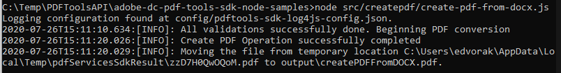

# Crea un PDF da HTML o MS Office in pochi minuti con API di PDF Services e Node.js


La digitalizzazione dei flussi di lavoro dei documenti non è mai stata così semplice con la nuova API di Adobe PDF Services, che offre agli sviluppatori la possibilità di scegliere tra diversi potenti servizi di manipolazione dei PDF per soddisfare le esigenze di flussi di lavoro aziendali complessi. Architetture complicate, strategie di implementazione e potenziamento della tecnologia possono essere semplificati con questi servizi web basati su cloud facilmente disponibili.

All&#39;interno dell&#39;API PDF Services sono disponibili diversi servizi per la creazione e la gestione di PDF o l&#39;esportazione da PDF a MS Office e altri formati.

* Crea un file PDF da HTML statico o dinamico, MS Word, PowerPoint, Excel e altro ancora
* Export PDF a MS Word, PowerPoint, Excel e altro
* OCR per riconoscere il testo nei file PDF e abilitare la ricerca nei documenti
* Protect PDF con una password all’apertura dei documenti
* Combinare pagine PDF o documenti PDF in un unico PDF
* Comprimi i PDF per ridurre le dimensioni per la condivisione tramite e-mail o online
* Linearizza per ottimizzare un PDF per una visualizzazione rapida sul Web
* Organizza le pagine PDF con i servizi Inserisci, Sostituisci, Riordina, Elimina e Ruota

Gli sviluppatori possono iniziare in pochi minuti con i file di esempio pronti per l&#39;esecuzione forniti per accedere a tutti i servizi Web disponibili. Ecco come iniziare.

## Recupero delle credenziali e download dei file di esempio

Il primo passaggio consiste nel ottenere una credenziale (chiave API) per sbloccare l’utilizzo. [Registrati qui per la prova gratuita](https://www.adobe.com/go/dcsdks_credentials) e fai clic su &quot;Inizia&quot; per creare le nuove credenziali.


È importante scegliere un &quot;Account personale&quot; per registrarsi per la versione di prova gratuita:


Nel passaggio successivo si sceglierà il servizio API di PDF Services, quindi si aggiungeranno un nome e una descrizione per le credenziali.

È presente una casella di controllo per &quot;Creare codice di esempio personalizzato&quot;. Scegliete questa opzione per aggiungere automaticamente le nuove credenziali ai file di esempio, ignorando il passaggio manuale.

Quindi, scegli Node.js come lingua per ricevere gli esempi specifici di Node.js e fai clic sul pulsante &quot;Crea credenziali&quot;.


Riceverai per il download un file .zip denominato PDFToolsSDK-Node.jsSamples.zip che può essere salvato nel file system locale.

## Aggiunta delle credenziali agli esempi di codice

Se si sceglie l&#39;opzione &quot;Crea campione di codice personalizzato&quot;, non è necessario aggiungere manualmente l&#39;ID client ai file di esempio del codice e si può saltare il passaggio successivo per passare direttamente alla sezione Esempi di codice in esecuzione riportata di seguito.

Se non hai scelto l’opzione per &quot;Crea campione di codice personalizzato&quot;, dovrai copiare l’ID client (chiave API) dalla console di Adobe.io:


Decomprimi il contenuto di PDFToolsSDK-Node.jsSamples.zip.

Accedi alla directory principale nella cartella adobe-dc-pdf-tools-sdk-node-samples.

Apri pdftools-api-credentials.json con qualsiasi editor di testo o IDE.

Incolla le credenziali nel campo per l&#39;ID client nel codice:

```javascript
{
 "client_credentials": {
  "client_id": "abcdefghijklmnopqrstuvwxyz",
```

Salvare il file e continuare con il passaggio successivo per eseguire gli esempi di codice.

## Esecuzione del primo esempio di codice

Utilizzando il prompt dei comandi, accedi alla directory principale nella cartella adobe-dc-pdf-tools-sdk-node-samples.

Installazione npm di tipo:

C:\Temp\PDFToolsAPI\adobe-dc-pdf-tools-sdk-node-samples>installazione npm

Ora sei pronto per eseguire i file di esempio.

Per il primo esempio, create un PDF:

Mentre sei ancora nel prompt dei comandi, esegui il comando seguente per creare l&#39;esempio di PDF:

C:\Temp\PDFToolsAPI\adobe-dc-pdf-tools-sdk-node-samples>nodo src/createpdf/create-pdf-from-docx.js

Output di esempio:



Il PDF verrà creato nel percorso indicato nell&#39;output, che per impostazione predefinita è la directory pdfServicesSdkResult.

## Risorse e passaggi successivi

* Per ulteriore assistenza e supporto, visita il forum della community [[!DNL Acrobat Services] API](https://community.adobe.com/t5/document-cloud-sdk/bd-p/Document-Cloud-SDK?page=1&sort=latest_replies&filter=all) di Adobe

API dei servizi PDF [Documentazione](https://www.adobe.com/go/pdftoolsapi_doc)

* [Domande frequenti](https://community.adobe.com/t5/contentarchivals/contentarchivedpage/message-uid/10726197) per le domande sull&#39;API di PDF Services

* [Contattaci](https://www.adobe.com/go/pdftoolsapi_requestform) per domande su licenze e prezzi

* Articoli correlati:
  [La nuova API di PDF Services offre ancora più funzionalità per i flussi di lavoro dei documenti](https://community.adobe.com/t5/acrobat-services-api-discussions/new-pdf-tools-api-brings-more-capabilities-for-document-services/m-p/11294170)

  [Versione di luglio di [!DNL Adobe Acrobat Services]: PDF Embed e PDF Services](https://medium.com/adobetech/july-release-of-adobe-document-services-pdf-embed-and-pdf-tools-17211bf7776d)
