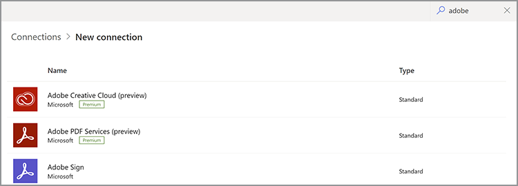

# Ottenere le credenziali per Microsoft Power Automate

[Microsoft Power Automate](https://powerautomate.microsoft.com/it-it/) offre agli sviluppatori e agli sviluppatori di cittadini un modo efficace per creare processi automatizzati avanzati per migliorare il proprio business senza scrivere codice. [Servizi Adobe PDF](https://us.flow.microsoft.com/it-it/connectors/shared_adobepdftools/adobe-pdf-services/) , come parte di [[!DNL Adobe Acrobat Services]](https://developer.adobe.com/document-services), consente agli utenti di eseguire qualsiasi azione disponibile nelle API dei servizi Adobe PDF all&#39;interno di Microsoft Power Automate.

In questa esercitazione, scoprite come ottenere le credenziali per iniziare a utilizzare o provare i servizi Adobe PDF. A seconda che tu sia un utente di prova o un cliente esistente, questa esercitazione illustra i passaggi corretti per ottenere le credenziali.

## In che modo gli utenti di Microsoft Power Automate possono iniziare a utilizzare il connettore Adobe PDF Services?

Gli utenti esistenti di Microsoft Power Automate possono [ottenere le credenziali di prova](https://www.adobe.com/go/powerautomate_getstarted) per i servizi Adobe PDF. Il collegamento qui sopra è uno speciale collegamento di iscrizione che aiuta in questo processo specificamente per gli utenti di Microsoft Power Automate.


>[!IMPORTANT]
> Se esegui l’accesso per una versione di prova, devi utilizzare un Adobe ID e non un’Enterprise ID. Se non sei un abbonato corrente all’API dei servizi Adobe PDF e tenti di accedere con l’Enterprise ID, potrebbe verificarsi un errore di autorizzazione perché l’azienda non ha i diritti per utilizzare l’API dei servizi Adobe PDF. Per questo motivo, si consiglia di utilizzare un Adobe ID personale gratuito.

1. Dopo aver effettuato l’accesso, viene richiesto di selezionare un nome per le nuove credenziali. Inserisci il *Nome credenziali*.
1. Seleziona la casella di controllo per accettare i termini dello sviluppatore.
1. Seleziona **[!UICONTROL Crea credenziali]**.

   

Queste credenziali coprono cinque valori diversi:

* ID client (chiave API)
* Segreto client
* ID organizzazione
* ID account tecnico
* Base64 (chiave privata codificata)


Un file JSON contenente tutti questi valori viene scaricato automaticamente nel sistema. Questo file è denominato `pdfservices-api-pa-credentials.json` e ha l&#39;aspetto di:

```json
{
 "client_id": "client id value",
 "client_secret": "client secret value",
 "organization_id": "organized id value",
 "account_id": "account id value",
 "base64_encoded_private_key": "base64 version of the private key"
}
```

Archivia questo file in una posizione sicura perché non è possibile ottenere di nuovo una copia della chiave privata.

### Aggiungere la connessione in Microsoft Power Automate

Ora che hai le tue credenziali, puoi iniziare a usarle nei flussi di Microsoft Power Automate.

1. Nel menu della barra laterale, aprite il **[!UICONTROL Dati]** e seleziona **Connessioni**:

   

1. Seleziona **+ [!UICONTROL Nuova connessione]**.

1. La schermata successiva mostra un elenco di possibili tipi di connessione. Nell’angolo superiore destro, immetti &quot;adobe&quot; per filtrare le opzioni:

   

1. Seleziona **[!UICONTROL Servizi Adobe PDF (anteprima)]**.
1. Nella finestra a scelta obbligatoria, immettete tutti e cinque i valori generati in precedenza. Seleziona **[!UICONTROL Crea]** al termine.

   

A questo punto è possibile utilizzare i servizi Adobe PDF in Microsoft Power Automate.

### Accesso alle credenziali dopo la loro creazione

Se hai già creato le credenziali e le hai inserite male, puoi recuperarle di nuovo in [Console Adobe Developer](https://developer.adobe.com/console).

1. Dopo l’accesso a [Console Adobe Developer](https://developer.adobe.com/console), individua innanzitutto il progetto e selezionalo.
1. Nel menu a sinistra sotto *Credenziali*, seleziona **Account di servizio (JWT)**:

   

1. I cinque valori presentati sono: *ID client*, *Segreto del client*, *ID account tecnico*, *E-mail account tecnico* e *ID organizzazione*.

Sfortunatamente, non è possibile scaricare la chiave privata precedente, ma è possibile utilizzare il pulsante &quot;Genera una tastiera pubblica/privata&quot; per crearne una nuova.

## Utilizzo delle credenziali di Adobe PDF Services esistenti

Se sono state generate credenziali API di Adobe PDF Services esistenti da [!DNL Adobe Acrobat Services] sito web, puoi utilizzarli con Microsoft Power Automate. Se hai scaricato un SDK durante la registrazione, le credenziali esistenti si presentano sotto forma di un file JSON probabilmente denominato `pdfservices-api-credentials.json`. Il file JSON contiene le cinque chiavi necessarie per creare le credenziali di connessione. Copia ogni valore dal file JSON nel campo di connessione corrispondente.

Il valore della chiave privata deriva da un secondo file denominato `private.key`.

Puoi anche ottenere i valori da Adobe Developer Console come descritto sopra.

## Come [!DNL Adobe Acrobat Services] gli utenti iniziano a lavorare con Microsoft Power Automate?

Per iniziare a lavorare con Power Automate, inizia a <https://powerautomate.microsoft.com> e utilizzare il pulsante &quot;Inizia gratis&quot;. Se non disponi di un account Microsoft, devi crearne uno. Dopo aver effettuato l’accesso, ti verrà presentato il dashboard di Power Automate.


Come descritto all’inizio di questa esercitazione, crea un nuovo flusso, aggiungi un passaggio e trova i servizi Adobe PDF. Seleziona un’azione e potresti essere avvisato che è necessario un account premium.


Come mostra la schermata precedente, puoi passare a un account di lavoro o configurare un nuovo account per l’organizzazione. Una volta ottenuto l’accesso, potrai quindi aggiungere l’azione Servizi Adobe PDF.

Per un&#39;analisi più approfondita della creazione del primo flusso di Microsoft Power Automate con [!DNL Adobe Acrobat Services], vedere [Crea il tuo primo flusso di lavoro in Microsoft Power Automate](https://experienceleague.adobe.com/docs/document-services/tutorials/pdfservices/create-workflow-power-automate.html).

## Risorse aggiuntive

Per aiutarti a fare di più, ecco un elenco di risorse aggiuntive:

* I primi sono i documenti Power Automate di Adobe PDF Services: <https://docs.microsoft.com/en-us/connectors/adobepdftools/>. Queste risorse completano quello che hai imparato qui.
* Hai bisogno di esempi? Potete trovare numerosi [Modelli Power Automate](https://powerautomate.microsoft.com/en-us/connectors/details/shared_adobepdftools/adobe-pdf-services/) dimostrazione dei servizi PDF.
* I nostri contenuti video live, [Clip carta](https://www.youtube.com/playlist?list=PLcVEYUqU7VRe4sT-Bf8flvRz1XXUyGmtF), contiene anche video che dimostrano l&#39;utilizzo di Power Automate.
* Il [Blog tecnico Adobe](https://medium.com/adobetech/tagged/microsoft-power-automate) contiene numerosi articoli sulle operazioni con Power Automate.
* Infine, assicurati di consultare il nucleo [Servizi PDF](https://developer.adobe.com/document-services/docs/overview/) documentazione.
