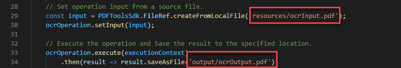

# Utilizzo dell’API di Adobe PDF Services per i file OCR PDF

Con l’OCR (riconoscimento ottico dei caratteri) puoi sbloccare i PDF scansionati per estrarre il testo e creare file ricercabili. Utilizzando le nostre potenti API basate sul cloud, integra l’OCR in qualsiasi flusso di lavoro dei documenti per offrire la soluzione perfetta per archiviare, copiare il testo e creare indici di documenti ricercabili. Creazione di archivi ricercabili da archivi di PDF scansionati per sbloccare informazioni importanti e risparmiare tempo grazie alla possibilità di eseguire ricerche rapide. Oppure applica l’OCR ai tuoi PDF dalle scansioni caricate per consentirne la modifica e utilizzarli nei flussi di lavoro di onboarding.

Gli sviluppatori possono iniziare in pochi minuti con i file di esempio pronti per l’esecuzione forniti per l’OCR.

In questo tutorial vengono illustrate le nozioni di base per l&#39;esecuzione della prima operazione OCR dell&#39;API di PDF Services utilizzando file di esempio per i linguaggi Node.js, Java e .Net.

## Passaggio 1: crea le tue credenziali e configura il tuo ambiente

Utilizza le esercitazioni introduttive riportate di seguito per creare le credenziali API, scaricare file di esempio e configurare l’ambiente.

[Guida introduttiva all’API e a Java di PDF Services](gettingstartedjava.md)

[Guida introduttiva all&#39;API di PDF Services e a .Net](gettingstartednet.md)

[Guida introduttiva all’API di PDF Services e a Node.js](createpdffromhtml.md)

## Esegui l’esempio di OCR fornito nei file di esempio

Per impostazione predefinita, l’operazione OCR consente di utilizzare la lingua inglese, ma supporta anche il tedesco, il francese, il danese e [altre lingue](https://opensource.adobe.com/pdftools-sdk-docs/release/latest/howtos.html#ocr-with-explicit-language). L’impostazione predefinita è impostazioni internazionali en-us.

Quando si passano opzioni con operazioni OCR che includono impostazioni internazionali specifiche, il metodo accetta anche il parametro &#39;type&#39; che dispone di due opzioni:

* SEARCHABLE_IMAGE: modifica l&#39;immagine originale durante il processo di pulitura (ad esempio, la disegna sul desktop) prima di posizionare sopra di essa un livello di testo invisibile. Questo tipo rimuove gli artefatti indesiderati e, in alcuni casi, può risultare in un documento più leggibile.

* SEARCHABLE_IMAGE_EXACT: assicura che il testo sia ricercabile e selezionabile. Questa opzione mantiene l’immagine originale e posiziona sopra di essa un livello di testo invisibile. Opzione consigliata per i casi che richiedono la massima fedeltà all’immagine originale.

**Java**

1. Aprire un prompt dei comandi.

1. Cambia le directory nella directory del codice di esempio.

   Ad esempio, C:\Temp\PDFToolsAPI\adobe-dc-pdf-tools-sdk-java-samples>.

1. Esegui il comando seguente:

   `mvn -f pom.xml exec:java -Dexec.mainClass=com.adobe.platform.operation.samples.ocrpdf.OcrPDF`

Il PDF verrà creato nella directory src/main/resources.

**.Net**

1. Aprire un prompt dei comandi.

1. Cambia le directory nella directory del codice di esempio.

   Ad esempio, C:\Temp\PDFToolsAPI\adobe-dc-pdf-tools-sdk-NetSamples

1. Cambia nuovamente le directory nella directory OcrPDF.

1. Esegui il comando seguente:

   `dotnet run OcrPDF.csproj`

Il tuo PDF verrà creato nella stessa directory.

**Nodo.js**

1. Aprire un prompt dei comandi.

1. Cambia le directory nella directory del codice di esempio.

   Ad esempio, C:\Temp\PDFToolsAPI\adobe-dc-pdf-tools-sdk-node-samples

1. Esegui il comando seguente:

   `node src/ocr/ocr-pdf.js`

Il PDF verrà creato nella posizione indicata nell’output, che per impostazione predefinita è la directory di output.

## Pensieri finali

Con questi semplici passaggi utilizzando i file di esempio, dovresti avere un esempio di lavoro su cui poter basarti. Oltre all’esempio di OCR utilizzato in questa esercitazione, esiste un altro esempio di OCR che utilizza le opzioni relative al tipo e alle impostazioni internazionali supportate illustrate in precedenza.

Da qui puoi semplicemente sostituire i file di input e output che si trovano nell&#39;esempio per utilizzare il tuo PDF per finalizzare il tuo proof of concept per il tuo caso d&#39;uso.

## Risorse e passaggi successivi

* Per ulteriore assistenza e supporto, visita il forum della community [[!DNL Acrobat Services] API](https://community.adobe.com/t5/document-cloud-sdk/bd-p/Document-Cloud-SDK?page=1&amp;sort=latest_replies&amp;filter=all) di Adobe

* API dei servizi PDF [Documentazione](https://www.adobe.com/go/pdftoolsapi_doc)

* [Domande frequenti](https://community.adobe.com/t5/contentarchivals/contentarchivedpage/message-uid/10726197) per le domande sull&#39;API di PDF Services

* [Contattaci](https://www.adobe.com/go/pdftoolsapi_requestform) per domande su licenze e prezzi
