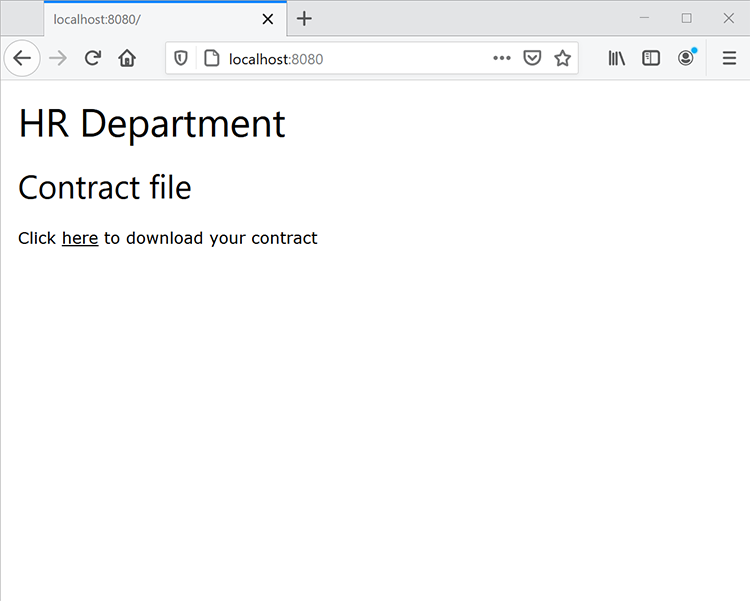

# Flussi di lavoro per documenti HR in Java


Molte aziende richiedono una documentazione per un nuovo assunto, come gli accordi sul posto di lavoro per i dipendenti che lavorano da casa. In genere, le aziende gestivano fisicamente questi documenti in moduli difficili da gestire e archiviare. Quando si passa a documenti elettronici, i file PDF rappresentano la scelta ideale perché sono più sicuri e meno modificabili rispetto ad altri tipi di file. Inoltre, supportano le firme digitali.

## Cosa puoi imparare

In questo tutorial pratico scopri come implementare un modulo HR basato su web che salva un accordo sul posto di lavoro in PDF con l’approvazione in una semplice applicazione Java Spring MVC.

## API e risorse pertinenti

* [API dei servizi PDF](https://opensource.adobe.com/pdftools-sdk-docs/release/latest/index.html)

* [API Adobe Sign](https://www.adobe.io/apis/documentcloud/sign.html)

* [Codice progetto](https://github.com/dawidborycki/adobe-sign)

## Generazione delle credenziali API

Registrati per iniziare alla versione di prova gratuita delle API di Adobe PDF Services. Passate al [Adobe](https://www.adobe.io/apis/documentcloud/dcsdk/gettingstarted.html?ref=getStartedWithServicesSDK) [sito Web](https://www.adobe.io/apis/documentcloud/dcsdk/gettingstarted.html?ref=getStartedWithServicesSDK) e fate clic sul pulsante *Inizia* in *Crea nuove credenziali*. La versione di prova gratuita fornisce 1.000 transazioni di documenti che possono essere utilizzati nell&#39;arco di sei mesi. Nella pagina successiva (vedi di seguito), scegli il servizio (API di PDF Services), imposta il nome delle credenziali (ad esempio, HRDocumentWFCredentials) e immetti una descrizione.

Selezionare il linguaggio (Java per questo esempio) e controllare *Creare esempi di codice personalizzati*. L’ultimo passaggio garantisce che gli esempi di codice contengano già il file precompilato pdftools-api-credentials.json che utilizzi, insieme alla chiave privata per autenticare l’app all’interno dell’API.

Fare clic sul pulsante *Crea credenziali*. Questo genera le credenziali e gli esempi iniziano automaticamente a essere scaricati.


Per verificare che le credenziali funzionino, apri gli esempi scaricati. In questo caso si utilizza IntelliJ IDEA. Quando si apre il codice sorgente, l&#39;ambiente di sviluppo integrato (IDE) richiede il motore di generazione. In questo esempio viene utilizzato Maven, ma potete anche lavorare con Gradle, a seconda delle preferenze.

Quindi, esegui l&#39;obiettivo di `mvn clean install` Maven per creare i file jar.

Infine, esegui l’esempio Combina PDF, come illustrato di seguito. Il codice genera il PDF nella cartella di output.


## Creazione dell’applicazione MVC primaverile

Fornite le credenziali che avete creato l&#39;applicazione. Questo esempio utilizza l&#39;inizializzatore di primavera.

Per prima cosa, configura le impostazioni del progetto per utilizzare il linguaggio Java 8 e il packaging Jar (vedi la schermata riportata di seguito).


In secondo luogo, aggiungi Spring Web (dal Web) e Thymeleaf (dai motori modello):


Dopo aver creato il progetto, accedi al file pom.xml e completa la sezione delle dipendenze con pdftools-sdk e log4j-slf4j-impl:

```
<dependencies>
    <dependency>
        <groupId>org.springframework.boot</groupId>
        <artifactId>spring-boot-starter-thymeleaf</artifactId>
    </dependency>
    <dependency>
        <groupId>org.springframework.boot</groupId>
        <artifactId>spring-boot-starter-web</artifactId>
    </dependency>

    <dependency>
        <groupId>org.springframework.boot</groupId>
        <artifactId>spring-boot-starter-test</artifactId>
        <scope>test</scope>
    </dependency>

</dependencies>
```

Quindi, completa la cartella principale del progetto con due file scaricati con il codice di esempio:

* pdftools-api-credentials.json

* private.key

## Rendering di un modulo Web

Per eseguire il rendering del modulo Web, modifica l’applicazione con il controller che esegue il rendering del modulo dati personali e gestisce la registrazione del modulo. Modificare quindi innanzitutto l&#39;applicazione con la classe di modello PersonForm:

```
package com.hr.docsigning;
import javax.validation.constraints.NotNull;
import javax.validation.constraints.Size;

public class PersonForm {
    @NotNull
    @Size(min=2, max=30)
    private String firstName;

    @NotNull
    @Size(min=2, max=30)
    private String lastName;

    public String getFirstName() {
            return this.firstName;
    }


    public void setFirstName(String firstName) {
            this.firstName = firstName;
    }

    public String getLastName() {
           return this.lastName;
    }

    public void setLastName(String lastName) {
            this.lastName = lastName;
    }

    public String GetFullName() {
           return this.firstName + " " + this.lastName;
    }
}
```

Questa classe contiene due proprietà: `firstName` e `lastName`. Inoltre, utilizza questa semplice convalida per verificare se sono compresi tra due e 30 caratteri.

Data la classe del modello, è possibile creare il controller (vedere PersonController.java dal codice correlato):

```
package com.hr.docsigning;
import org.springframework.stereotype.Controller;
import org.springframework.validation.BindingResult;
import org.springframework.web.bind.annotation.GetMapping;
import org.springframework.web.bind.annotation.PostMapping;
import javax.validation.Valid;


@Controller
public class PersonController {
    @GetMapping("/")
    public String showForm(PersonForm personForm) {
        return "form";
    }
}
```

Il controller dispone di un solo metodo: showForm. È responsabile del rendering del modulo utilizzando il modello HTML che si trova in resources/templates/form.html:

```
<html>
<head>
    <link rel="stylesheet" href="https://www.w3schools.com/w3css/4/w3.css">
</head>
 
<body>
<div class="w3-container">
    <h1>HR Department</h1>
</div>
 
<form class="w3-panel w3-card-4" action="#" th:action="@{/}"
        th:object="${personForm}" method="post">
    <h2>Personal data</h2>
    <table>
        <tr>
            <td>First Name:</td>
            <td><input type="text" class="w3-input"
                placeholder="First name" th:field="*{firstName}" /></td>
            <td class="w3-text-red" th:if="${#fields.hasErrors('firstName')}"
                th:errors="*{firstName}"></td>
        </tr>
        <tr>
            <td>Last Name:</td>
            <td><input type="text" class="w3-input"
                placeholder="Last name" th:field="*{lastName}" /></td>
            <td class="w3-text-red" th:if="${#fields.hasErrors('lastName')}"
                th:errors="*{lastName}"></td>
        </tr>
        <tr>
            <td><button class="w3-button w3-black" type="submit">Submit</button></td>
        </tr>
    </table>
</form>
</body>
</html>
```

Per eseguire il rendering del contenuto dinamico, viene utilizzato il motore di rendering del modello Thymeleaf. Quindi, dopo aver eseguito l&#39;applicazione, dovresti visualizzare quanto segue:


## Generazione del PDF con contenuto dinamico

A questo punto, genera il documento PDF contenente il contratto virtuale compilando dinamicamente i campi selezionati dopo il rendering del modulo dati personali. In particolare, devi inserire i dati relativi alla persona nel contratto precreato.

Qui, per semplicità, hai solo un&#39;intestazione, un sottotitolo e una costante di stringa che dice: &quot;Questo contratto è stato preparato per \&lt;nome completo della persona\>&quot;.

Per raggiungere questo obiettivo, iniziare con l&#39;Adobe [Creazione di un PDF da Dynamic HTML](https://opensource.adobe.com/pdftools-sdk-docs/release/latest/howtos.html#create-a-pdf-from-dynamic-html). Analizzando il codice di esempio, è possibile verificare che il processo di popolamento dei campi Dynamic HTML funzioni nel modo seguente.

In primo luogo, è necessario preparare la pagina HTML, che ha contenuto statico e dinamico. La parte dinamica viene aggiornata utilizzando JavaScript. Nello specifico, l’API di PDF Services inserisce l’oggetto JSON nel HTML.

Otterrai quindi le proprietà JSON utilizzando la funzione JavaScript che viene richiamata quando viene caricato il documento HTML. Questa funzione JavaScript aggiorna gli elementi DOM selezionati. Nell&#39;esempio seguente viene compilato l&#39;elemento span, contenente i dati della persona (vedere src\\main\\resources\\contract\\index.html del codice correlato):

```
<html>
<head>
    <link rel="stylesheet" href="https://www.w3schools.com/w3css/4/w3.css">
</head>
 
<body onload="updateFullName()">
    <script src="./json.js"></script>
    <script type="text/javascript">
        function updateFullName()
        {
            var document = window.document;
            document.getElementById("personFullName").innerHTML = String(
                window.json.personFullName);
        }
    </script>
 
    <div class="w3-container ">
        <h1>HR Department</h1>
 
        <h2>Contract details</h2>
 
        <p>This contract was prepared for:
            <strong><span id="personFullName"></span></strong>
        </p>
    </div>
</body>
</html>
```

Quindi, è necessario comprimere il HTML con tutti i file JavaScript e CSS dipendenti. L&#39;API PDF Services non accetta file di HTML. Al contrario, richiede un file zip come input. In questo caso, il file compresso viene memorizzato in src\\main\\resources\\contract\\index.zip.

Successivamente, è possibile integrare `PersonController` con un altro metodo che gestisce le richieste POST:

```
@PostMapping("/")
public String checkPersonInfo(@Valid PersonForm personForm,
    BindingResult bindingResult) {
    if (bindingResult.hasErrors()) {
        return "form";
    }
 
    CreateContract(personForm);
 
    return "contract-actions";
}
```

Il metodo sopra descritto crea un contratto PDF utilizzando i dati personali forniti ed esegue il rendering della vista delle azioni del contratto. Quest’ultimo fornisce collegamenti al PDF generato e per la firma del PDF.

Ora vediamo come funziona il metodo `CreateContract` (l&#39;elenco completo è riportato di seguito). Il metodo si basa su due campi:

* `LOGGER`, da log4j, per eseguire il debug delle informazioni su eventuali eccezioni

* `contractFilePath`, contenente il percorso del file per PDF generato

Il metodo `CreateContract` imposta le credenziali e crea il PDF da HTML. Per passare e popolare i dati della persona nel contratto, utilizzare l&#39;helper `setCustomOptionsAndPersonData`. Questo metodo recupera i dati della persona dal modulo, quindi li invia al PDF generato tramite l&#39;oggetto JSON descritto in precedenza.

In `setCustomOptionsAndPersonData` viene inoltre illustrato come controllare l&#39;aspetto dei PDF disattivando l&#39;intestazione e il piè di pagina. Una volta completati questi passaggi, puoi salvare il file PDF in output/contract.pdf ed eventualmente eliminare il file generato in precedenza.

```
private static final Logger LOGGER = LoggerFactory.getLogger(PersonController.class);
private String contractFilePath = "output/contract.pdf"; 
private void CreateContract(PersonForm personForm) {
    try {
        // Initial setup, create credentials instance.
        Credentials credentials = Credentials.serviceAccountCredentialsBuilder()
                .fromFile("pdftools-api-credentials.json")
                .build();

        //Create an ExecutionContext using credentials 
       //and create a new operation instance.
        ExecutionContext executionContext = ExecutionContext.create(credentials);
        CreatePDFOperation htmlToPDFOperation = CreatePDFOperation.createNew();

        // Set operation input from a source file.
        FileRef source = FileRef.createFromLocalFile(
           "src/main/resources/contract/index.zip");
       htmlToPDFOperation.setInput(source);

        // Provide any custom configuration options for the operation
        // You pass person data here to dynamically fill out the HTML
        setCustomOptionsAndPersonData(htmlToPDFOperation, personForm);

        // Execute the operation.
        FileRef result = htmlToPDFOperation.execute(executionContext);

        // Save the result to the specified location. Delete previous file if exists
        File file = new File(contractFilePath);
        Files.deleteIfExists(file.toPath());

        result.saveAs(file.getPath());

    } catch (ServiceApiException | IOException | 
             SdkException | ServiceUsageException ex) {
        LOGGER.error("Exception encountered while executing operation", ex);
    }
}
 
private static void setCustomOptionsAndPersonData(
    CreatePDFOperation htmlToPDFOperation, PersonForm personForm) {
    //Set the dataToMerge field that needs to be populated 
    //in the HTML before its conversion
    JSONObject dataToMerge = new JSONObject();
    dataToMerge.put("personFullName", personForm.GetFullName());
 
    // Set the desired HTML-to-PDF conversion options.
    CreatePDFOptions htmlToPdfOptions = CreatePDFOptions.htmlOptionsBuilder()
        .includeHeaderFooter(false)
        .withDataToMerge(dataToMerge)
        .build();
    htmlToPDFOperation.setOptions(htmlToPdfOptions);
}
```

Quando si genera il contratto, è inoltre possibile unire i dati dinamici specifici della persona con condizioni di contratto fisse. A tale scopo, seguire l&#39;esempio [Create a PDF from static HTML](https://opensource.adobe.com/pdftools-sdk-docs/release/latest/howtos.html#create-a-pdf-from-dynamic-html). In alternativa, è possibile [unire due PDF](https://opensource.adobe.com/pdftools-sdk-docs/release/latest/howtos.html#create-a-pdf-from-static-html).

## Presentazione del file PDF per il download

Ora puoi presentare il collegamento al PDF generato per il download da parte dell&#39;utente. A tale scopo, creare innanzitutto il file contract-actions.html (vedere resources/templates contract-actions.html del codice correlato):

```
<html>
<head>
    <link rel="stylesheet" href="https://www.w3schools.com/w3css/4/w3.css">
</head>
 
<div class="w3-container ">
    <h1>HR Department</h1>
 
    <h2>Contract file</h2>
 
    <p>Click <a href="/pdf">here</a> to download your contract</p>
</div>
</body>
</html>
```

Implementare quindi il metodo `downloadContract` all&#39;interno della classe `PersonController` nel modo seguente:

```
@RequestMapping("/pdf")
public void downloadContract(HttpServletResponse response)
{
    Path file = Paths.get(contractFilePath);
 
    response.setContentType("application/pdf");
    response.addHeader(
        "Content-Disposition", "attachment; filename=contract.pdf");

    try
    {
        Files.copy(file, response.getOutputStream());
        response.getOutputStream().flush();
    }
    catch (IOException ex) 
    {
        ex.printStackTrace();
    }
}
```

Dopo l’esecuzione dell’app, viene visualizzato il seguente flusso. Nella prima schermata viene visualizzato il form dati personale. Per eseguire il test, riempirlo con valori compresi tra due e 30 caratteri:


Dopo aver fatto clic sul pulsante *Invia*, il modulo viene convalidato e il PDF viene generato in base al HTML (resources/contract/index.html). Nell’applicazione viene visualizzata un’altra vista (dettagli del contratto), in cui è possibile scaricare PDF:



Dopo il rendering nel browser Web, PDF ha il seguente aspetto. In particolare, i dati personali immessi vengono propagati al PDF:


## Abilitazione delle firme e della sicurezza

Quando l’accordo è pronto, Adobe Sign può aggiungere firme digitali che rappresentano l’approvazione. L’autenticazione Adobe Sign funziona in modo leggermente diverso rispetto a OAuth. Scopriamo ora come integrare l&#39;applicazione con Adobe Sign. A tale scopo, è necessario preparare il token di accesso per l’applicazione. Quindi, scrivi il codice client utilizzando Adobe Sign Java SDK.

Per ottenere un token di autorizzazione, è necessario eseguire diversi passaggi:

Registra innanzitutto un [account sviluppatore](https://acrobat.adobe.com/it/it/sign/developer-form.html).

Creare l&#39;applicazione CLIENT nel [portale Adobe Sign](https://www.adobe.io/apis/documentcloud/sign/docs.html#!adobedocs/adobe-sign/master/gstarted/create_app.md).

Configura OAuth per l’applicazione come descritto [qui](https://www.adobe.io/apis/documentcloud/sign/docs.html#!adobedocs/adobe-sign/master/gstarted/configure_oauth.md) e [qui](https://secure.eu1.adobesign.com/public/static/oauthDoc.jsp). Annota l&#39;identificatore client e il segreto client. Puoi quindi utilizzare `https://www.google.com` come URI di reindirizzamento e i seguenti ambiti:

* user_login: self

* agreement_read: account

* agreement_write: account

* agreement_send: account

Prepara un URL come segue utilizzando il tuo ID client al posto di \&lt;CLIENT_ID\>:

```
https://secure.eu1.adobesign.com/public/oauth?redirect_uri=https://www.google.com
&response_type=code
&client_id=<CLIENT_ID>
&scope=user_login:self+agreement_read:account+agreement_write:account+agreement_send:account
```

Digitate l’URL sopra riportato nel browser Web. Verrai reindirizzato a google.com e il codice verrà visualizzato nella barra degli indirizzi come code=\&lt;YOUR_CODE\>, per
esempio:

```
https://www.google.com/?code=<YOUR_CODE>&api_access_point=https://api.eu1.adobesign.com/&web_access_point=https://secure.eu1.adobesign.com%2F
```

Prendi nota dei valori forniti per \&lt;YOUR_CODE\> e api_access_point.

Per inviare una richiesta HTTP POST che fornisce il token di accesso, utilizzare i valori ID client, \&lt;CODICE_UTENTE\> e api_access_point. Puoi utilizzare [Postman](https://helpx.adobe.com/sign/kb/how-to-create-access-token-using-postman-adobe-sign.html) o cURL:

```
curl --location --request POST "https://**api.eu1.adobesign.com**/oauth/token"
\\

\--data-urlencode "client_secret=**\<CLIENT_SECRET\>**" \\

\--data-urlencode "client_id=**\<CLIENT_ID\>**" \\

\--data-urlencode "code=**\<YOUR_CODE\>**" \\

\--data-urlencode "redirect_uri=**https://www.google.com**" \\

\--data-urlencode "grant_type=authorization_code"
```

La risposta del campione è la seguente:

```
{
    "access_token":"3AAABLblqZhByhLuqlb-…",
    "refresh_token":"3AAABLblqZhC_nJCT7n…",
    "token_type":"Bearer",
    "expires_in":3600
}
```

Prendi nota del tuo access_token. Ne hai bisogno per autorizzare il codice cliente.

## Utilizzo di Adobe Sign Java SDK

Una volta ottenuto il token di accesso, puoi inviare chiamate API REST ad Adobe Sign. Per semplificare questo processo, utilizza Adobe Sign Java SDK. Il codice sorgente è disponibile nel [repository GitHub di Adobe](https://github.com/adobe-sign/AdobeSignJavaSdk).

Per integrare il pacchetto con l&#39;applicazione, è necessario clonare il codice. Quindi, crea il pacchetto Maven (pacchetto mvn) e installa i seguenti file nel progetto (li puoi trovare nel codice complementare nella cartella adobe-sign-sdk):

* target/swagger-java-client-1.0.0.jar

* target/lib/gson-2.8.1.jar

* target/lib/gson-fire-1.8.0.jar

* target/lib/hamcrest-core-1.3.jar

* target/lib/junit-4.12.jar

* target/lib/logging-interceptor-2.7.5.jar

* target/lib/okhttp-2.7.5.jar

* target/lib/okio-1.6.0.jar

* target/lib/swagger-annotations-1.5.15.jar

In IntelliJ IDEA è possibile aggiungere tali file come dipendenze utilizzando *Struttura progetto* (Struttura file/progetto).

## Invio del PDF per la firma

Ora puoi inviare l’accordo da firmare. A tale scopo, completa prima contract-details.html con un altro collegamento ipertestuale alla richiesta di invio:

```
<html>
<head>
    <link rel="stylesheet" href="https://www.w3schools.com/w3css/4/w3.css">
</head>
 
<div class="w3-container ">
    <h1>HR Department</h1>
 
    <h2>Contract file</h2>
 
    <p>Click <a href="/pdf"> here</a> to download your contract</p>
 
    
</div>
</body>
</html>
```

Quindi, aggiungere un altro controller, `AdobeSignController`, in cui implementare `sendContractMethod` (vedere il codice correlato). Il metodo funziona come segue:

In primo luogo, utilizza `ApiClient` per ottenere l&#39;endpoint API.

```
ApiClient apiClient = new ApiClient();

//Default baseUrl to make GET /baseUris API call.
String baseUrl = "https://api.echosign.com/";
String endpointUrl = "/api/rest/v6";
apiClient.setBasePath(baseUrl + endpointUrl);

// Provide an OAuth Access Token as "Bearer access token" in authorization
String authorization = "Bearer ";

// Get the baseUris for the user and set it in apiClient.
BaseUrisApi baseUrisApi = new BaseUrisApi(apiClient);
BaseUriInfo baseUriInfo = baseUrisApi.getBaseUris(authorization);
apiClient.setBasePath(baseUriInfo.getApiAccessPoint() + endpointUrl);
```

Quindi, il metodo utilizza il file contract.pdf per creare il documento transitorio:

```
// Get PDF file
String filePath = "output/";
String fileName = "contract.pdf";
File file = new File(filePath + fileName);
String mimeType = "application/pdf";
 
//Get the id of the transient document.
TransientDocumentsApi transientDocumentsApi =
    new TransientDocumentsApi(apiClient);
TransientDocumentResponse response = transientDocumentsApi.createTransientDocument(authorization,
    file, null, null, fileName, mimeType);
String transientDocumentId = response.getTransientDocumentId();
```

Successivamente, devi creare un accordo. A tale scopo, utilizzare il file contract.pdf e impostare lo stato dell&#39;accordo su IN_PROCESS per inviare immediatamente il file. Inoltre, scegli la firma elettronica:

```
// Create AgreementCreationInfo
AgreementCreationInfo agreementCreationInfo = new AgreementCreationInfo();
 
// Add file
FileInfo fileInfo = new FileInfo();
fileInfo.setTransientDocumentId(transientDocumentId);
agreementCreationInfo.addFileInfosItem(fileInfo);
 
// Set state to IN_PROCESS, so the agreement is be sent immediately
agreementCreationInfo.setState(AgreementCreationInfo.StateEnum.IN_PROCESS);
agreementCreationInfo.setName("Contract");
agreementCreationInfo.setSignatureType(AgreementCreationInfo.SignatureTypeEnum.ESIGN);
```

Quindi, puoi aggiungere i destinatari dell’accordo nel modo seguente. In questo caso vengono aggiunti due destinatari (vedere le sezioni Dipendente e Manager):

```
// Provide emails of recipients to whom agreement is be sent
// Employee
ParticipantSetInfo participantSetInfo = new ParticipantSetInfo();
ParticipantSetMemberInfo participantSetMemberInfo = new ParticipantSetMemberInfo();
participantSetMemberInfo.setEmail("");
participantSetInfo.addMemberInfosItem(participantSetMemberInfo);
participantSetInfo.setOrder(1);
participantSetInfo.setRole(ParticipantSetInfo.RoleEnum.SIGNER);
agreementCreationInfo.addParticipantSetsInfoItem(participantSetInfo);
 
// Manager
participantSetInfo = new ParticipantSetInfo();
participantSetMemberInfo = new ParticipantSetMemberInfo();
participantSetMemberInfo.setEmail("");
participantSetInfo.addMemberInfosItem(participantSetMemberInfo);
participantSetInfo.setOrder(2);
participantSetInfo.setRole(ParticipantSetInfo.RoleEnum.SIGNER);
agreementCreationInfo.addParticipantSetsInfoItem(participantSetInfo);
```

Infine, invia l’accordo utilizzando il metodo `createAgreement` dall’SDK Java di Adobe Sign:

```
// Create agreement using the transient document.
AgreementsApi agreementsApi = new AgreementsApi(apiClient);
AgreementCreationResponse agreementCreationResponse = agreementsApi.createAgreement(
    authorization, agreementCreationInfo, null, null);
 
System.out.println("Agreement sent, ID: " + agreementCreationResponse.getId());
```

Dopo aver eseguito questo codice, riceverai un messaggio e-mail (all’indirizzo specificato nel codice come `<email_address>)`) con la richiesta di firma dell’accordo. L’e-mail contiene il collegamento ipertestuale che indirizza i destinatari al portale Adobe Sign per l’esecuzione della firma. Puoi visualizzare il documento nel Portale per sviluppatori Adobe Sign (vedi figura seguente) nonché tenere traccia del processo di firma a livello di programmazione utilizzando il metodo [getAgreementInfo](https://github.com/adobe-sign/AdobeSignJavaSdk/blob/master/docs/AgreementsApi.md#getAgreementInfo).

Infine, puoi anche proteggere con password il tuo PDF utilizzando l&#39;API di PDF Services, come mostrato in questi [esempi](https://github.com/adobe/pdfservices-java-sdk-samples/tree/master/src/main/java/com/adobe/pdfservices/operation/samples/protectpdf).


## Fasi seguenti

Come puoi vedere, sfruttando i quickstart, puoi implementare un semplice modulo Web per creare un PDF approvato in Java con l’API di Adobe PDF Services. Le API Adobe PDF si integrano perfettamente nelle applicazioni client esistenti.

Proseguendo nell’esempio, è possibile creare moduli che i destinatari possono firmare in remoto e in modo sicuro. Quando sono necessarie più firme, è anche possibile instradare automaticamente i moduli a una serie di persone in un flusso di lavoro. L&#39;inserimento dei tuoi dipendenti è stato migliorato e il reparto Risorse Umane ti amerà.

Consulta [[!DNL Adobe Acrobat Services]](https://www.adobe.io/apis/documentcloud/dcsdk/) per aggiungere numerose funzionalità di PDF alle tue applicazioni.
