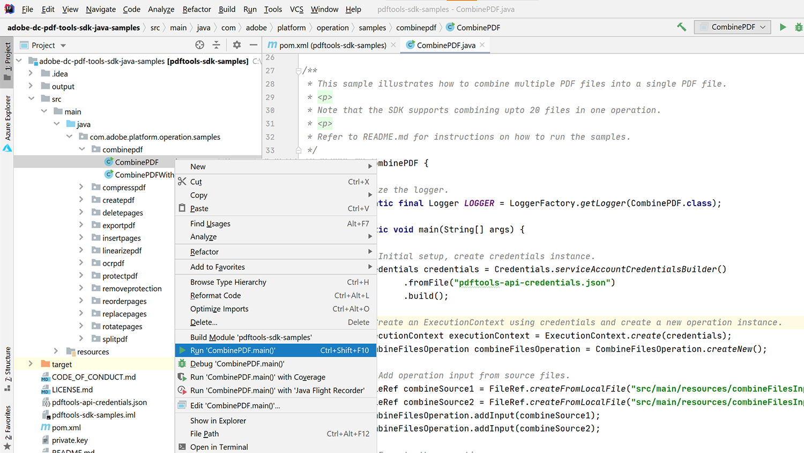

# Flussi di lavoro basati su documenti HR in Java


Molte aziende richiedono la documentazione di un nuovo assunto, ad esempio gli accordi sul posto di lavoro per i dipendenti che lavorano da casa. Tradizionalmente, le aziende gestivano questi documenti fisicamente in moduli difficili da gestire e archiviare. Quando si passa ai documenti elettronici, i file PDF sono la scelta ideale perché sono più sicuri e meno modificabili rispetto ad altri tipi di file. Inoltre, supportano le firme digitali.

## Cosa puoi imparare

In questa esercitazione pratica, scopri come implementare un modulo HR basato su web che salva un accordo sul posto di lavoro da PDF con la disconnessione in una semplice applicazione Java Spring MVC.

## API e risorse pertinenti

* [API dei servizi PDF](https://opensource.adobe.com/pdftools-sdk-docs/release/latest/index.html)

* [API Adobe Sign](https://www.adobe.io/apis/documentcloud/sign.html)

* [Codice progetto](https://github.com/dawidborycki/adobe-sign)

## Generazione delle credenziali API

Inizia registrandoti alla versione di prova gratuita delle API di Adobe PDF. Vai alla [Adobe](https://www.adobe.io/apis/documentcloud/dcsdk/gettingstarted.html?ref=getStartedWithServicesSDK) [sito web](https://www.adobe.io/apis/documentcloud/dcsdk/gettingstarted.html?ref=getStartedWithServicesSDK) e fare clic sul *Introduzione* pulsante sotto *Crea nuove credenziali*. La versione di prova gratuita offre 1.000 transazioni documento utilizzabili nell&#39;arco di sei mesi. Nella pagina successiva (vedere di seguito), scegli il servizio (API PDF Services), imposta il nome delle credenziali (ad esempio, HRDocumentWFCredentials) e immetti una descrizione.

Seleziona la lingua (Java per questo esempio) e controlla *Creare esempi di codice personalizzati*. L&#39;ultimo passaggio garantisce che gli esempi di codice contengano già il file pdftools-api-credentials.json precompilato, insieme alla chiave privata per autenticare l&#39;app all&#39;interno dell&#39;API.

Infine, fare clic sul *Crea credenziali* pulsante. In questo modo vengono generate le credenziali e gli esempi vengono scaricati automaticamente.


Per assicurarti che le credenziali funzionino, apri gli esempi scaricati. In questo caso si utilizza IntelliJ IDEA. Quando aprite il codice sorgente, l&#39;ambiente di sviluppo integrato (IDE) richiede il motore di creazione. In questo esempio viene utilizzato il componente Maven, ma potete anche lavorare con Gradle, a seconda delle preferenze.

Quindi, eseguire la proprietà `mvn clean install` Maven ha l&#39;obiettivo di creare i file jar.

Infine, eseguire l&#39;esempio CombinaPDF, come illustrato di seguito. Il codice genera il PDF all&#39;interno della cartella di output.



## Creazione dell&#39;applicazione MVC Spring

Date le credenziali, quindi create l&#39;applicazione. Questo esempio utilizza Inizializzatore di primavera.

Per prima cosa, configura le impostazioni del progetto per utilizzare il linguaggio Java 8 e il packaging Jar (vedi la schermata riportata di seguito).


Quindi, aggiungete Spring Web (dal Web) e Thymeleaf (dai motori di modello):


Dopo aver creato il progetto, accedi al file pom.xml e integra la sezione dipendenze con pdftools-sdk e log4j-slf4j-impl:

```
<dependencies>
    <dependency>
        <groupId>org.springframework.boot</groupId>
        <artifactId>spring-boot-starter-thymeleaf</artifactId>
    </dependency>
    <dependency>
        <groupId>org.springframework.boot</groupId>
        <artifactId>spring-boot-starter-web</artifactId>
    </dependency>

    <dependency>
        <groupId>org.springframework.boot</groupId>
        <artifactId>spring-boot-starter-test</artifactId>
        <scope>test</scope>
    </dependency>

</dependencies>
```

Aggiungete quindi alla cartella principale del progetto due file scaricati con il codice di esempio:

* pdftools-api-credentials.json

* private.key

## Rendering di un modulo Web

Per eseguire il rendering del modulo Web, modificate l’applicazione con il controller che esegue il rendering del modulo di dati personali e gestisce la pubblicazione del modulo. Quindi, modificate innanzitutto l&#39;applicazione con la classe di modello PersonForm:

```
package com.hr.docsigning;
import javax.validation.constraints.NotNull;
import javax.validation.constraints.Size;

public class PersonForm {
    @NotNull
    @Size(min=2, max=30)
    private String firstName;

    @NotNull
    @Size(min=2, max=30)
    private String lastName;

    public String getFirstName() {
            return this.firstName;
    }


    public void setFirstName(String firstName) {
            this.firstName = firstName;
    }

    public String getLastName() {
           return this.lastName;
    }

    public void setLastName(String lastName) {
            this.lastName = lastName;
    }

    public String GetFullName() {
           return this.firstName + " " + this.lastName;
    }
}
```

Questa classe contiene due proprietà: `firstName` e `lastName`. Inoltre, utilizzate questa semplice convalida per verificare se sono compresi tra due e 30 caratteri.

Data la classe del modello, è possibile creare il controller (vedete PersonController.java dal codice del componente):

```
package com.hr.docsigning;
import org.springframework.stereotype.Controller;
import org.springframework.validation.BindingResult;
import org.springframework.web.bind.annotation.GetMapping;
import org.springframework.web.bind.annotation.PostMapping;
import javax.validation.Valid;


@Controller
public class PersonController {
    @GetMapping("/")
    public String showForm(PersonForm personForm) {
        return "form";
    }
}
```

Il controller dispone di un solo metodo: showForm. È responsabile del rendering del modulo utilizzando il modello di HTML disponibile in resources/templates/form.html:

```
<html>
<head>
    <link rel="stylesheet" href="https://www.w3schools.com/w3css/4/w3.css">
</head>
 
<body>
<div class="w3-container">
    <h1>HR Department</h1>
</div>
 
<form class="w3-panel w3-card-4" action="#" th:action="@{/}"
        th:object="${personForm}" method="post">
    <h2>Personal data</h2>
    <table>
        <tr>
            <td>First Name:</td>
            <td><input type="text" class="w3-input"
                placeholder="First name" th:field="*{firstName}" /></td>
            <td class="w3-text-red" th:if="${#fields.hasErrors('firstName')}"
                th:errors="*{firstName}"></td>
        </tr>
        <tr>
            <td>Last Name:</td>
            <td><input type="text" class="w3-input"
                placeholder="Last name" th:field="*{lastName}" /></td>
            <td class="w3-text-red" th:if="${#fields.hasErrors('lastName')}"
                th:errors="*{lastName}"></td>
        </tr>
        <tr>
            <td><button class="w3-button w3-black" type="submit">Submit</button></td>
        </tr>
    </table>
</form>
</body>
</html>
```

Per eseguire il rendering del contenuto dinamico, viene utilizzato il motore di rendering del modello Thymeleaf. Quindi, dopo aver eseguito l&#39;applicazione, si consiglia di visualizzare quanto segue:


## Generazione del PDF con contenuto dinamico

Ora, genera il documento PDF contenente il contratto virtuale compilando dinamicamente i campi selezionati dopo aver eseguito il rendering del modulo dati personali. In particolare, devi inserire i dati delle persone nel contratto precreato.

Qui, per semplicità, sono disponibili solo un’intestazione, una sottointestazione e una lettura costante di stringa: &quot;Questo contratto è stato preparato per \&lt;full name=&quot;&quot; of=&quot;&quot; the=&quot;&quot; person=&quot;&quot;>&quot;.

Adobe Per raggiungere questo obiettivo, iniziare con la [Creare un PDF da Dynamic HTML](https://opensource.adobe.com/pdftools-sdk-docs/release/latest/howtos.html#create-a-pdf-from-dynamic-html) esempio. Analizzando il codice di esempio, si nota che il processo della popolazione dei campi di HTML dinamici funziona nel modo seguente.

Innanzitutto, dovete preparare la pagina HTML, che contiene contenuto statico e dinamico. La parte dinamica viene aggiornata utilizzando JavaScript. In particolare, l&#39;API dei servizi di PDF inserisce l&#39;oggetto JSON nel HTML.

Le proprietà JSON vengono quindi acquisite mediante la funzione JavaScript che viene richiamata quando viene caricato il documento HTML. Questa funzione JavaScript aggiorna gli elementi DOM selezionati. Di seguito è riportato l&#39;esempio che compila l&#39;elemento span, contenente i dati della persona (vedete src\\main\\resources\\contract\\index.html del codice di accompagnamento):

```
<html>
<head>
    <link rel="stylesheet" href="https://www.w3schools.com/w3css/4/w3.css">
</head>
 
<body onload="updateFullName()">
    <script src="./json.js"></script>
    <script type="text/javascript">
        function updateFullName()
        {
            var document = window.document;
            document.getElementById("personFullName").innerHTML = String(
                window.json.personFullName);
        }
    </script>
 
    <div class="w3-container ">
        <h1>HR Department</h1>
 
        <h2>Contract details</h2>
 
        <p>This contract was prepared for:
            <strong><span id="personFullName"></span></strong>
        </p>
    </div>
</body>
</html>
```

Quindi, dovete comprimere il HTML con tutti i file JavaScript e CSS dipendenti. L’API dei servizi PDF non accetta i file HTML. Al contrario, richiede un file zip come input. In questo caso, memorizzate il file compresso in src\\main\\resources\\contract\\index.zip.

In seguito, puoi aggiungere un supplemento al `PersonController` con un altro metodo che gestisce le richieste POST:

```
@PostMapping("/")
public String checkPersonInfo(@Valid PersonForm personForm,
    BindingResult bindingResult) {
    if (bindingResult.hasErrors()) {
        return "form";
    }
 
    CreateContract(personForm);
 
    return "contract-actions";
}
```

Il metodo sopra riportato crea un contratto di PDF utilizzando i dati personali forniti ed esegue il rendering della vista delle azioni contrattuali. Quest&#39;ultimo fornisce collegamenti al PDF generato e per la firma del PDF.

Vediamo ora come `CreateContract` funziona (l&#39;elenco completo è riportato di seguito). Il metodo si basa su due campi:

* `LOGGER`, da log4j, per eseguire il debug delle informazioni sulle eccezioni

* `contractFilePath`, contenente il percorso del file del PDF generato

Il `CreateContract` imposta le credenziali e crea il PDF da HTML. Per passare e compilare i dati della persona nel contratto, utilizza il metodo `setCustomOptionsAndPersonData` aiutante. Questo metodo recupera i dati della persona dal form, quindi li invia al PDF generato tramite l&#39;oggetto JSON descritto sopra.

Inoltre, `setCustomOptionsAndPersonData` mostra come controllare l’aspetto del PDF disattivando l’intestazione e il piè di pagina. Una volta completati questi passaggi, salvate il file PDF in output/contract.pdf ed eliminate il file generato in precedenza.

```
private static final Logger LOGGER = LoggerFactory.getLogger(PersonController.class);
private String contractFilePath = "output/contract.pdf"; 
private void CreateContract(PersonForm personForm) {
    try {
        // Initial setup, create credentials instance.
        Credentials credentials = Credentials.serviceAccountCredentialsBuilder()
                .fromFile("pdftools-api-credentials.json")
                .build();

        //Create an ExecutionContext using credentials 
       //and create a new operation instance.
        ExecutionContext executionContext = ExecutionContext.create(credentials);
        CreatePDFOperation htmlToPDFOperation = CreatePDFOperation.createNew();

        // Set operation input from a source file.
        FileRef source = FileRef.createFromLocalFile(
           "src/main/resources/contract/index.zip");
       htmlToPDFOperation.setInput(source);

        // Provide any custom configuration options for the operation
        // You pass person data here to dynamically fill out the HTML
        setCustomOptionsAndPersonData(htmlToPDFOperation, personForm);

        // Execute the operation.
        FileRef result = htmlToPDFOperation.execute(executionContext);

        // Save the result to the specified location. Delete previous file if exists
        File file = new File(contractFilePath);
        Files.deleteIfExists(file.toPath());

        result.saveAs(file.getPath());

    } catch (ServiceApiException | IOException | 
             SdkException | ServiceUsageException ex) {
        LOGGER.error("Exception encountered while executing operation", ex);
    }
}
 
private static void setCustomOptionsAndPersonData(
    CreatePDFOperation htmlToPDFOperation, PersonForm personForm) {
    //Set the dataToMerge field that needs to be populated 
    //in the HTML before its conversion
    JSONObject dataToMerge = new JSONObject();
    dataToMerge.put("personFullName", personForm.GetFullName());
 
    // Set the desired HTML-to-PDF conversion options.
    CreatePDFOptions htmlToPdfOptions = CreatePDFOptions.htmlOptionsBuilder()
        .includeHeaderFooter(false)
        .withDataToMerge(dataToMerge)
        .build();
    htmlToPDFOperation.setOptions(htmlToPdfOptions);
}
```

Quando generi il contratto, puoi anche unire i dati dinamici specifici per ogni persona con termini contrattuali fissi. A questo scopo, seguire il metodo [Creare un PDF da static HTML](https://opensource.adobe.com/pdftools-sdk-docs/release/latest/howtos.html#create-a-pdf-from-dynamic-html) esempio. In alternativa, puoi [unire due PDF](https://opensource.adobe.com/pdftools-sdk-docs/release/latest/howtos.html#create-a-pdf-from-static-html).

## Presentazione del file PDF per il download

È ora possibile presentare il collegamento al PDF generato affinché l&#39;utente possa scaricarlo. A tale scopo, creare innanzitutto il file contract-actions.html (vedere resources/templates contract-actions.html del codice del componente):

```
<html>
<head>
    <link rel="stylesheet" href="https://www.w3schools.com/w3css/4/w3.css">
</head>
 
<div class="w3-container ">
    <h1>HR Department</h1>
 
    <h2>Contract file</h2>
 
    <p>Click <a href="/pdf">here</a> to download your contract</p>
</div>
</body>
</html>
```

Quindi, si implementa la proprietà `downloadContract` all&#39;interno del metodo `PersonController` di seguito:

```
@RequestMapping("/pdf")
public void downloadContract(HttpServletResponse response)
{
    Path file = Paths.get(contractFilePath);
 
    response.setContentType("application/pdf");
    response.addHeader(
        "Content-Disposition", "attachment; filename=contract.pdf");

    try
    {
        Files.copy(file, response.getOutputStream());
        response.getOutputStream().flush();
    }
    catch (IOException ex) 
    {
        ex.printStackTrace();
    }
}
```

Dopo aver eseguito l&#39;app, viene visualizzato il flusso seguente. La prima schermata mostra il modulo dati personali. Per provare, riempirlo con valori compresi tra due e 30 caratteri:


Dopo aver fatto clic sul *Invia* , il modulo viene convalidato e il PDF viene generato in base al HTML (resources/contract/index.html). L’applicazione visualizza un’altra vista (dettagli contratto), in cui è possibile scaricare il PDF:


Il PDF, dopo il rendering nel browser Web, ha il seguente aspetto. In particolare, i dati personali immessi vengono propagati al PDF:


## Abilitazione di firme e protezione

Quando l’accordo è pronto, Adobe Sign può aggiungere firme digitali che rappresentano l’approvazione. L’autenticazione Adobe Sign funziona in modo leggermente diverso da OAuth. Vediamo ora come integrare l&#39;applicazione con Adobe Sign. A tale scopo, è necessario preparare il token di accesso per l&#39;applicazione. Quindi, scrivete il codice client utilizzando Adobe Sign Java SDK.

Per ottenere un token di autorizzazione, è necessario eseguire diverse operazioni:

Innanzitutto, registrare un [account sviluppatore](https://acrobat.adobe.com/it/it/sign/developer-form.html).

Creare l&#39;applicazione CLIENT nel [Portale Adobe Sign](https://www.adobe.io/apis/documentcloud/sign/docs.html#!adobedocs/adobe-sign/master/gstarted/create_app.md).

Configurare OAuth per l&#39;applicazione come descritto [qui](https://www.adobe.io/apis/documentcloud/sign/docs.html#!adobedocs/adobe-sign/master/gstarted/configure_oauth.md) e [qui](https://secure.eu1.adobesign.com/public/static/oauthDoc.jsp). Prendi nota dell&#39;identificatore client e del segreto client. Potrai quindi utilizzare `https://www.google.com` come URI di reindirizzamento e i seguenti ambiti:

* user_login: sé

* agreement_read: account

* agreement_write: account

* agreement_send: account

Preparare un URL nel modo seguente utilizzando l&#39;ID client al posto di \&lt;client_id>:

```
https://secure.eu1.adobesign.com/public/oauth?redirect_uri=https://www.google.com
&response_type=code
&client_id=<CLIENT_ID>
&scope=user_login:self+agreement_read:account+agreement_write:account+agreement_send:account
```

Digita l’URL sopra riportato nel browser Web. Verrai reindirizzato a google.com e il codice viene visualizzato nella barra degli indirizzi come code=\&lt;your_code>, ad esempio:

```
https://www.google.com/?code=<YOUR_CODE>&api_access_point=https://api.eu1.adobesign.com/&web_access_point=https://secure.eu1.adobesign.com%2F
```

Annota i valori forniti per \&lt;your_code> e api_access_point.

Per inviare una richiesta HTTP POST che fornisce il token di accesso, utilizzare l&#39;ID client, \&lt;your_code>e i valori api_access_point. È possibile utilizzare [Postman](https://helpx.adobe.com/sign/kb/how-to-create-access-token-using-postman-adobe-sign.html) o cURL:

```
curl --location --request POST "https://**api.eu1.adobesign.com**/oauth/token"
\\

\--data-urlencode "client_secret=**\<CLIENT_SECRET\>**" \\

\--data-urlencode "client_id=**\<CLIENT_ID\>**" \\

\--data-urlencode "code=**\<YOUR_CODE\>**" \\

\--data-urlencode "redirect_uri=**https://www.google.com**" \\

\--data-urlencode "grant_type=authorization_code"
```

La risposta di esempio è la seguente:

```
{
    "access_token":"3AAABLblqZhByhLuqlb-…",
    "refresh_token":"3AAABLblqZhC_nJCT7n…",
    "token_type":"Bearer",
    "expires_in":3600
}
```

Prendi nota del token di accesso. È necessario per autorizzare il codice client.

## Utilizzo di Adobe Sign Java SDK

Una volta ottenuto il token di accesso, puoi inviare chiamate API REST ad Adobe Sign. Per semplificare questo processo, utilizzate Adobe Sign Java SDK. Il codice sorgente è disponibile nella [Adobe repository GitHub](https://github.com/adobe-sign/AdobeSignJavaSdk).

Per integrare questo pacchetto con l&#39;applicazione, è necessario clonare il codice. Quindi, crea il pacchetto Maven (pacchetto mvn) e installa i seguenti file nel progetto (puoi trovarli nel codice associato nella cartella adobe-sign-sdk):

* target/swagger-java-client-1.0.0.jar

* target/lib/gson-2.8.1.jar

* target/lib/gson-fire-1.8.0.jar

* target/lib/hamcrest-core-1.3.jar

* target/lib/junit-4.12.jar

* target/lib/logging-interceptor-2.7.5.jar

* target/lib/okhttp-2.7.5.jar

* target/lib/okio-1.6.0.jar

* target/lib/swagger-annotations-1.5.15.jar

In IntelliJ IDEA, puoi aggiungere questi file come dipendenze utilizzando *Struttura del progetto* (Struttura file/progetto).

## Invio del PDF per la firma

Ora puoi inviare l’accordo per la firma. A tale scopo, aggiungere innanzitutto il file contract-details.html con un altro collegamento ipertestuale alla richiesta di invio:

```
<html>
<head>
    <link rel="stylesheet" href="https://www.w3schools.com/w3css/4/w3.css">
</head>
 
<div class="w3-container ">
    <h1>HR Department</h1>
 
    <h2>Contract file</h2>
 
    <p>Click <a href="/pdf"> here</a> to download your contract</p>
 
    
</div>
</body>
</html>
```

Quindi, aggiungi un altro controller, `AdobeSignController`, in cui implementate `sendContractMethod` (vedete codice di accompagnamento). Il metodo funziona nel modo seguente:

Innanzitutto, utilizza `ApiClient` per ottenere l&#39;endpoint API.

```
ApiClient apiClient = new ApiClient();

//Default baseUrl to make GET /baseUris API call.
String baseUrl = "https://api.echosign.com/";
String endpointUrl = "/api/rest/v6";
apiClient.setBasePath(baseUrl + endpointUrl);

// Provide an OAuth Access Token as "Bearer access token" in authorization
String authorization = "Bearer ";

// Get the baseUris for the user and set it in apiClient.
BaseUrisApi baseUrisApi = new BaseUrisApi(apiClient);
BaseUriInfo baseUriInfo = baseUrisApi.getBaseUris(authorization);
apiClient.setBasePath(baseUriInfo.getApiAccessPoint() + endpointUrl);
```

Quindi, il metodo utilizza il file contract.pdf per creare il documento transitorio:

```
// Get PDF file
String filePath = "output/";
String fileName = "contract.pdf";
File file = new File(filePath + fileName);
String mimeType = "application/pdf";
 
//Get the id of the transient document.
TransientDocumentsApi transientDocumentsApi =
    new TransientDocumentsApi(apiClient);
TransientDocumentResponse response = transientDocumentsApi.createTransientDocument(authorization,
    file, null, null, fileName, mimeType);
String transientDocumentId = response.getTransientDocumentId();
```

A questo punto è necessario creare un accordo. A tale scopo, utilizza il file contract.pdf e imposta lo stato dell’accordo su IN_PROCESS per inviare immediatamente il file. Inoltre, è possibile scegliere la firma elettronica:

```
// Create AgreementCreationInfo
AgreementCreationInfo agreementCreationInfo = new AgreementCreationInfo();
 
// Add file
FileInfo fileInfo = new FileInfo();
fileInfo.setTransientDocumentId(transientDocumentId);
agreementCreationInfo.addFileInfosItem(fileInfo);
 
// Set state to IN_PROCESS, so the agreement is be sent immediately
agreementCreationInfo.setState(AgreementCreationInfo.StateEnum.IN_PROCESS);
agreementCreationInfo.setName("Contract");
agreementCreationInfo.setSignatureType(AgreementCreationInfo.SignatureTypeEnum.ESIGN);
```

Quindi, aggiungi i destinatari dell’accordo nel modo seguente. Di seguito vengono aggiunti due destinatari (vedere le sezioni Dipendente e Manager):

```
// Provide emails of recipients to whom agreement is be sent
// Employee
ParticipantSetInfo participantSetInfo = new ParticipantSetInfo();
ParticipantSetMemberInfo participantSetMemberInfo = new ParticipantSetMemberInfo();
participantSetMemberInfo.setEmail("");
participantSetInfo.addMemberInfosItem(participantSetMemberInfo);
participantSetInfo.setOrder(1);
participantSetInfo.setRole(ParticipantSetInfo.RoleEnum.SIGNER);
agreementCreationInfo.addParticipantSetsInfoItem(participantSetInfo);
 
// Manager
participantSetInfo = new ParticipantSetInfo();
participantSetMemberInfo = new ParticipantSetMemberInfo();
participantSetMemberInfo.setEmail("");
participantSetInfo.addMemberInfosItem(participantSetMemberInfo);
participantSetInfo.setOrder(2);
participantSetInfo.setRole(ParticipantSetInfo.RoleEnum.SIGNER);
agreementCreationInfo.addParticipantSetsInfoItem(participantSetInfo);
```

Infine, invia l’accordo utilizzando il metodo `createAgreement` da Adobe Sign Java SDK:

```
// Create agreement using the transient document.
AgreementsApi agreementsApi = new AgreementsApi(apiClient);
AgreementCreationResponse agreementCreationResponse = agreementsApi.createAgreement(
    authorization, agreementCreationInfo, null, null);
 
System.out.println("Agreement sent, ID: " + agreementCreationResponse.getId());
```

Dopo aver eseguito questo codice, riceverai un messaggio e-mail (all&#39;indirizzo specificato nel codice come `<email_address>)` con la richiesta di firma dell’accordo. L’e-mail contiene il collegamento ipertestuale che indirizza i destinatari al portale Adobe Sign per eseguire la firma. Il documento viene visualizzato nel portale per sviluppatori Adobe Sign (vedi figura di seguito) e puoi anche tenere traccia del processo di firma a livello di codice utilizzando [getAgreementInfo](https://github.com/adobe-sign/AdobeSignJavaSdk/blob/master/docs/AgreementsApi.md#getAgreementInfo) metodo.

Infine, puoi anche proteggere il tuo PDF con una password utilizzando l’API dei servizi PDF, come illustrato di seguito [esempi](https://github.com/adobe/pdfservices-java-sdk-samples/tree/master/src/main/java/com/adobe/pdfservices/operation/samples/protectpdf).


## Fasi seguenti

Come potete vedere, sfruttando le procedure di avvio rapido, potete implementare un semplice modulo Web per creare un PDF approvato in Java con l’API dei servizi Adobe PDF. Le API Adobe PDF si integrano perfettamente nelle applicazioni client esistenti.

A questo scopo, è possibile creare moduli che i destinatari possono firmare in remoto e in modo sicuro. Quando sono necessarie più firme, puoi anche inviare automaticamente i moduli a una serie di persone in un flusso di lavoro. La formazione dei dipendenti è migliorata e il reparto Risorse Umane ti sarà molto affezionato.

Check-out [[!DNL Adobe Acrobat Services]](https://www.adobe.io/apis/documentcloud/dcsdk/) per aggiungere molte funzionalità di PDF alle applicazioni di oggi.
