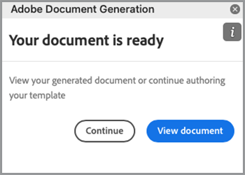

# Automatizzare i flussi di lavoro legali


In uno scenario ideale, i termini dell’accordo sono accettati senza alcuna modifica. Spesso, tuttavia, gli accordi richiedono una personalizzazione, che richiede quindi una revisione legale. Le revisioni legali creano costi significativi e rallentano il processo di fornitura dei termini dell&#39;accordo. L’utilizzo di modelli predefiniti che cambiano in base alla lingua approvata consente ai team legali di gestire e rispettare in modo più sicuro i termini degli accordi.

Questa esercitazione utilizza un accordo legale che varia da stato a stato. Per risolvere queste variazioni, viene creato un modello di accordo con sezioni condizionali, che vengono inclusi solo quando vengono soddisfatti determinati criteri. Il documento generato può essere un documento Word o PDF. È inoltre possibile apprendere alcuni modi per proteggere il documento utilizzando le API dei servizi Adobe PDF o Acrobat Sign.

## Ottieni credenziali

Inizia registrandoti per ottenere le credenziali gratuite di Adobe PDF Services:

1. Naviga [qui](https://documentcloud.adobe.com/dc-integration-creation-app-cdn/main.html) per registrare le credenziali.
1. Accedi con il tuo Adobe ID.
1. Imposta il nome della credenziale.

   

1. Scegliete una lingua per scaricare il codice di esempio (ad esempio Node.js).
1. Verifica di accettare **[!UICONTROL termini per sviluppatori]**.
1. Seleziona **[!UICONTROL Creare le credenziali]**.
Un file viene scaricato sul computer con un file ZIP contenente i file di esempio pdfservices-api-credentials.json e private.key per l&#39;autenticazione.

   

1. Seleziona **[!UICONTROL Scarica il componente aggiuntivo Microsoft Word]** oppure andare a [AppSource](https://appsource.microsoft.com/en-cy/product/office/WA200002654) da installare.

   >[!NOTE]
   >
   >L’installazione del componente aggiuntivo Word richiede l’autorizzazione per installare i componenti aggiuntivi in Microsoft 365. Se non disponi dell’autorizzazione, contatta l’amministratore di Microsoft 365.

## I tuoi dati

In questo scenario, le informazioni vengono passate per aiutare a generare il documento e per informare se alcune sezioni devono essere incluse o meno:

```
{
    "customer": {
        "name": "Home Services Company",
        "street": "123 Any Street",
        "city": "Anywhere",
        "state": "CA",
        "zip": "12345",
        "country":"USA",
        "signer": {
            "email": "johnnyechostone@gmail.com",
            "firstName": "John",
            "lastName": "Echostone"
        }
    },
    "company": {
        "name": "Projected Consultants",
        "signer": {
            "email": "maryburostone@gmail.com",
            "firstName": "Mary",
            "lastName": "Burostone"
        }
    },
    "conditions": {
        "includeGeneralTerms": true,
        "includeConsumerDiscloure": true
    }
}
```

Nei dati, ci sono informazioni sul cliente, il suo nome, chi firma, lo stato in cui si trova e così via. Inoltre, sono disponibili sezioni per informazioni sulla società che genera i flag agreement e condition utilizzati per includere determinate sezioni dell’accordo.

## Aggiungere tag di base al documento

Questo scenario utilizza un documento Termini e condizioni, che può essere scaricato [qui](https://github.com/benvanderberg/adobe-document-generation-samples/blob/main/Agreement/exercise/TermsAndConditions_Sample.docx?raw=true).


1. Apri il *TermsAndConditions.docx* documento di esempio in Microsoft Word.
1. Se la proprietà [Generazione documento](https://appsource.microsoft.com/en-cy/product/office/WA200002654) plugin installato, seleziona **[!UICONTROL Generazione documento]** nella barra multifunzione. Se la barra multifunzione non contiene la Generazione di documenti, seguire queste istruzioni.
1. Seleziona **[!UICONTROL Introduzione]**.
1. Copia i dati di esempio JSON scritti sopra nel campo Dati JSON.

   

Passa al *Tag Generazione documento* per inserire i tag nel documento.

## Inserire il nome della società

1. Selezionate il testo da sostituire. In questo scenario, sostituisci l’AZIENDA nella sezione di apertura del documento.
1. In *Tag Generazione documento*, cercare &quot;name&quot;.
1. In Azienda, scegli *nome*.

   

1. Seleziona **[!UICONTROL Inserisci testo]**.

In questo modo viene inserito un tag denominato `{{company.name}}` perché il tag si trova sotto quel percorso nel file JSON.

```
{
    "company": {
        "name": "Projected Consultants",
        ...
    }
    ...
}
```

Ripeti quindi questo passaggio nella sezione di apertura per il testo DEL CLIENTE. Ripeti **passaggi 1-4**, sostituendo CUSTOMER con &quot;name&quot; in customer. Il risultato deve essere `{{customer.name}}`, che indica che il testo proviene da sotto l&#39;oggetto cliente.

L’API di generazione dei documenti di Adobe consente inoltre di includere i tag all’interno delle intestazioni e dei piè di pagina e alla fine del percorso in cui devono essere inseriti i titoli per le firme.

Ripeti nuovamente questa procedura con **passaggi 1-4** per il testo AZIENDA e CLIENTE nel piè di pagina.


Finalmente, devi **ripetizione dei punti 1-4** per sostituire FIRST NAME e LAST NAME nella sezione Cliente della pagina di firma con i tag `{{customer.signer.firstName}}` e `{{customer.signer.lastName}}` rispettivamente. Non preoccupatevi se il tag è lungo e scorre fino alla riga successiva perché il tag viene sostituito quando il documento viene generato.

L’inizio del documento e il piè di pagina devono avere un aspetto simile al seguente:

* Sezione iniziale:


* Piè di pagina:


* Pagina Firma:


Ora che i tag vengono inseriti nel documento, puoi visualizzare in anteprima l’accordo generato.

## Anteprima del documento generato

Direttamente in Microsoft Word, potete visualizzare in anteprima il documento generato in base ai dati JSON di esempio.

1. In *Tag Generazione documento*, seleziona **[!UICONTROL Genera documento]**.
1. La prima volta che ti verrà richiesto di accedere con il tuo Adobe ID. Seleziona **[!UICONTROL Accedi]** e completa le richieste di accesso con le tue credenziali.

   

1. Seleziona **[!UICONTROL Visualizza documento]**.

   

1. Si apre una finestra del browser che consente di visualizzare in anteprima i risultati del documento.

   

## Aggiungere termini condizionali per ogni stato

In questa sezione successiva vengono impostate solo determinate sezioni da includere in base a determinati criteri di input. Nel documento di esempio, le sezioni 4 e 5 riguardano solo uno stato specifico. Per questo scenario, solo i termini specifici dello stato devono essere inclusi quando un cliente risiede in quello stato. Inoltre, la numerazione in Microsoft Word non deve includere tale sezione se viene rimossa. Utilizzate la funzione Condizionale dell&#39;API per la generazione di documenti per applicare i tag.


1. Nel documento, seleziona la sezione California Disclosure e tutti i sottocartoli.

   

1. In *[!UICONTROL Tag Generazione documento]*, seleziona **[!UICONTROL Avanzate]**.
1. Espandi **[!UICONTROL Contenuto condizionale]**.
1. In *[!UICONTROL Selezionare i record]* campo, ricerca e selezione **[!UICONTROL customer.state]**.
1. In *[!UICONTROL Seleziona, operatore]* , seleziona **=**.
1. In *[!UICONTROL Valore]* campo, testo *CA*.
1. Seleziona **[!UICONTROL Inserisci condizione]**.

La sezione è ora racchiusa in alcuni tag denominati tag di sezione condizionale. Quando avete aggiunto i tag, è possibile che il tag della sezione condizionale sia stato aggiunto come riga numerata. È possibile rimuoverlo mediante backspacing prima del tag, altrimenti gli elementi saranno numerati come se il tag non fosse presente quando il documento viene generato. La sezione condizionale termina con il parametro `` tag.


**Ripetere i punti da 1 a 7** per la *Washington Disclosure* , in sostituzione del *CA* valore con *WA* di rappresentare che la sezione è mostrata solo se lo stato del cliente è Washington.


## Prova con sezioni condizionali

Una volta inserite le sezioni condizionali, potete visualizzare l’anteprima del documento selezionando **Genera documento**.

Quando generate il documento, notate che la sezione inclusa è solo quella che soddisfa i criteri relativi ai dati. Nell&#39;esempio seguente, poiché lo stato era uguale a CA, è inclusa solo la sezione California.


Un&#39;altra modifica degna di nota è che la numerazione della sezione successiva, Utilizzo di servizi e software, ha il numero 5. Questo significa che quando la sezione di Washington viene omessa, la numerazione continua.


Per verificare se il modello si comporta correttamente quando il cliente si trova nello stato di Washington anziché in California, modificate i dati di esempio per il modello:

1. In *Tag Generazione documento*, seleziona **[!UICONTROL Modificare i dati di input]**.

   

1. Seleziona **[!UICONTROL Modifica]**.

1. Nei dati JSON, modifica *CA* a *WA*.

   

1. Seleziona **[!UICONTROL Genera tag]**.
1. Seleziona **[!UICONTROL Genera documento]** per rigenerare il documento.

Notate che il documento include solo la sezione dello stato di Washington.


## Aggiunta di una frase condizionale

Come le sezioni condizionali, puoi anche avere frasi specifiche che vengono incluse quando vengono soddisfatte determinate condizioni. Per questo esempio, la politica di rimpatrio è diversa tra la California e Washington.

1. Nella sezione 3.1, selezionare la prima frase &quot;Quando si acquista nello stato di Washington, si deve essere restituiti per posta entro 30 giorni dalla transazione originale per un rimborso completo&quot;.
1. In *[!UICONTROL Tag Generazione documento]*, seleziona **[!UICONTROL Avanzate]**.
1. Espandi **[!UICONTROL Contenuto condizionale]**.
1. Sotto *[!UICONTROL Tipo di contenuto]*, seleziona **[!UICONTROL Frase]**.
1. In *[!UICONTROL Selezionare i record]* campo, ricerca e selezione **[!UICONTROL customer.state]**.
1. In *[!UICONTROL Seleziona, operatore]* , seleziona **=**.
1. In *[!UICONTROL Valore]* campo, testo *CA*.
1. Seleziona **[!UICONTROL Inserisci condizione]**.

Mentre il nome del tag è lo stesso, la differenza principale tra Frase e Sezione è che la sezione non include nuove righe. Il tag condition-section e il tag -end-section devono trovarsi nello stesso paragrafo.


## Aggiungere tag per Acrobat Sign

Acrobat Sign consente di inviare accordi per la firma o incorporarli nell’esperienza Web per consentire a un utente di visualizzarli e firmarli facilmente. Adobe tag di generazione dei documenti in Microsoft Word consente di pre-assegnare facilmente i tag ai documenti prima di inviarli con Acrobat Sign, in modo che le firme vengano sempre posizionate nella posizione corretta. In questo scenario, due firmatari devono avere un luogo per firmare e una data per il documento.

1. Passa al punto in cui il cliente deve firmare.
1. Posiziona il cursore nel punto in cui deve andare la firma.

   

1. In *[!UICONTROL Tag Generazione documento]*, seleziona **[!UICONTROL Adobe Sign]**.
1. In *[!UICONTROL Specificare il numero di destinatari]* , impostare il numero di destinatari (questo esempio utilizza 2).
1. In *[!UICONTROL Destinatari]* , seleziona **[!UICONTROL Signer-1]**.
1. In *[!UICONTROL Campo]* testo, selezione **[!UICONTROL Firma]**.
1. Seleziona **[!UICONTROL Inserisci tag di testo Adobe Sign]**.

   

>[!NOTE]
>
>Se la proprietà **Inserisci tag di testo Adobe Sign** il pulsante sembra mancante, scorri verso il basso.

In questo modo viene inserito un campo firma in cui il primo firmatario deve firmare.


Quindi, inserire un campo dati per il firmatario che viene compilato automaticamente al momento della firma.

1. Spostate il cursore nel punto in cui inserire la data.

   

1. Imposta il tipo di campo su Data.
1. Seleziona **[!UICONTROL Inserisci tag di testo Adobe Sign]**.

Il tag Date inserito è piuttosto lungo: `{{Date 3_es_:signer1:date:format(mm/dd/yyyy):font(size=Auto)}}`. Il tag di testo Acrobat Sign deve rimanere sulla stessa riga, che è diversa dai tag Generazione documento. Il `:format()` e `font()` i parametri sono opzionali, pertanto per questo scenario è possibile ridurre il tag a `{{Date 3_es_:signer1:date}}`.

Ripetere i passaggi sopra il *Firma aziendale* sezione. In questo caso, è necessario modificare il campo Destinatari in **Signer-2**, altrimenti tutti i campi firma vengono assegnati alla stessa persona.

## Genera il tuo accordo

A questo punto è stato aggiunto un tag al documento e il documento è pronto per essere inviato. In questa sezione imparerai come generare un documento utilizzando gli esempi API di generazione del documento per Node.js. Questi esempi funzionano in qualsiasi lingua.

Apri il file pdfservices-node-sdk-samples-master scaricato durante la registrazione delle credenziali. Questi file includono i file pdfservices-api-credentials.json e private.key.

1. Apri il **[!UICONTROL Terminale]** per installare dipendenze utilizzando `npm install`.
1. Copia il campione *data.json* nella *risorse* cartella.
1. Copia il modello di Word creato nel *risorse* cartella.
1. Creare un nuovo file nella directory principale della cartella samples chiamata *generate-salesOrder.js*.

   ```
   const PDFServicesSdk = require('@adobe/pdfservices-node-sdk').
   const fs = require('fs');
   const path = require('path');
   
   var dataFileName = path.join('resources', '<INSERT JSON FILE');
   var outputFileName = path.join('output', 'salesOrder_'+Date.now()+".pdf");
   var inputFileName = path.join('resources', '<INSERT DOCX>');
   
   //Loads credentials from the file that you created.
   const credentials =  PDFServicesSdk.Credentials
      .serviceAccountCredentialsBuilder()
      .fromFile("pdfservices-api-credentials.json")
      .build();
   
   // Setup input data for the document merge process
   const jsonString = fs.readFileSync(dataFileName),
   jsonDataForMerge = JSON.parse(jsonString);
   
   // Create an ExecutionContext using credentials
   const executionContext = PDFServicesSdk.ExecutionContext.create(credentials);
   
   // Create a new DocumentMerge options instance
   const documentMerge = PDFServicesSdk.DocumentMerge,
   documentMergeOptions = documentMerge.options,
   options = new documentMergeOptions.DocumentMergeOptions(jsonDataForMerge, documentMergeOptions.OutputFormat.PDF);
   
   // Create a new operation instance using the options instance
   const documentMergeOperation = documentMerge.Operation.createNew(options)
   
   // Set operation input document template from a source file.
   const input = PDFServicesSdk.FileRef.createFromLocalFile(inputFileName);
   documentMergeOperation.setInput(input);
   
   // Execute the operation and Save the result to the specified location.
   documentMergeOperation.execute(executionContext)
   .then(result => result.saveAsFile(outputFileName))
   .catch(err => {
      if(err instanceof PDFServicesSdk.Error.ServiceApiError
         || err instanceof PDFServicesSdk.Error.ServiceUsageError) {
         console.log('Exception encountered while executing operation', err);
      } else {
         console.log('Exception encountered while executing operation', err);
      }
   });
   ```

1. Sostituisci `<JSON FILE>` con il nome del file JSON in /resources.
1. Sostituisci `<INSERT DOCX>` con il nome del file DOCX.
1. Per eseguire, utilizzare **[!UICONTROL Terminale]** per eseguire il nodo `generate-salesOrder.js`.

Il file di output si trova nella cartella /output con il documento generato correttamente.

Potete modificare il formato modificando la riga sottostante. Il formato DOCX è utile se il documento verrà inviato per consentire a un utente di modificarlo in Word o per la revisione del contratto.

PDF:

```
options = new documentMergeOptions.DocumentMergeOptions(jsonDataForMerge,
documentMergeOptions.OutputFormat.PDF);
```

Word:

```
options = new documentMergeOptions.DocumentMergeOptions(jsonDataForMerge, documentMergeOptions.OutputFormat.DOCX);
```

Dovete anche modificare il nome del file di output nel formato di output .pdf o .docx rispettivamente per PDF o DOCX:

```
var outputFileName = path.join('output', 'salesOrder_'+Date.now()+".docx");
```

## Inviare un accordo per la firma

[Adobe Acrobat Sign](https://www.adobe.com/it/sign.html) consente di inviare accordi a uno o più destinatari affinché possano visualizzare e firmare i documenti. Oltre a un’esperienza utente intuitiva per inviare un documento per la firma, sono disponibili API REST che consentono di acquisire Word, PDF, HTML e altri formati e inviarli per la firma.

L&#39;esempio seguente illustra come utilizzare la pagina di documentazione API REST per prendere il documento generato in precedenza e inviarlo per la firma. Per prima cosa, scopri come eseguirlo tramite l’interfaccia Web di Acrobat Sign e come utilizzarlo con l’API REST.

## Ottieni un account Acrobat Sign

Se non disponi di un account Acrobat Sign, registrati per un account sviluppatore e rivedi la documentazione [qui](https://developer.adobe.com/adobesign-api/)e selezionare **Registrazione account sviluppatore**. Ti viene richiesto di compilare un modulo e di ricevere un’e-mail di verifica. Una volta effettuata questa operazione, verrai indirizzato a un sito Web per impostare la password e l’account per accedere ad Acrobat Sign.

## Inviare un accordo dall’interfaccia Web

1. Seleziona **[!UICONTROL Invia]** dalla barra di navigazione.

   

1. In *Destinatari* specifica due indirizzi e-mail. È consigliabile utilizzare un indirizzo e-mail non associato al tuo account Acrobat Sign.

   

1. Impostare un **[!UICONTROL Nome accordo]** e **[!UICONTROL Messaggio]**.
1. Seleziona **[!UICONTROL Aggiungi file]** e caricare il file generato dal computer.
1. Seleziona **[!UICONTROL Anteprima e aggiungi campi firma]**.
1. Seleziona **[!UICONTROL Avanti]**.
1. Quando scorri verso il basso fino alla pagina della firma, puoi visualizzare i campi della firma inseriti in base ai tag.

   

1. Fai clic su **[!UICONTROL Invia]**.
1. Nel messaggio e-mail viene visualizzato un messaggio con un collegamento da visualizzare e firmare.

   

1. Seleziona **[!UICONTROL Revisione e firma]**.
1. Seleziona **[!UICONTROL Continua]** accettare i termini di utilizzo.
1. Seleziona **[!UICONTROL Inizio]** per passare al punto in cui devi firmare.

   

1. Seleziona **[!UICONTROL Fai clic qui per firmare]**.

   

1. Digitare la firma.

   

1. Seleziona **[!UICONTROL Applica]**.
1. Seleziona **[!UICONTROL Fai clic per firmare]**.

Un messaggio e-mail viene inviato al firmatario successivo. Ripeti i passaggi da 9 a 16 per visualizzare e firmare per il secondo firmatario.

Una volta completato l’accordo, una copia firmata dell’accordo viene inviata tramite e-mail a ciascuna delle parti. Inoltre, un accordo firmato può essere recuperato dall&#39;interfaccia Web di Acrobat Sign nel **Gestisci** pagina.


Scopri quindi come eseguire lo stesso scenario tramite la documentazione delle API REST.

## Ottieni credenziali

1. Passa a [Documentazione REST di Acrobat Sign](https://secure.na1.adobesign.com/public/docs/restapi/v6).
1. Espandi *transientDocuments* e la proprietà [POST /transientDocuments](https://benprojecteddemo.na1.adobesign.com/public/docs/restapi/v6#!/transientDocuments/createTransientDocument).
1. Seleziona **[!UICONTROL OAUTH ACCESS-TOKEN]**.

   

1. Verifica le autorizzazioni OAUTH per *agreement_write*, *agreement_sign*, *widget_write* e *library_write*.
1. Seleziona **[!UICONTROL Autorizza]**.
1. Ti verrà richiesto di accedere al tuo account Acrobat Sign tramite un menu a comparsa. Accedi all’utente con il nome utente e la password dell’amministratore.
1. Viene richiesto di consentire l’accesso alla documentazione REST. Seleziona **[!UICONTROL Consenti accesso]**.

Un token del portatore viene quindi aggiunto al **Autorizzazione** campo.

Per ulteriori informazioni su come creare un token di autorizzazione per Acrobat Sign, puoi seguire il passaggio descritto [qui](https://opensource.adobe.com/acrobat-sign/developer_guide/helloworld.html).

## Caricare un documento transitorio

Poiché il token di autorizzazione viene aggiunto dai passaggi precedenti, è necessario caricare un documento per effettuare la chiamata API:

1. In *File* , carica il documento PDF generato nei passaggi precedenti.

   

1. Seleziona **[!UICONTROL Provalo!]**.
1. In **[!UICONTROL Corpo Di Risposta]**, copiare il *transientDocumentId* valore.

Il *transientDocumentId* viene utilizzato per fare riferimento a un documento temporaneamente memorizzato in Acrobat Sign in modo che possa essere utilizzato nelle successive chiamate API.

## Inviare per la firma

Una volta caricato un documento, devi inviare l’accordo per la firma.

1. Espandi la sezione accordo e le sezioni POST accordo.
1. Nel *AgreementInfo* compilalo con il seguente JSON:

   ```
   {
   "fileInfos": [
      {
         "transientDocumentId": "3AAABLblqZhAJeoswpyslef8_toTGT1WgBLk3TlhfJXy_uSLlKyre2hjF0-J1meBDn0PlShk0uQy6JghlqEoqXNnskq7YawteF6QWtHefP9wN2CW_Xbt0O9kq1tkpznG0a5-mEm4bYAV1FGOnD1mt_ooYdzKxm7KzTB11DLX2-81Zbe2Z1suy7oXiWNR3VSb-zMfIb5D4oIxF8BiNfN0q08RwT108FcB1bx4lekkATGld3nRbf8ApVPhB72VNrAIF0F1rAFBWTtfgvBKZaxrYSyZq73R_neMdvZEtxWTk5fii_bLVe7VdNZMcO55sofH61eQC_QIIsoYswZP4rw6dsTa68ZRgKUNs"
      }
   ],
   "name": "Terms and Conditions",
   "participantSetsInfo": [
      {
         "memberInfos": [
         {
            "email": "adobesigndemo+customer@outlook.com"
         }
         ],
         "order": 1,
         "role": "SIGNER"
      },
      {
         "memberInfos": [
            {
               "email": "adobesigndemo+company@outlook.com"
            }
         ],
         "order": 1,
         "role": "SIGNER"
         }
   ],
   "signatureType": "ESIGN",
   "state": "IN_PROCESS"
   }
   ```

1. Seleziona **[!UICONTROL Provalo!]**.

**API POST agreements** restituisce un ID per l’accordo. Per ottenere un modello per lo schema del modello JSON, selezionate **Schema del modello minimo**. Un elenco completo di parametri è disponibile nella **Schema modello completo** sezione.

## Verifica dello stato dell’accordo

Una volta ottenuto l’ID dell’accordo, puoi inviare lo stato dell’accordo.

1. Espandi **[!UICONTROL GET /agreements/{agreementId}]**.
1. Poiché potrebbe essere necessario un ambito OAUTH aggiuntivo, selezionate **[!UICONTROL OAUTH-ACCESS-TOKEN]** ancora.
1. Copia il valore agreementId dalla risposta precedente alla chiamata API nel campo agreementId.
1. Seleziona **[!UICONTROL Provalo!]**.

Ora disponi di informazioni sull&#39;accordo.

```
{
    "id": "CBJCHBCAABAAc6LyP4SVuKXP_pNstzIzyripanRdz4IB",
    "name": "Terms and Conditions",
    "groupId": "CBJCHBCAABAAoyMb1yIgczAGhBuJeHf99mglPtM7ElEu",
    "type": "AGREEMENT",
    "participantSetsInfo": [
      {
        "id": "CBJCHBCAABAAzZE-IcHHkt05-AVbxas4Jz7DUl3oEBO6",
        "memberInfos": [
          {
            "email": "adobesigndemo+customer@outlook.com",
            "id": "CBJCHBCAABAAyWgMMReqbxUFM7ctI5xz16c2kOmEy-IQ",
            "securityOption": {
              "authenticationMethod": "NONE"
            }
          }
        ],
        "role": "SIGNER",
        "order": 1
      },
      {
        "id": "CBJCHBCAABAAaRHz3gY2W0w5n_6pj1GMMuZAfhBihc1j",
        "memberInfos": [
          {
            "email": "adobesigndemo+company@outlook.com",
            "id": "CBJCHBCAABAAOZQwjPwJXFiX8YDKPYtzMpftsmxYrIo9",
            "securityOption": {
              "authenticationMethod": "NONE"
            }
          }
        ],
        "role": "SIGNER",
        "order": 1
      }
    ],
    "senderEmail": "adobesigndemo+new@outlook.com",
    "createdDate": "2022-03-22T02:59:36Z",
    "lastEventDate": "2022-03-22T02:59:41Z",
    "signatureType": "ESIGN",
    "locale": "en_US",
    "status": "OUT_FOR_SIGNATURE",
    "documentVisibilityEnabled": true,
    "hasFormFieldData": false,
    "hasSignerIdentityReport": false,
    "documentRetentionApplied": false
  }
```

Il metodo più efficiente per ricevere notifiche quando gli aggiornamenti vengono modificati è tramite i webhook, che potete scoprire in dettaglio [qui](https://opensource.adobe.com/acrobat-sign/developer_guide/webhookapis.html.

## Archiviare un documento firmato

Una volta firmato, il documento può essere recuperato utilizzando il file GET /agreements/combinedDocument.

1. Espandi **[!UICONTROL GET /agreements/{agreementId}/combinedDocument]**.
1. Set **[!UICONTROL agreementId]** alla proprietà *agreementId* fornito dalla precedente chiamata API.
1. Seleziona **[!UICONTROL Provalo!]**.

È possibile impostare parametri aggiuntivi per allegare un report di audit o documenti di supporto utilizzando i parametri attachSupportingDocuments e attachAuditReport.

Nel **Corpo Di Risposta**, può quindi essere scaricato sul computer e archiviato dove preferisci.

## Altre opzioni

Oltre a generare un documento e inviarlo per la firma, sono disponibili ulteriori azioni.

Ad esempio, se il documento non contiene una firma, l’API dei servizi Adobe PDF offre molti modi per trasformare i documenti dopo la generazione dell’accordo, ad esempio:

* Protezione dei documenti tramite password
* Comprimi PDF se sono presenti immagini di grandi dimensioni
* Per ulteriori informazioni su altre azioni disponibili, consultate gli script nella cartella /src nei file di esempio per l’API dei servizi Adobe PDF. Per ulteriori informazioni, consultate la documentazione delle diverse azioni che possono essere utilizzate.

Inoltre, Acrobat Sign offre diverse funzioni aggiuntive come:

* Incorporare l’esperienza di firma in un’applicazione
* Aggiungere metodi di verifica dell’identità per i firmatari
* Configurare le impostazioni di notifica e-mail
* Scaricare singoli documenti separati come parte di un accordo

## Apprendimento ulteriore

Sei interessato a saperne di più? Dai un&#39;occhiata ad alcuni altri modi di usare [!DNL Adobe Acrobat Services]:

* Scopri di più da [documentazione](https://developer.adobe.com/document-services/docs/overview/)
* Altre esercitazioni su Adobe Experience League
* Utilizzare gli script di esempio nella cartella /src per vedere come utilizzare PDF
* Segui [Blog tecnico Adobe](https://medium.com/adobetech/tagged/adobe-document-cloud) per suggerimenti e trucchi più recenti
* Abbonati a [Clip carta (streaming dal vivo mensile)](https://www.youtube.com/playlist?list=PLcVEYUqU7VRe4sT-Bf8flvRz1XXUyGmtF) informazioni sull&#39;automazione mediante [!DNL Adobe Acrobat Services].
