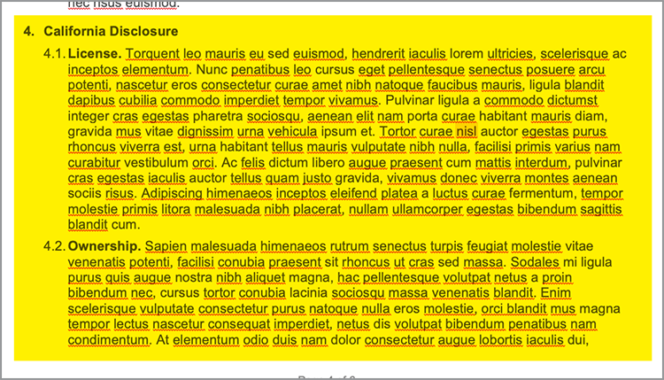

# Automatizzare i flussi di lavoro legali


In uno scenario ideale, i termini dell’accordo vengono accettati senza alcuna modifica. Spesso, tuttavia, gli accordi devono essere personalizzati, per essere poi sottoposti a revisione legale. Le revisioni legali creano costi significativi e rallentano il processo di consegna dei termini degli accordi. L’utilizzo di modelli predefiniti che cambiano in base al linguaggio approvato aiuta i team legali a gestire ed eseguire in modo più sicuro i termini degli accordi.

Questo tutorial utilizza un accordo legale che varia da stato a stato. Per risolvere queste variazioni, viene creato un modello di accordo con sezioni condizionali, che vengono incluse solo quando vengono soddisfatti determinati criteri. Il documento generato può essere un documento Word o PDF. È inoltre possibile apprendere alcuni dei modi per proteggere il documento utilizzando l’API di Adobe PDF Services o Acrobat Sign.

## Ottieni credenziali

Per iniziare, registra le credenziali gratuite dei servizi Adobe PDF:

1. Naviga [qui](https://documentcloud.adobe.com/dc-integration-creation-app-cdn/main.html) per registrare le tue credenziali.
1. Effettua l’accesso utilizzando il tuo Adobe ID.
1. Impostare il nome delle credenziali.

   

1. Scegli una lingua per scaricare il codice di esempio (ad esempio Node.js).
1. Verifica di accettare **[!UICONTROL condizioni per gli sviluppatori]**.
1. Selezionare **[!UICONTROL Crea credenziali]**.
Nel computer viene scaricato un file con un file ZIP contenente i file di esempio pdfservices-api-credentials.json e private.key per l&#39;autenticazione.

   

1. Seleziona **[!UICONTROL Scarica il componente aggiuntivo Microsoft Word]** o vai a [AppSource](https://appsource.microsoft.com/en-cy/product/office/WA200002654) per installarlo.

   >[!NOTE]
   >
   >L’installazione del componente aggiuntivo Word richiede l’autorizzazione per installare i componenti aggiuntivi in Microsoft 365. Se non disponi delle autorizzazioni necessarie, contatta il tuo amministratore Microsoft 365.

## I tuoi dati

In questo scenario, vengono passate informazioni per facilitare la generazione del documento e per informare se determinate sezioni devono essere incluse o meno:

```
{
    "customer": {
        "name": "Home Services Company",
        "street": "123 Any Street",
        "city": "Anywhere",
        "state": "CA",
        "zip": "12345",
        "country":"USA",
        "signer": {
            "email": "johnnyechostone@gmail.com",
            "firstName": "John",
            "lastName": "Echostone"
        }
    },
    "company": {
        "name": "Projected Consultants",
        "signer": {
            "email": "maryburostone@gmail.com",
            "firstName": "Mary",
            "lastName": "Burostone"
        }
    },
    "conditions": {
        "includeGeneralTerms": true,
        "includeConsumerDiscloure": true
    }
}
```

Nei dati sono presenti informazioni sul cliente, sul suo nome, su chi firma, sullo stato in cui si trova e così via. Inoltre, sono disponibili sezioni per le informazioni sulla società che genera l’accordo e flag di condizioni utilizzati per includere determinate sezioni dell’accordo.

## Aggiungere tag di base al documento

In questo scenario viene utilizzato un documento Termini e condizioni che può essere scaricato [qui](https://github.com/benvanderberg/adobe-document-generation-samples/blob/main/Agreement/exercise/TermsAndConditions_Sample.docx?raw=true).


1. Apri il documento di esempio *TermsAndConditions.docx* in Microsoft Word.
1. Se è installato il plug-in [Document Generation](https://appsource.microsoft.com/en-cy/product/office/WA200002654), selezionare **[!UICONTROL Document Generation]** nella barra multifunzione. Se sulla barra multifunzione non è presente Document Generation, seguire le istruzioni riportate di seguito.
1. Seleziona **[!UICONTROL Introduzione]**.
1. Copia i dati di esempio JSON scritti in precedenza nel campo Dati JSON.

   

Passate al pannello *Document Generation Tagger* per inserire i tag nel documento.

## Inserire il nome dell&#39;azienda

1. Selezionate il testo da sostituire. In questo scenario, si sostituisce la società nella sezione di apertura del documento.
1. In *Document Generation Tagger*, cercate &quot;name&quot;.
1. In Azienda, scegli *nome*.

   

1. Selezionare **[!UICONTROL Inserisci testo]**.

In questo modo viene inserito un tag denominato `{{company.name}}` perché il tag si trova sotto quel percorso nel file JSON.

```
{
    "company": {
        "name": "Projected Consultants",
        ...
    }
    ...
}
```

Ripetere quindi questo passaggio nella sezione di apertura per il testo CUSTOMER. Ripeti **i passaggi 1-4**, sostituendo CUSTOMER con &quot;name&quot; in Customer. L&#39;output deve essere `{{customer.name}}`, a indicare che il testo proviene da sotto l&#39;oggetto cliente.

L’API di Document Generation di Adobe consente inoltre di includere i tag nelle intestazioni e nei piè di pagina e alla fine della pagina, dove devono essere inseriti i titoli delle firme.

Ripetere nuovamente questa procedura con **passaggi 1-4** per il testo AZIENDA e CLIENTE nel piè di pagina.


Infine, è necessario **ripetere i passaggi 1-4** per sostituire FIRST NAME e LAST NAME nella sezione Customer della pagina della firma rispettivamente con i tag per `{{customer.signer.firstName}}` e `{{customer.signer.lastName}}`. Non preoccuparti se il tag è lungo e torna alla riga successiva perché il tag viene sostituito quando viene generato il documento.

L’inizio del documento e il piè di pagina dovrebbero essere simili al seguente:

* Sezione iniziale:


* Piè di pagina:


* Pagina Firma:


Ora che i tag sono stati inseriti nel documento, puoi visualizzare in anteprima l’accordo generato.

## Visualizzare in anteprima il documento generato

Direttamente in Microsoft Word, puoi visualizzare in anteprima il documento generato in base ai dati JSON di esempio.

1. In *Document Generation Tagger*, seleziona **[!UICONTROL Genera documento]**.
1. La prima volta che ti viene richiesto di accedere con il tuo Adobe ID. Seleziona **[!UICONTROL Accedi]** e completa le richieste di accesso con le tue credenziali.

   

1. Selezionare **[!UICONTROL Visualizza documento]**.

   

1. Viene visualizzata una finestra del browser che consente di visualizzare in anteprima i risultati del documento.

   

## Aggiungere termini condizionali per ciascuno stato

In questa sezione seguente vengono impostate solo determinate sezioni da includere in base a determinati criteri dei dati di input. Nel documento di esempio, le sezioni 4 e 5 riguardano solo uno stato specifico. Per questo scenario, quando un cliente risiede in quello stato, devono essere incluse solo le condizioni specifiche dello stato. Inoltre, la numerazione in Microsoft Word non deve includere quella sezione se viene rimossa. Utilizza la funzione Condizionale del contenuto dell’API di Document Generation per aggiungere tag.




1. Nel documento, selezionate la sezione Informativa sulla California e tutti i punti secondari.

   

1. In *[!UICONTROL Document Generation Tagger]*, seleziona **[!UICONTROL Advanced]**.
1. Espandere **[!UICONTROL Contenuto condizionale]**.
1. Nel campo *[!UICONTROL Seleziona record]*, cerca e seleziona **[!UICONTROL customer.state]**.
1. Nel campo *[!UICONTROL Seleziona operatore]*, selezionare **=**.
1. Nel campo *[!UICONTROL Valore]*, digitare *CA*.
1. Selezionare **[!UICONTROL Inserisci condizione]**.

La sezione è ora completata con alcuni tag denominati tag di sezione condizionale. Quando li avete aggiunti, è possibile che il tag di sezione condizionale sia stato aggiunto come riga numerata. Puoi rimuoverla spostando la barra rovesciata prima del tag, altrimenti numererà gli elementi come se il tag non fosse presente quando viene generato il documento. La sezione condizionale termina con il tag ``.


**Ripetere i passaggi 1-7** per la sezione *Informativa di Washington*, sostituendo il valore *CA* con *WA* per indicare che la sezione viene visualizzata solo se lo stato del cliente è Washington.


## Test con sezioni condizionali

Una volta posizionate le sezioni condizionali, potete visualizzare in anteprima il documento selezionando **Genera documento**.

Quando si genera il documento, si noti che la sezione inclusa è solo quella che soddisfa i criteri relativi ai dati. Nell&#39;esempio seguente, poiché lo stato è uguale a CA, viene inclusa solo la sezione California.


Un’altra modifica rilevante è che la numerazione della sezione successiva, Uso dei Servizi e del Software, ha il numero 5. Ciò significa che quando la sezione Washington viene omessa, la numerazione continua.


Per verificare se il modello funziona correttamente quando il cliente si trova nello stato di Washington anziché in California, modificare i dati di esempio per il modello:

1. In *Document Generation Tagger*, seleziona **[!UICONTROL Modifica dati di input]**.

   

1. Seleziona **[!UICONTROL Modifica]**.

1. Nei dati JSON, modifica *CA* in *WA*.

   

1. Selezionare **[!UICONTROL Genera tag]**.
1. Selezionare **[!UICONTROL Genera documento]** per rigenerare il documento.

Notate che il documento include solo la sezione Stato di Washington.


## Aggiunta di una frase condizionale

Come le sezioni condizionali, potete anche avere frasi specifiche che vengono incluse quando vengono soddisfatte determinate condizioni. In questo esempio, la politica di restituzione è diversa tra California e Washington.

1. Nella sezione 3.1, selezionare la prima frase &quot;Quando si acquista nello stato di Washington, uno deve essere restituito via MAIL entro 30 giorni dalla transazione originale per un rimborso completo.&quot;.
1. In *[!UICONTROL Document Generation Tagger]*, seleziona **[!UICONTROL Advanced]**.
1. Espandere **[!UICONTROL Contenuto condizionale]**.
1. In *[!UICONTROL Tipo di contenuto]*, selezionare **[!UICONTROL Frase]**.
1. Nel campo *[!UICONTROL Seleziona record]*, cerca e seleziona **[!UICONTROL customer.state]**.
1. Nel campo *[!UICONTROL Seleziona operatore]*, selezionare **=**.
1. Nel campo *[!UICONTROL Valore]*, digitare *CA*.
1. Selezionare **[!UICONTROL Inserisci condizione]**.

Anche se il nome del tag è lo stesso, la differenza principale tra Frase e Sezione è che una frase ha la sezione che non include nuove righe. Il tag di sezione della condizione e il tag di sezione finale devono trovarsi nello stesso paragrafo.


## Aggiungere tag per Acrobat Sign

Acrobat Sign consente di inviare accordi da firmare o incorporarli nell’esperienza web in modo che altri utenti possano visualizzarli e firmarli facilmente. Adobe Document Generation Tagger in Microsoft Word consente di applicare facilmente i pre-tag ai documenti prima che vengano inviati con Acrobat Sign, in modo da posizionare sempre le firme nella posizione corretta. In questo scenario, due firmatari devono disporre di un luogo in cui firmare e datare il documento.

1. Seleziona il punto che il cliente deve firmare.
1. Posiziona il cursore nel punto in cui la firma deve andare.

   

1. In *[!UICONTROL Document Generation Tagger]*, seleziona **[!UICONTROL Adobe Sign]**.
1. Nel campo *[!UICONTROL Specificare il numero di destinatari]*, impostare il numero di destinatari (in questo esempio viene utilizzato 2).
1. Nel campo *[!UICONTROL Destinatari]*, seleziona **[!UICONTROL Firmatario-1]**.
1. Nel tipo *[!UICONTROL Campo]*, selezionare **[!UICONTROL Firma]**.
1. Seleziona **[!UICONTROL Inserisci tag di testo Adobe Sign]**.

   

>[!NOTE]
>
>Se il pulsante **Inserisci tag di testo Adobe Sign** risulta mancante, scorri verso il basso.

In questo modo viene inserito un campo firma che deve essere firmato dal primo firmatario.


Quindi, inserisci un campo dati per il firmatario che verrà compilato automaticamente quando firma.

1. Spostare il cursore nel punto in cui deve essere posizionata la data.

   

1. Imposta Tipo campo su Data.
1. Seleziona **[!UICONTROL Inserisci tag di testo Adobe Sign]**.

Il tag Date posizionato è piuttosto lungo: `{{Date 3_es_:signer1:date:format(mm/dd/yyyy):font(size=Auto)}}`. Il tag di testo di Acrobat Sign deve rimanere sulla stessa riga, il che è diverso dai tag di Document Generation. I parametri `:format()` e `font()` sono facoltativi, pertanto per questo scenario è possibile ridurre il tag a `{{Date 3_es_:signer1:date}}`.

Ripeti i passaggi precedenti la sezione *Firma aziendale*. In questo caso, è necessario modificare il campo Destinatari in **Firmatario-2**, altrimenti tutti i campi firma vengono assegnati alla stessa persona.

## Generare l’accordo

Ora hai aggiunto i tag al documento e sei pronto per iniziare. In questa sezione successiva, scoprite come generare un documento utilizzando gli esempi di API di Document Generation per Node.js. Questi esempi funzionano in qualsiasi lingua.

Aprire il file master pdfservices-node-sdk-samples scaricato durante la registrazione delle credenziali. Questi file includono i file pdfservices-api-credentials.json e private.key.

1. Apri il **[!UICONTROL Terminale]** per installare le dipendenze con `npm install`.
1. Copia il file *data.json* di esempio nella cartella *resources*.
1. Copiare il modello Word creato nella cartella *resources*.
1. Creare un nuovo file nella directory principale della cartella samples denominata *generate-salesOrder.js*.

   ```
   const PDFServicesSdk = require('@adobe/pdfservices-node-sdk').
   const fs = require('fs');
   const path = require('path');
   
   var dataFileName = path.join('resources', '<INSERT JSON FILE');
   var outputFileName = path.join('output', 'salesOrder_'+Date.now()+".pdf");
   var inputFileName = path.join('resources', '<INSERT DOCX>');
   
   //Loads credentials from the file that you created.
   const credentials =  PDFServicesSdk.Credentials
      .serviceAccountCredentialsBuilder()
      .fromFile("pdfservices-api-credentials.json")
      .build();
   
   // Setup input data for the document merge process
   const jsonString = fs.readFileSync(dataFileName),
   jsonDataForMerge = JSON.parse(jsonString);
   
   // Create an ExecutionContext using credentials
   const executionContext = PDFServicesSdk.ExecutionContext.create(credentials);
   
   // Create a new DocumentMerge options instance
   const documentMerge = PDFServicesSdk.DocumentMerge,
   documentMergeOptions = documentMerge.options,
   options = new documentMergeOptions.DocumentMergeOptions(jsonDataForMerge, documentMergeOptions.OutputFormat.PDF);
   
   // Create a new operation instance using the options instance
   const documentMergeOperation = documentMerge.Operation.createNew(options)
   
   // Set operation input document template from a source file.
   const input = PDFServicesSdk.FileRef.createFromLocalFile(inputFileName);
   documentMergeOperation.setInput(input);
   
   // Execute the operation and Save the result to the specified location.
   documentMergeOperation.execute(executionContext)
   .then(result => result.saveAsFile(outputFileName))
   .catch(err => {
      if(err instanceof PDFServicesSdk.Error.ServiceApiError
         || err instanceof PDFServicesSdk.Error.ServiceUsageError) {
         console.log('Exception encountered while executing operation', err);
      } else {
         console.log('Exception encountered while executing operation', err);
      }
   });
   ```

1. Sostituisci `<JSON FILE>` con il nome del file JSON in /resources.
1. Sostituire `<INSERT DOCX>` con il nome del file DOCX.
1. Per eseguire, utilizzare **[!UICONTROL Terminale]** per eseguire il nodo `generate-salesOrder.js`.

Il file di output si trova nella cartella /output con il documento generato correttamente.

È possibile modificare il formato cambiando la riga seguente. Il formato DOCX è utile se il documento verrà inviato per la modifica in Word o per la revisione del contratto.

PDF:

```
options = new documentMergeOptions.DocumentMergeOptions(jsonDataForMerge,
documentMergeOptions.OutputFormat.PDF);
```

Parola:

```
options = new documentMergeOptions.DocumentMergeOptions(jsonDataForMerge, documentMergeOptions.OutputFormat.DOCX);
```

È inoltre necessario modificare il nome del file di output in formato .pdf o .docx rispettivamente per il formato di output PDF o DOCX:

```
var outputFileName = path.join('output', 'salesOrder_'+Date.now()+".docx");
```

## Inviare un accordo per la firma

[Adobe Acrobat Sign](https://www.adobe.com/acrobat/business/sign.html) consente di inviare gli accordi a uno o più destinatari che potranno così visualizzare e firmare i documenti. Oltre a un’esperienza utente di facile utilizzo per inviare un documento per la firma, sono disponibili API REST che consentono di accettare Word, PDF, HTML e altri formati e di inviarli per la firma.

L’esempio seguente spiega come utilizzare la pagina della documentazione API REST per acquisire il documento generato in precedenza e inviarlo per la firma. Scopri innanzitutto come farlo tramite l’interfaccia web di Acrobat Sign e quindi come farlo con l’API REST.

## Ottieni un account Acrobat Sign

Se non disponi di un account Acrobat Sign, registrati per un account sviluppatore e consulta la documentazione [qui](https://developer.adobe.com/adobesign-api/), quindi seleziona **Registrazione account sviluppatore**. Ti verrà richiesto di compilare un modulo e di ricevere un’e-mail di verifica. Una volta effettuata questa operazione, verrai reindirizzato a un sito Web per impostare la password e l’account, da cui potrai quindi accedere ad Acrobat Sign.

## Inviare un accordo da un’interfaccia web

1. Seleziona **[!UICONTROL Invia]** dalla barra di navigazione.

   

1. Nel campo *Destinatari*, specifica due indirizzi e-mail. È buona norma utilizzare un indirizzo e-mail non associato al tuo account Acrobat Sign.

   

1. Imposta un **[!UICONTROL Nome accordo]** e un **[!UICONTROL Messaggio]**.
1. Seleziona **[!UICONTROL Aggiungi file]** e carica il file generato dal computer.
1. Seleziona **[!UICONTROL Anteprima e aggiungi campi firma]**.
1. Seleziona **[!UICONTROL Avanti]**.
1. Scorrendo verso il basso fino alla pagina della firma, puoi visualizzare i campi firma inseriti in base ai tag.

   

1. Fai clic su **[!UICONTROL Invia]**.
1. Nell’e-mail viene visualizzato un messaggio con un collegamento per visualizzare e firmare.

   

1. Seleziona **[!UICONTROL Rivedi e firma]**.
1. Selezionare **[!UICONTROL Continua]** per accettare le condizioni d&#39;uso.
1. Seleziona **[!UICONTROL Inizia]** per passare al punto in cui devi firmare.

   

1. Seleziona **[!UICONTROL Fai clic qui per firmare]**.

   

1. Digita la firma.

   

1. Selezionare **[!UICONTROL Applica]**.
1. Seleziona **[!UICONTROL Fai clic per firmare]**.

Viene inviato un messaggio e-mail al firmatario successivo. Ripeti i passaggi 9-16 per visualizzare e firmare per il secondo firmatario.

Una volta completato l’accordo, una copia firmata dell’accordo viene inviata tramite e-mail a ciascuna delle parti. Inoltre, è possibile recuperare un accordo firmato dall’interfaccia Web di Acrobat Sign nella pagina **Gestisci**.


Scopri quindi come eseguire lo stesso scenario tramite la documentazione delle API REST.

## Ottieni credenziali

1. Passa alla [documentazione REST di Acrobat Sign](https://secure.na1.adobesign.com/public/docs/restapi/v6).
1. Espandere *transientDocuments* e [POST /transientDocuments](https://benprojecteddemo.na1.adobesign.com/public/docs/restapi/v6#!/transientDocuments/createTransientDocument).
1. Seleziona **[!UICONTROL OAUTH ACCESS-TOKEN]**.

   

1. Controlla le autorizzazioni OAUTH per *agreement_write*, *agreement_sign*, *widget_write* e *library_write*.
1. Seleziona **[!UICONTROL Autorizza]**.
1. Viene richiesto tramite un pop-up di accedere con il tuo account Acrobat Sign. Accedi utente il nome utente e la password dell&#39;amministratore.
1. Viene richiesto di consentire l’accesso alla documentazione REST. Seleziona **[!UICONTROL Consenti accesso]**.

Viene quindi aggiunto un token di connessione al campo **Autorizzazione**.

Per ulteriori informazioni sulla creazione di un token di autorizzazione per Acrobat Sign, segui il passaggio descritto [qui](https://opensource.adobe.com/acrobat-sign/developer_guide/helloworld.html).

## Caricare un documento transitorio

Poiché il token di autorizzazione viene aggiunto dai passaggi precedenti, è necessario caricare un documento per effettuare la chiamata API:

1. Nel campo *File*, carica il documento PDF generato nei passaggi precedenti.

   

1. Seleziona **[!UICONTROL Prova!]**.
1. In **[!UICONTROL corpo della risposta]**, copia il valore *transientDocumentId*.

*transientDocumentId* viene utilizzato per fare riferimento a un documento archiviato temporaneamente in Acrobat Sign in modo che possa essere utilizzato nelle chiamate API successive.

## Inviare per la firma

Una volta caricato un documento, è necessario inviare l’accordo per la firma.

1. Espandi la sezione dell’accordo e le sezioni dell’accordo POST.
1. Nel campo *AgreementInfo*, inserisci il seguente codice JSON:

   ```
   {
   "fileInfos": [
      {
         "transientDocumentId": "3AAABLblqZhAJeoswpyslef8_toTGT1WgBLk3TlhfJXy_uSLlKyre2hjF0-J1meBDn0PlShk0uQy6JghlqEoqXNnskq7YawteF6QWtHefP9wN2CW_Xbt0O9kq1tkpznG0a5-mEm4bYAV1FGOnD1mt_ooYdzKxm7KzTB11DLX2-81Zbe2Z1suy7oXiWNR3VSb-zMfIb5D4oIxF8BiNfN0q08RwT108FcB1bx4lekkATGld3nRbf8ApVPhB72VNrAIF0F1rAFBWTtfgvBKZaxrYSyZq73R_neMdvZEtxWTk5fii_bLVe7VdNZMcO55sofH61eQC_QIIsoYswZP4rw6dsTa68ZRgKUNs"
      }
   ],
   "name": "Terms and Conditions",
   "participantSetsInfo": [
      {
         "memberInfos": [
         {
            "email": "adobesigndemo+customer@outlook.com"
         }
         ],
         "order": 1,
         "role": "SIGNER"
      },
      {
         "memberInfos": [
            {
               "email": "adobesigndemo+company@outlook.com"
            }
         ],
         "order": 1,
         "role": "SIGNER"
         }
   ],
   "signatureType": "ESIGN",
   "state": "IN_PROCESS"
   }
   ```

1. Seleziona **[!UICONTROL Prova!]**.

L’API **POST agreements** restituisce un ID per l’accordo. Per ottenere un modello per lo schema del modello JSON, selezionare **Schema modello minimo**. Nella sezione **Schema modello completo** è disponibile un elenco completo dei parametri.

## Verifica lo stato dell’accordo

Una volta ottenuto l’ID di un accordo, puoi inviare lo stato dell’accordo.

1. Espandere **[!UICONTROL GET /agreements/{agreementId}]**.
1. Poiché potrebbe essere necessario un ambito OAUTH aggiuntivo, seleziona nuovamente **[!UICONTROL OAUTH-ACCESS-TOKEN]**.
1. Copia l’agreementId dalla risposta alla chiamata API precedente nel campo agreementId.
1. Seleziona **[!UICONTROL Prova!]**.

Ora hai informazioni su quell’accordo.

```
{
    "id": "CBJCHBCAABAAc6LyP4SVuKXP_pNstzIzyripanRdz4IB",
    "name": "Terms and Conditions",
    "groupId": "CBJCHBCAABAAoyMb1yIgczAGhBuJeHf99mglPtM7ElEu",
    "type": "AGREEMENT",
    "participantSetsInfo": [
      {
        "id": "CBJCHBCAABAAzZE-IcHHkt05-AVbxas4Jz7DUl3oEBO6",
        "memberInfos": [
          {
            "email": "adobesigndemo+customer@outlook.com",
            "id": "CBJCHBCAABAAyWgMMReqbxUFM7ctI5xz16c2kOmEy-IQ",
            "securityOption": {
              "authenticationMethod": "NONE"
            }
          }
        ],
        "role": "SIGNER",
        "order": 1
      },
      {
        "id": "CBJCHBCAABAAaRHz3gY2W0w5n_6pj1GMMuZAfhBihc1j",
        "memberInfos": [
          {
            "email": "adobesigndemo+company@outlook.com",
            "id": "CBJCHBCAABAAOZQwjPwJXFiX8YDKPYtzMpftsmxYrIo9",
            "securityOption": {
              "authenticationMethod": "NONE"
            }
          }
        ],
        "role": "SIGNER",
        "order": 1
      }
    ],
    "senderEmail": "adobesigndemo+new@outlook.com",
    "createdDate": "2022-03-22T02:59:36Z",
    "lastEventDate": "2022-03-22T02:59:41Z",
    "signatureType": "ESIGN",
    "locale": "en_US",
    "status": "OUT_FOR_SIGNATURE",
    "documentVisibilityEnabled": true,
    "hasFormFieldData": false,
    "hasSignerIdentityReport": false,
    "documentRetentionApplied": false
  }
```

Il metodo più efficiente per ricevere notifiche quando gli aggiornamenti vengono modificati è tramite i webhook, che puoi scoprire di più su [qui](https://opensource.adobe.com/acrobat-sign/developer_guide/webhookapis.html).

## Memorizzare un documento firmato

Una volta firmato, il documento può essere recuperato utilizzando il file GET /agreements/combinedDocument.

1. Espandere **[!UICONTROL GET /agreements/{agreementId}/combinedDocument]**.
1. Imposta **[!UICONTROL agreementId]** su *agreementId* fornito dalla chiamata API precedente.
1. Seleziona **[!UICONTROL Prova!]**.

È possibile impostare parametri aggiuntivi per allegare un report di audit o documenti di supporto utilizzando i parametri attachSupportingDocuments e attachAuditReport.

Nel **corpo della risposta**, può quindi essere scaricato nel computer e archiviato dove preferisci.

## Altre opzioni

Oltre a generare un documento e inviarlo per la firma, sono disponibili azioni aggiuntive.

Ad esempio, se il documento non ha una firma, l’API di Adobe PDF Services offre numerosi modi per trasformare i documenti dopo la generazione dell’accordo, come:

* Proteggi il documento con una password
* Comprimi PDF se sono presenti immagini di grandi dimensioni
* Per ulteriori informazioni sulle altre azioni disponibili, consulta gli script nella cartella /src nei file di esempio per l’API di Adobe PDF Services. Puoi anche imparare di più esaminando la documentazione delle diverse azioni che possono essere utilizzate.

Inoltre, Acrobat Sign offre diverse funzioni aggiuntive, quali:

* Incorporare l’esperienza di firma in un’applicazione
* Aggiungere metodi di verifica dell’identità per i firmatari
* Configurare le impostazioni per le notifiche e-mail
* Scaricare singoli documenti separati come parte di un accordo

## Ulteriori informazioni

Vuoi saperne di più? Scopri altri modi per utilizzare [!DNL Adobe Acrobat Services]:

* Ulteriori informazioni dalla [documentazione](https://developer.adobe.com/document-services/docs/overview/)
* Vedi altre esercitazioni su Adobe Experience League
* Utilizza gli script di esempio nella cartella /src per scoprire come utilizzare PDF
* Segui [Blog Adobe](https://medium.com/adobetech/tagged/adobe-document-cloud) per suggerimenti e trucchi più recenti
* Abbonati a [Paper Clips (lo streaming dal vivo mensile)](https://www.youtube.com/playlist?list=PLcVEYUqU7VRe4sT-Bf8flvRz1XXUyGmtF) per informazioni sull&#39;automazione tramite [!DNL Adobe Acrobat Services].
