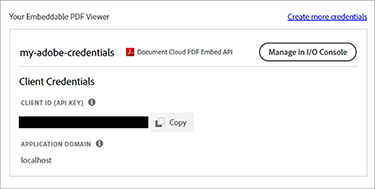

# Pubblicazione di documenti digitali


I documenti elettronici sono ovunque, infatti probabilmente ce ne sono [trilioni di PDF](https://itextpdf.com/en/blog/technical-notes/do-you-know-how-many-pdf-documents-exist-world) globalmente, e quel numero aumenta ogni giorno. Incorporando un visualizzatore PDF nelle pagine Web, potete consentire agli utenti di visualizzare i documenti senza riprogettare il HTML e il CSS o ostacolare l&#39;accesso al sito Web.

Esaminiamo uno scenario popolare. Postazioni aziendali [white paper sul sito web](https://www.adobe.io/apis/documentcloud/dcsdk/digital-content-publishing.html)
per fornire un contesto per le app e i servizi. L&#39;esperto di marketing del sito web desidera comprendere meglio il modo in cui gli utenti interagiscono con i contenuti basati su PDF e li incorporano con la propria pagina web e il proprio marchio. Hanno deciso di pubblicare i white paper come [contenuto chiuso](https://whatis.techtarget.com/definition/gated-content-ungated-content#:~:text=Gated%20content%20is%20online%20materials,about%20their%20jobs%20and%20organizations.), controllando chi può scaricarli.

## Cosa puoi imparare

In questa esercitazione pratica, scoprite come visualizzare i documenti PDF incorporati nelle pagine Web utilizzando [API di incorporamento di Adobe PDF](https://www.adobe.io/apis/documentcloud/dcsdk/pdf-embed.html), che è gratuito e facile da usare. In questi esempi vengono utilizzati codice JavaScript, Node.js, Express.js, HTML e CSS. Potete visualizzare il codice completo del progetto su [GitHub](https://www.google.com/url?q=https://github.com/marcelooliveira/EmbedPDF/tree/main/pdf-app&amp;sa=D&amp;source=editors&amp;ust=1617129543031000&amp;usg=AOvVaw2rzSwYuJ_JI7biVIgbNMw1).

## API e risorse pertinenti

* [API di incorporamento PDF](https://www.adobe.com/devnet-docs/dcsdk_io/viewSDK/index.html)

* [API dei servizi PDF](https://opensource.adobe.com/pdftools-sdk-docs/release/latest/index.html)

* [Codice progetto](https://www.google.com/url?q=https://github.com/marcelooliveira/EmbedPDF/tree/main/pdf-app&amp;sa=D&amp;source=editors&amp;ust=1617129543031000&amp;usg=AOvVaw2rzSwYuJ_JI7biVIgbNMw1)

## Creazione di un’app Web Node

Iniziamo creando un sito utilizzando Node.js ed Express che utilizza un modello di bell&#39;aspetto e offre diversi PDF per il download.

Primo, [download e installazione di Node.js](https://nodejs.org/en/download/).

Per creare facilmente un progetto Node.js con una struttura minima per le applicazioni Web, installate lo strumento di generazione delle applicazioni `` `express-generator` ``.

```
npm install express-generator -g
```

Quindi, crea la nuova app Express denominata pdf-app, scegliendo come motore di visualizzazione.

```
express pdf-app --view=ejs
```

Ora, passa alla directory \\pdf-app e installa tutte le dipendenze del progetto.

```
cd pdf-app
npm install
```

Avviate quindi il server Web locale ed eseguite l&#39;applicazione.

```
npm start
```

Infine, aprire il sito Web all&#39;indirizzo <http://localhost:3000>.


Ora hai un sito web di base.

## Rendering dei dati della documentazione tecnica

Per pubblicare i white paper sul sito web, i dati del white paper vengono definiti e preparati sul sito web per visualizzare questi documenti. Creare innanzitutto una nuova cartella \\data nella cartella principale del progetto. Le informazioni sui white paper disponibili provengono da un nuovo file denominato [data.json](https://github.com/marcelooliveira/EmbedPDF/blob/main/pdf-app/data/data.json), che viene inserito nella cartella dei dati.

Per dare all&#39;app web un aspetto piacevole e ottimizzato, installa il [Bootstrap](https://getbootstrap.com/) e [Font Awesome](https://fontawesome.com/) librerie front-end.

```
npm install bootstrap
npm install font-awesome
```

Apri il file app.js e includi queste directory come origini per i file statici, posizionandoli dopo il file esistente `` `express.static` `` linea.

```
app.use(express.static(path.join(__dirname, '/node_modules/bootstrap/dist')));
app.use(express.static(path.join(__dirname, '/node_modules/font-awesome')));
```

Per includere i documenti PDF, create una cartella denominata \\pdfs nella cartella \\public del progetto. Invece di creare da soli i PDF e le miniature, potete copiarli da questo [Cartella del repository GitHub](https://github.com/marcelooliveira/EmbedPDF/tree/main/pdf-app/public) alle cartelle \\pdfs e \\image.

La cartella \\public\\pdfs contiene ora i documenti di PDF:


La cartella \\public\\images deve contenere le miniature di ciascuno dei documenti di PDF:


A questo punto, aprire il file \\route\\index.js, che contiene la logica di indirizzamento della home page. Per utilizzare i dati del white paper dal file data.json, è necessario caricare il modulo Node.js responsabile dell&#39;accesso e dell&#39;interazione con il file system. Quindi, dichiarare la proprietà `fs` nella prima riga del file \\route\\index.js, come indicato di seguito:

```
const fs = require('fs');
```

Quindi, leggere e analizzare il file data.json e memorizzarlo nella variabile papers:

```
let rawdata = fs.readFileSync('data/data.json');
let papers = JSON.parse(rawdata);
```

Ora modificate la riga per richiamare il metodo di rendering per la vista indice, passando la raccolta di documenti come modello per la vista indice.

```
res.render('index', { title: 'Embedding PDF', papers: papers });
```

Per eseguire il rendering della raccolta di white paper sulla pagina principale, aprite il file \\views\\index.ejs e sostituite il codice esistente con quello del progetto [file indice](https://github.com/marcelooliveira/EmbedPDF/blob/main/pdf-app/views/index.ejs).

Ora riesegui l’avvio e l’apertura di npm <http://localhost:3000> per visualizzare la raccolta di white paper disponibili.


Nelle sezioni successive si tratta di migliorare il sito Web e utilizzare [API di incorporamento PDF](https://www.adobe.io/apis/documentcloud/dcsdk/pdf-embed.html) per visualizzare i documenti di PDF nella pagina web. L’API per l’incorporazione di PDF è gratuita: è sufficiente ottenere una credenziale API.

## Ottenere una credenziale API Incorpora PDF

Per ottenere una credenziale API di incorporamento PDF gratuita, visita la [Introduzione](https://www.adobe.io/apis/documentcloud/dcsdk/gettingstarted.html) pagina dopo la registrazione per un nuovo account o l’accesso all’account esistente.

Fai clic su **Crea nuove credenziali** e poi **Guida introduttiva:**


A questo punto, ti viene chiesto di registrarti per un account gratuito se non ne hai uno.

Seleziona **API di incorporamento PDF**, quindi digita il nome delle credenziali e il dominio dell&#39;applicazione. Utilizzare la proprietà **localhost** a causa della prova dell&#39;app web a livello locale.


Fate clic sul **Crea credenziali** per accedere alle credenziali del PDF e ottenere l’ID client (API KEY).



Nel progetto Node.js, create un file di nome .ENV nella cartella principale dell&#39;applicazione e dichiarate la variabile di ambiente per l&#39;ID client incorporato del PDF con il valore della credenziale API KEY del passaggio precedente.

```
PDF_EMBED_CLIENT_ID=**********************************************
```

In seguito, questo ID client viene utilizzato per accedere all’API di incorporamento PDF. Installate il pacchetto dotenv per accedere a questa variabile di ambiente utilizzando il codice Node.js.

```
npm install dotenv
```

Ora apri il file app.js e aggiungi la riga seguente nella parte superiore del file in modo che Node.js possa caricare il modulo dotenv:

```
require('dotenv').config();
```

## Visualizzazione dei PDF nell’app Web

Ora utilizzate l&#39;API di incorporamento PDF per visualizzare i PDF sul sito. Aprire la diretta [Demo API Incorpora PDF](https://documentcloud.adobe.com/view-sdk-demo/index.html#/view/FULL_WINDOW/Bodea%20Brochure.pdf).


Nel pannello a sinistra potete scegliere la modalità di incorporamento più adatta alle esigenze del sito Web:

* **Finestra intera**: il PDF copre tutto lo spazio della pagina web

* **Contenitore di dimensioni**: il PDF viene visualizzato all’interno della pagina web, una pagina alla volta, in un div di dimensioni limitate

* **In linea**: l’intero PDF viene visualizzato in div all’interno della pagina web

* **Lightbox**: il PDF viene visualizzato come livello sopra la pagina web

Si consiglia di utilizzare la modalità di incorporamento in linea per i white paper e successivamente il generatore di codice per incorporare un PDF nell&#39;applicazione.

## Creazione di una pagina in linea per la modalità di incorporamento

Per incorporare un visualizzatore PDF nella pagina Web e visualizzare tutte le pagine contemporaneamente, create una nuova pagina utilizzando la modalità incorporamento in linea.

Create una nuova vista nel file \\views\\in-line.ejs utilizzando il motore di visualizzazione EJS.

```
<! html DOCTYPE >
<html>
<head>
<title>
<%= title %>
</title>
<link rel='stylesheet' href='/stylesheets/style.css' />
<link rel='stylesheet' href='/css/bootstrap.min.css'/>
<link rel='stylesheet' href='/css/font-awesome.min.css' />
<style type="text/css">
p {
font-family: 'Gill Sans', 'Gill Sans MT', Calibri, 'Trebuchet MS', sans-serif
}
</style>
</head>
<body class="m-0">
<div>
<main>
<div class="row">
<div class="col-sm-3"></div>
<div class="col-sm-6">
<h3>
<p class="text-center">Grow your business, establish your brand,<br
/>
```

E metti i tuoi clienti al primo posto.

```
</p>
</h3>
<div>
<p class="text-center">Lorem ipsum dolor sit amet, consectetur adipiscing elit, sed do<br />
eiusmod tempor incididunt ut labore et dolore</p>
</div>
</div>
</main>
<footer>
<div class="row">
<div class="col-sm-3"></div>
<div class="col-sm-6">
<p class="text-center">Bodea Inc. Your trusted partner since 2008</p>
</div>
</div>
</footer>
</div>
</div>
</body>
</html>
```

Quindi, modificare \\views\\index.ejs per creare un pulsante per aprire la vista in linea.

```
<div class="card-body">
<h5 class="card-title">
<span>
<%= paper.title %>
</span>
</h5>
<p>
<a class="btn btn-sm btn btn-danger" href="/in-line/<%=
paper.id %>">
<span type="button"></span>
<span class="fa fa-file-pdf-o"></span>&nbsp;View Document</button>
</a>
</p>
</div>
```

Aprite il file app.js e dichiarate un nuovo router dopo la dichiarazione indexRouter:

```
var indexRouter = require('./routes/index');
var inLineRouter = require('./routes/in-line');
```

Aggiungere quindi questo codice dopo app.use(&#39;/&#39;, indexRouter); per associare la vista in modalità incorporata in linea al router:

```
app.use('/', indexRouter);
app.use('/in-line', inLineRouter);
```

A questo punto, create un nuovo file in-line.js in \\route per creare una nuova logica del router. Includi Express, un modulo Node che abilita un backend dell&#39;applicazione Web.

```
var express = require('express');
const fs = require('fs');
var router = express.Router();
```

Quindi, create un endpoint che gestisca le richieste di GET per un ID white paper specifico ed esegua il rendering della vista in-line.ejs.

```
router.all('/:id', function(req, res, next) {
let rawdata = fs.readFileSync('data/data.json');
let papers = JSON.parse(rawdata);
let paper = papers.filter(p => p.id == parseInt(req.params.id))[0];
res.render('in-line', { title: paper.title, paper: paper });
});
module.exports = router;
```

Guarda ancora il [demo live](https://documentcloud.adobe.com/view-sdk-demo/index.html#/view/FULL_WINDOW/Bodea%20Brochure.pdf) per generare automaticamente il codice API Incorpora PDF. Fai clic su **In linea** dal pannello a sinistra:


Fai clic su **Genera codice** per visualizzare il codice HTML necessario per visualizzare un visualizzatore Container PDF ridimensionato.


Fai clic su **Copia codice** e incollare il codice nel file in-line.ejs.

```
<div>
<p class="text-center">Lorem ipsum dolor sit amet, consectetur adipiscing elit, sed do<br />
eiusmod tempor incididunt ut labore et dolore</p>
</div>
<div class="row align-items-center border border-primary">
<div id="adobe-dc-view" style="width: 800px;"></div>
<script src="https://documentcloud.adobe.com/view-sdk/main.js"></script>
<script type="text/javascript">
document.addEventListener("adobe_dc_view_sdk.ready", function(){
var adobeDCView = new AdobeDC.View({clientId: "<YOUR_CLIENT_ID>", divId: "adobe-dc-view"});
adobeDCView.previewFile({
content:{location: {url: "https://documentcloud.adobe.com/view-sdk-demo/PDFs/Bodea Brochure.pdf"}},
metaData:{fileName: "Bodea Brochure.pdf"}
}, {embedMode: "IN_LINE"});
});
</script>
</div>
```

Tuttavia, i parametri del documento sono ancora hardcoded. Sostituiamoli con la sintassi parentesi quadra EJS (\&lt;%= someValue %\>) per eseguire il rendering della pagina in base ai dati del modello white paper.

```
<div id="adobe-dc-view" style="width: 800px;"></div>
<script src="https://documentcloud.adobe.com/view-sdk/main.js"></script>
<script type="text/javascript">
document.addEventListener("adobe_dc_view_sdk.ready", function () {
var adobeDCView = new AdobeDC.View({ clientId: "<%=process.env.PDF_EMBED_CLIENT_ID %>", divId: "adobe-dc-view" });
adobeDCView.previewFile({
content: { location: { url: "<%= paper.pdf %>" } },
metaData: { fileName: "<%= paper.fileName %>" }
}, {
embedMode: "IN_LINE"
});
});
</script>
```

Ora esegui l’applicazione con il comando npm start e apri il sito Web all’indirizzo <http://localhost:3000>.


Infine, scegliere un documento e fare clic **Visualizza documento** per aprire una nuova pagina con il PDF incorporato in linea:


Nota come sono ora disponibili le opzioni Download PDF e Print PDF.


Vuoi controllare queste bandiere sul back-end. In seguito puoi implementare controlli di autorizzazione basati sull&#39;identità dell&#39;utente e limitare l&#39;accesso in base alle tue regole aziendali. Questa complessità non è necessaria in questo caso, quindi è sufficiente modificare \\route\\in-line.js per includere le proprietà di autenticazione e di autorizzazione nell&#39;oggetto modello.

```
let authenticated = false;
res.render('in-line', {
title: paper.title,
paper: paper,
authenticated: authenticated,
permissions: {
showDownloadPDF: true,
showPrintPDF: true,
showFullScreen: true
}
});
```

Quindi, modificare \\views\\in-line.ejs in modo che la pagina Web possa eseguire il rendering dei valori di segnalazione provenienti dal backend.

```
embedMode: "IN_LINE",
showDownloadPDF: <%= permissions.showDownloadPDF %>,
showPrintPDF: <%= permissions.showPrintPDF %>,
showFullScreen: <%= permissions.showFullScreen %>
Now, open the in-line.js route file and modify it to disallow the printing, downloading, and full-screen controls.
permissions: {
showDownloadPDF: false,
showPrintPDF: false,
showFullScreen: false
}
```

Quindi, eseguite di nuovo l&#39;applicazione per vedere come questa modifica si riflette nel Visualizzatore PDF.


## Creazione di contenuto con porte

Secondo lo scenario per gli utenti finali, gli esperti di marketing del sito web dell&#39;azienda vogliono comprendere meglio come gli utenti interagiscono con i contenuti basati su PDF e incorporare i contenuti con il resto della loro pagina web e del marchio.

Il nostro obiettivo è l’incorporazione di PDF, quindi non stai creando una funzione di autenticazione degli utenti. Al contrario, è sufficiente implementare un paywall semplice e falso utilizzando un modulo web che accetta alcune informazioni dell’utente, quindi visualizza il documento PDF una volta che l’utente invia il modulo.

Sostituire il file \\route\\in-line.js con il contenuto seguente per fornire al modello di visualizzazione le informazioni dell&#39;utente:

```
var express = require('express');
const fs = require('fs');
var router = express.Router();
router.all('/:id', function(req, res, next) {
let rawdata = fs.readFileSync('data/data.json');
let papers = JSON.parse(rawdata);
let paper = papers.filter(p => p.id == parseInt(req.params.id))[0];
let authenticated = false;
let user = {};
if (req.body.firstName) {
user = {
firstName: req.body.firstName,
lastName: req.body.lastName,
jobTitle: req.body.jobTitle,
email: req.body.email,
};
authenticated = true;
}
res.render('in-line', {
title: paper.title,
paper: paper,
user: user,
authenticated: authenticated,
permissions: {
showDownloadPDF: false,
showPrintPDF: false,
showFullScreen: false
}
});
});
module.exports = router;
```

Quindi, sostituire il contenuto \\views\\in-line.ejs con il codice seguente. Viene visualizzato il modulo dati utente o il visualizzatore PDF, a seconda che si tratti di un utente autenticato.

```
<!DOCTYPE html>
<html>
<head>
<title>
<%= title %>
</title>
<link rel='stylesheet' href='/css/bootstrap.min.css'/>
<link rel='stylesheet' href='/css/font-awesome.min.css' />
<style type="text/css">
p {
font-family: 'Gill Sans', 'Gill Sans MT', Calibri, 'Trebuchet MS', sans-serif
}
</style>
</head>
<body class="m-0">
<% if (authenticated) { %>
<header class="bg-dark text-white">
<div class="text-right mr-4">Hello, <%= user.firstName %> <%= user.lastName%></div>
</header>
<% } %>
<div>
<main>
<div class="row">
<div class="col-sm-3"></div>
<div class="col-sm-6">
<h3>
<p class="text-center">Grow your business, establish your brand,<br
/>
```

E metti i tuoi clienti al primo posto.

```
</p>
</h3>
<div>
<p class="text-center">Lorem ipsum dolor sit amet, consectetur adipiscing elit, sed do<br />
eiusmod tempor incididunt ut labore et dolore</p>
</div>
<% if (!authenticated) { %>
<div class="row">
<form method="POST" class="center-panel text offset-md-3 col-md-6 border">
<fieldset class="offset-md-1">
<legend>Submit your info to<br/>access the whitepaper</legend>
<p><input name="firstName" placeholder="first name"/></p>
<p><input name="lastName" placeholder="last name"/></p>
<p><input name="jobTitle" placeholder="job title"/></p>
<p><input name="email" placeholder="email"/></p>
<p><button type="submit" class="btn btn-sm btn btn-primary">Submit</button></p>
</fieldset>
</form>
</div>
<% } %>
<% if (authenticated) { %>
<div class="row align-items-center border border-primary">
<div id="adobe-dc-view" style="width: 800px;"></div>
<script src="https://documentcloud.adobe.com/view-sdk/main.js"></script>
<script type="text/javascript">
document.addEventListener("adobe_dc_view_sdk.ready", function () {
var adobeDCView = new AdobeDC.View({ clientId: "<%=process.env.PDF_EMBED_CLIENT_ID %>", divId: "adobe-dc-view" });
adobeDCView.previewFile({
content: { location: { url: "<%= paper.pdf %>" } },
metaData: { fileName: "<%= paper.fileName %>" }
}, {
embedMode: "IN_LINE",
showDownloadPDF: <%= permissions.showDownloadPDF %>,
showPrintPDF: <%= permissions.showPrintPDF %>,
showFullScreen: <%= permissions.showFullScreen %>
});
});
</script>
<% } %>
</div>
</div>
</main>
<footer>
<div class="row">
<div class="col-sm-3"></div>
<div class="col-sm-6">
<p class="text-center">Bodea Inc. Your trusted partner since 2008</p>
</div>
</div>
</footer>
</div>
</div>
</body>
</html>
```


I visitatori del sito ora possono accedere ai PDF solo dopo aver inviato le informazioni:


## Attivazione degli eventi

Vediamo come integrare facilmente gli eventi di visualizzatore PDF con l&#39;applicazione per raccogliere dati analitici per il marketer. Per estendere il visualizzatore utilizzando PDF EmbedAPI, aggiungere le seguenti righe di codice dopo aver dichiarato la variabile adobeDCView e prima di chiamare il metodo previewFile:

```
var adobeDCView = new AdobeDC.View({ clientId: "<%=process.env.PDF_EMBED_CLIENT_ID %>", divId: "adobe-dc-view" });
adobeDCView.registerCallback(
AdobeDC.View.Enum.CallbackType.EVENT_LISTENER,
function(event) {
console.log(event);
},
{ enablePDFAnalytics: true }
);
```

A questo punto, eseguite nuovamente l&#39;applicazione e aprite gli strumenti per sviluppatori del browser Web per visualizzare i dati degli eventi.


È possibile inviare questi dati a [Adobe Analytics](https://www.adobe.io/apis/documentcloud/dcsdk/docs.html?view=view) o altri strumenti di analisi.

## Fasi seguenti

[!DNL Acrobat Services] Le API consentono agli sviluppatori di risolvere facilmente i problemi legati al publishing digitale utilizzando un flusso di lavoro incentrato sui PDF. Hai visto come creare un’app Web Node di esempio per visualizzare una raccolta di white paper. Acquisire quindi un [credenziali API gratuite](https://www.adobe.io/apis/documentcloud/dcsdk/gettingstarted.html) e un accesso limitato ai white paper, che possono essere visualizzati in uno dei quattro [modalità di incorporamento](https://documentcloud.adobe.com/view-sdk-demo/index.html#/view/FULL_WINDOW/Bodea%20Brochure.pdf).

L&#39;unione di questo flusso di lavoro consente alle [ipotetico marketer](https://www.adobe.io/apis/documentcloud/dcsdk/digital-content-publishing.html) raccogli le informazioni di contatto dei lead in cambio di scaricamenti di white paper e visualizza le statistiche su chi interagisce con i PDF. Puoi incorporare queste funzionalità nel tuo sito web per stimolare e monitorare il coinvolgimento degli utenti.

Se sei uno sviluppatore Angular o React, potresti provare [campioni aggiuntivi](https://github.com/adobe/pdf-embed-api-samples) Scoprite come integrare le API per l’incorporazione di PDF con i progetti React e Angular.

Adobe ti consente di creare una customer experience end-to-end con soluzioni innovative. Check-out [API di incorporamento di Adobe PDF](https://www.adobe.io/apis/documentcloud/viesdk) gratis. Per scoprire cos&#39;altro puoi fare, prova l&#39;API dei servizi Adobe PDF con [pay-as-you-gopr](https://www.adobe.io/apis/documentcloud/dcsdk/pdf-pricing.html)[glassa](https://www.adobe.io/apis/documentcloud/dcsdk/pdf-pricing.html).

[Inizia](https://www.adobe.io/apis/documentcloud/dcsdk/gettingstarted.html) con [!DNL Adobe Acrobat Services] API di oggi.
