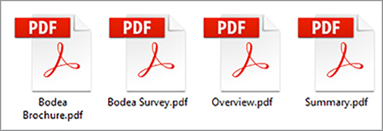

# Pubblicazione di documenti digitali


I documenti elettronici sono ovunque. Infatti, ci sono probabilmente [miliardi di PDF](https://itextpdf.com/en/blog/technical-notes/do-you-know-how-many-pdf-documents-exist-world) a livello globale, e questo numero aumenta ogni giorno. Incorporando un visualizzatore di PDF nelle pagine Web, si consente agli utenti di visualizzare i documenti senza riprogettare il HTML e il CSS o senza ostacolare l’accesso al sito Web.

Esploriamo uno scenario popolare. Post di società [white paper sul loro sito Web](https://www.adobe.io/apis/documentcloud/dcsdk/digital-content-publishing.html)
per fornire il contesto per le app e i servizi. Il commerciante del sito vuole capire meglio come gli utenti interagiscono con i loro contenuti basati su PDF e incorporarli con la loro pagina Web e marchio. Hanno deciso di pubblicare i white paper come [contenuto gestito](https://whatis.techtarget.com/definition/gated-content-ungated-content#:~:text=Gated%20content%20is%20online%20materials,about%20their%20jobs%20and%20organizations.), controllando chi può scaricarli.

## Cosa puoi imparare

In questo tutorial pratico, scoprite come visualizzare i documenti PDF incorporati nelle pagine Web utilizzando [API di Adobe PDF Embed](https://www.adobe.io/apis/documentcloud/dcsdk/pdf-embed.html), gratuito e facile da usare. In questi esempi vengono utilizzati alcuni JavaScript, Node.js, Express.js, HTML e CSS. Puoi visualizzare il codice completo del progetto su [GitHub](https://www.google.com/url?q=https://github.com/marcelooliveira/EmbedPDF/tree/main/pdf-app&amp;sa=D&amp;source=editors&amp;ust=1617129543031000&amp;usg=AOvVaw2rzSwYuJ_JI7biVIgbNMw1).

## API e risorse pertinenti

* [API PDF Embed](https://www.adobe.com/devnet-docs/dcsdk_io/viewSDK/index.html)

* [API di PDF Services](https://opensource.adobe.com/pdftools-sdk-docs/release/latest/index.html)

* [Codice progetto](https://www.google.com/url?q=https://github.com/marcelooliveira/EmbedPDF/tree/main/pdf-app&amp;sa=D&amp;source=editors&amp;ust=1617129543031000&amp;usg=AOvVaw2rzSwYuJ_JI7biVIgbNMw1)

## Creazione di un&#39;app Web nodo

Iniziamo creando un sito utilizzando Node.js ed Express che utilizza un modello di bell&#39;aspetto e offre diversi PDF per il download.

Primo, [scaricare e installare Node.js](https://nodejs.org/en/download/).

Per creare facilmente un progetto Node.js con una struttura minima dell’applicazione Web, installa lo strumento Application Generator `` `express-generator` ``.

```
npm install express-generator -g
```

Quindi, crea la nuova app Express denominata pdf-app, scegliendo come motore di visualizzazione.

```
express pdf-app --view=ejs
```

Passa ora alla directory \\pdf-app e installa tutte le dipendenze del progetto.

```
cd pdf-app
npm install
```

Quindi, avviate il server Web locale ed eseguite l&#39;applicazione.

```
npm start
```

Aprire infine il sito Web all&#39;indirizzo <http://localhost:3000>.


Ora hai un sito Web di base.

## Rendering dei dati dei white paper

Per pubblicare i white paper sul sito Web, i dati dei white paper vengono definiti e preparati sul sito Web per visualizzare questi documenti. Creare innanzitutto una nuova cartella \\data nella cartella principale del progetto. Le informazioni sui white paper disponibili provengono da un nuovo file denominato [data.json](https://github.com/marcelooliveira/EmbedPDF/blob/main/pdf-app/data/data.json), che viene inserito nella cartella dei dati.

Per conferire alla web app un aspetto elegante, installare la [Bootstrap](https://getbootstrap.com/) e [Font Straordinario](https://fontawesome.com/) librerie front-end.

```
npm install bootstrap
npm install font-awesome
```

Apri il file app.js e includi queste directory come sorgenti per file statici, posizionandole dopo le directory esistenti `` `express.static` `` linea.

```
app.use(express.static(path.join(__dirname, '/node_modules/bootstrap/dist')));
app.use(express.static(path.join(__dirname, '/node_modules/font-awesome')));
```

Per includere i documenti PDF, creare una cartella denominata \\pdfs nella cartella \\public del progetto. Invece di creare i PDF e le miniature da soli, puoi copiarli da questo [Cartella del repository GitHub](https://github.com/marcelooliveira/EmbedPDF/tree/main/pdf-app/public) nelle cartelle \\pdfs e \\image.

La cartella \\public\\pdfs contiene ora i documenti PDF:



Mentre la cartella \\public\\images deve contenere le miniature per ciascuno dei documenti PDF:


Aprire ora il file \\route\\index.js, che contiene la logica per l&#39;instradamento della home page. Per utilizzare i dati del white paper dal file data.json, è necessario caricare il modulo Node.js responsabile dell&#39;accesso e dell&#39;interazione con il file system. Quindi, dichiarare il `fs` costante nella prima riga del file \\route\\index.js, come indicato di seguito:

```
const fs = require('fs');
```

Quindi, leggi e analizza il file data.json e memorizzalo nella variabile paper:

```
let rawdata = fs.readFileSync('data/data.json');
let papers = JSON.parse(rawdata);
```

Ora modificare la riga per richiamare il metodo di rendering per la vista indice, passando l’insieme paper come modello per la vista indice.

```
res.render('index', { title: 'Embedding PDF', papers: papers });
```

Per eseguire il rendering della raccolta di white paper nella pagina principale, apri il file \\views\\index.ejs e sostituisci il codice esistente con il codice del progetto [file indice](https://github.com/marcelooliveira/EmbedPDF/blob/main/pdf-app/views/index.ejs).

Rieseguire npm start e open <http://localhost:3000> per visualizzare la raccolta di white paper disponibili.


Nelle sezioni successive verranno illustrati i miglioramenti del sito Web e l&#39;utilizzo [API PDF Embed](https://www.adobe.io/apis/documentcloud/dcsdk/pdf-embed.html) per visualizzare i documenti PDF nella pagina web. L’API PDF Embed può essere utilizzata gratuitamente, ma è sufficiente ottenere una credenziale API.

## Recupero delle credenziali API PDF Embed

Per ottenere una credenziale API di PDF Embed gratuita, visita la pagina [Introduzione](https://www.adobe.io/apis/documentcloud/dcsdk/gettingstarted.html) pagina dopo la registrazione per un nuovo account o l&#39;accesso all&#39;account esistente.

Fai clic **Crea nuove credenziali** e poi **Introduzione:**


A questo punto, ti viene chiesto di registrarti per un account gratuito se non ne hai uno.

Seleziona **API PDF Embed**, quindi digitare il nome delle credenziali e il dominio applicazione. Utilizzare la **localhost** a causa di test dell&#39;app web in locale.


Fare clic sul pulsante **Crea credenziali** per accedere alle credenziali PDF e ottenere l’ID client (CHIAVE API).


Nel progetto Node.js, creare un file denominato .ENV nella cartella principale dell&#39;applicazione e dichiarare la variabile di ambiente per l&#39;ID client di incorporamento PDF con il valore della credenziale API KEY del passaggio precedente.

```
PDF_EMBED_CLIENT_ID=**********************************************
```

Successivamente, utilizzerai questo ID client per accedere all’API PDF Embed. Installa il pacchetto dotenv per accedere a questa variabile di ambiente utilizzando il codice Node.js.

```
npm install dotenv
```

Ora, apri il file app.js e aggiungi la seguente riga nella parte superiore del file in modo che Node.js possa caricare il modulo dotenv:

```
require('dotenv').config();
```

## Visualizzazione dei PDF nell&#39;app Web

Ora puoi utilizzare l’API PDF Embed per visualizzare i PDF nel sito. Apri il live [Demo dell’API PDF Embed](https://documentcloud.adobe.com/view-sdk-demo/index.html#/view/FULL_WINDOW/Bodea%20Brochure.pdf).


Nel pannello a sinistra, puoi scegliere la modalità di incorporamento più adatta alle tue esigenze del sito Web:

* **Finestra intera**: il PDF copre tutto lo spazio della pagina Web

* **Contenitore dimensioni**: il PDF viene visualizzato all&#39;interno della pagina Web, una pagina alla volta, in un div con dimensioni limitate

* **In linea**: l&#39;intero PDF viene visualizzato in un div all&#39;interno della pagina Web

* **Lightbox**: il PDF viene visualizzato come livello sopra la pagina Web

Si consiglia di utilizzare la modalità incorporamento in linea per i white paper e il generatore di codice in un secondo momento per incorporare un PDF nell’applicazione.

## Creazione di una pagina in modalità incorporamento in linea

Per incorporare un visualizzatore di PDF nella pagina Web e visualizzare tutte le pagine contemporaneamente, è necessario creare una nuova pagina utilizzando la modalità di incorporamento in linea.

Creare una nuova visualizzazione nel file \\views\\in-line.ejs utilizzando il motore di visualizzazione EJS.

```
<! html DOCTYPE >
<html>
<head>
<title>
<%= title %>
</title>
<link rel='stylesheet' href='/stylesheets/style.css' />
<link rel='stylesheet' href='/css/bootstrap.min.css'/>
<link rel='stylesheet' href='/css/font-awesome.min.css' />
<style type="text/css">
p {
font-family: 'Gill Sans', 'Gill Sans MT', Calibri, 'Trebuchet MS', sans-serif
}
</style>
</head>
<body class="m-0">
<div>
<main>
<div class="row">
<div class="col-sm-3"></div>
<div class="col-sm-6">
<h3>
<p class="text-center">Grow your business, establish your brand,<br
/>
```

E mettete i vostri clienti al primo posto.

```
</p>
</h3>
<div>
<p class="text-center">Lorem ipsum dolor sit amet, consectetur adipiscing elit, sed do<br />
eiusmod tempor incididunt ut labore et dolore</p>
</div>
</div>
</main>
<footer>
<div class="row">
<div class="col-sm-3"></div>
<div class="col-sm-6">
<p class="text-center">Bodea Inc. Your trusted partner since 2008</p>
</div>
</div>
</footer>
</div>
</div>
</body>
</html>
```

Quindi, modificare \\views\\index.ejs per creare un pulsante per aprire la visualizzazione in linea.

```
<div class="card-body">
<h5 class="card-title">
<span>
<%= paper.title %>
</span>
</h5>
<p>
<a class="btn btn-sm btn btn-danger" href="/in-line/<%=
paper.id %>">
<span type="button"></span>
<span class="fa fa-file-pdf-o"></span>&nbsp;View Document</button>
</a>
</p>
</div>
```

Aprire il file app.js e dichiarare un nuovo router dopo la dichiarazione indexRouter:

```
var indexRouter = require('./routes/index');
var inLineRouter = require('./routes/in-line');
```

Quindi aggiungere questo codice dopo app.use(&#39;/&#39;, indexRouter); per associare la vista in linea della modalità incorporamento al router:

```
app.use('/', indexRouter);
app.use('/in-line', inLineRouter);
```

Creare un nuovo file in-line.js in \\route per creare una nuova logica router. Includi Express, un modulo Nodo che abilita il back-end di un&#39;applicazione Web.

```
var express = require('express');
const fs = require('fs');
var router = express.Router();
```

Quindi, creare un endpoint che gestisca le richieste di GET per un ID white paper specifico ed esegua il rendering della vista in-line.ejs.

```
router.all('/:id', function(req, res, next) {
let rawdata = fs.readFileSync('data/data.json');
let papers = JSON.parse(rawdata);
let paper = papers.filter(p => p.id == parseInt(req.params.id))[0];
res.render('in-line', { title: paper.title, paper: paper });
});
module.exports = router;
```

Guarda di nuovo il [demo live](https://documentcloud.adobe.com/view-sdk-demo/index.html#/view/FULL_WINDOW/Bodea%20Brochure.pdf) per generare automaticamente il codice API PDF Embed. Fai clic **In linea** nel pannello a sinistra:


Fai clic **Genera codice** per visualizzare il codice HTML necessario per visualizzare un visualizzatore PDF Contenitore dimensioni.


Fai clic **Copia codice** e incollarlo nel file in-line.ejs.

```
<div>
<p class="text-center">Lorem ipsum dolor sit amet, consectetur adipiscing elit, sed do<br />
eiusmod tempor incididunt ut labore et dolore</p>
</div>
<div class="row align-items-center border border-primary">
<div id="adobe-dc-view" style="width: 800px;"></div>
<script src="https://documentcloud.adobe.com/view-sdk/main.js"></script>
<script type="text/javascript">
document.addEventListener("adobe_dc_view_sdk.ready", function(){
var adobeDCView = new AdobeDC.View({clientId: "<YOUR_CLIENT_ID>", divId: "adobe-dc-view"});
adobeDCView.previewFile({
content:{location: {url: "https://documentcloud.adobe.com/view-sdk-demo/PDFs/Bodea Brochure.pdf"}},
metaData:{fileName: "Bodea Brochure.pdf"}
}, {embedMode: "IN_LINE"});
});
</script>
</div>
```

Tuttavia, i parametri del documento sono ancora hardcoded. Sostituiamoli con la sintassi della parentesi graffa EJS (\&lt;%= someValue %\>) per eseguire il rendering della pagina in base ai dati del modello di white paper.

```
<div id="adobe-dc-view" style="width: 800px;"></div>
<script src="https://documentcloud.adobe.com/view-sdk/main.js"></script>
<script type="text/javascript">
document.addEventListener("adobe_dc_view_sdk.ready", function () {
var adobeDCView = new AdobeDC.View({ clientId: "<%=process.env.PDF_EMBED_CLIENT_ID %>", divId: "adobe-dc-view" });
adobeDCView.previewFile({
content: { location: { url: "<%= paper.pdf %>" } },
metaData: { fileName: "<%= paper.fileName %>" }
}, {
embedMode: "IN_LINE"
});
});
</script>
```

Ora eseguire l&#39;applicazione con il comando npm start e aprire il sito Web all&#39;indirizzo <http://localhost:3000>.


Infine, scegliere un white paper e fare clic su **Visualizza documento** per aprire una nuova pagina con PDF incorporato inline:


Osservate come sono ora presenti le opzioni Scarica PDF e Stampa PDF.


Si desidera controllare questi contrassegni nel back-end. Successivamente, è possibile implementare i controlli di autorizzazione in base all&#39;identità dell&#39;utente e limitare l&#39;accesso in base alle regole aziendali. In questo caso la complessità non è necessaria, quindi è sufficiente modificare \\route\\in-line.js per includere le proprietà autenticate e delle autorizzazioni nell&#39;oggetto modello.

```
let authenticated = false;
res.render('in-line', {
title: paper.title,
paper: paper,
authenticated: authenticated,
permissions: {
showDownloadPDF: true,
showPrintPDF: true,
showFullScreen: true
}
});
```

Quindi, modificare \\views\\in-line.ejs in modo che la pagina Web possa eseguire il rendering dei valori dei contrassegni provenienti dal back-end.

```
embedMode: "IN_LINE",
showDownloadPDF: <%= permissions.showDownloadPDF %>,
showPrintPDF: <%= permissions.showPrintPDF %>,
showFullScreen: <%= permissions.showFullScreen %>
Now, open the in-line.js route file and modify it to disallow the printing, downloading, and full-screen controls.
permissions: {
showDownloadPDF: false,
showPrintPDF: false,
showFullScreen: false
}
```

Quindi, riesegui l&#39;applicazione per vedere come si riflette questa modifica nel Visualizzatore PDF.


## Creazione di contenuto gestito

In base allo scenario per l&#39;utente finale, l&#39;addetto al marketing del sito Web dell&#39;azienda vuole capire meglio come gli utenti interagiscono con i loro contenuti basati sui PDF e incorporare il contenuto con il resto della loro pagina Web e del marchio.

Il nostro obiettivo è l&#39;incorporamento di PDF, per cui non devi creare una funzione di autenticazione degli utenti. È sufficiente implementare un paywall semplice e falso utilizzando un modulo Web che accetti alcune informazioni utente e quindi visualizzi il documento PDF una volta inviato il modulo.

Sostituire il file \\route\\in-line.js con il contenuto seguente per fornire al modello di visualizzazione le informazioni utente:

```
var express = require('express');
const fs = require('fs');
var router = express.Router();
router.all('/:id', function(req, res, next) {
let rawdata = fs.readFileSync('data/data.json');
let papers = JSON.parse(rawdata);
let paper = papers.filter(p => p.id == parseInt(req.params.id))[0];
let authenticated = false;
let user = {};
if (req.body.firstName) {
user = {
firstName: req.body.firstName,
lastName: req.body.lastName,
jobTitle: req.body.jobTitle,
email: req.body.email,
};
authenticated = true;
}
res.render('in-line', {
title: paper.title,
paper: paper,
user: user,
authenticated: authenticated,
permissions: {
showDownloadPDF: false,
showPrintPDF: false,
showFullScreen: false
}
});
});
module.exports = router;
```

Sostituire quindi il contenuto \\views\\in-line.ejs con il codice seguente. Viene visualizzato il form dati utente o il visualizzatore PDF, a seconda che si tratti di un utente autenticato.

```
<!DOCTYPE html>
<html>
<head>
<title>
<%= title %>
</title>
<link rel='stylesheet' href='/css/bootstrap.min.css'/>
<link rel='stylesheet' href='/css/font-awesome.min.css' />
<style type="text/css">
p {
font-family: 'Gill Sans', 'Gill Sans MT', Calibri, 'Trebuchet MS', sans-serif
}
</style>
</head>
<body class="m-0">
<% if (authenticated) { %>
<header class="bg-dark text-white">
<div class="text-right mr-4">Hello, <%= user.firstName %> <%= user.lastName%></div>
</header>
<% } %>
<div>
<main>
<div class="row">
<div class="col-sm-3"></div>
<div class="col-sm-6">
<h3>
<p class="text-center">Grow your business, establish your brand,<br
/>
```

E mettete i vostri clienti al primo posto.

```
</p>
</h3>
<div>
<p class="text-center">Lorem ipsum dolor sit amet, consectetur adipiscing elit, sed do<br />
eiusmod tempor incididunt ut labore et dolore</p>
</div>
<% if (!authenticated) { %>
<div class="row">
<form method="POST" class="center-panel text offset-md-3 col-md-6 border">
<fieldset class="offset-md-1">
<legend>Submit your info to<br/>access the whitepaper</legend>
<p><input name="firstName" placeholder="first name"/></p>
<p><input name="lastName" placeholder="last name"/></p>
<p><input name="jobTitle" placeholder="job title"/></p>
<p><input name="email" placeholder="email"/></p>
<p><button type="submit" class="btn btn-sm btn btn-primary">Submit</button></p>
</fieldset>
</form>
</div>
<% } %>
<% if (authenticated) { %>
<div class="row align-items-center border border-primary">
<div id="adobe-dc-view" style="width: 800px;"></div>
<script src="https://documentcloud.adobe.com/view-sdk/main.js"></script>
<script type="text/javascript">
document.addEventListener("adobe_dc_view_sdk.ready", function () {
var adobeDCView = new AdobeDC.View({ clientId: "<%=process.env.PDF_EMBED_CLIENT_ID %>", divId: "adobe-dc-view" });
adobeDCView.previewFile({
content: { location: { url: "<%= paper.pdf %>" } },
metaData: { fileName: "<%= paper.fileName %>" }
}, {
embedMode: "IN_LINE",
showDownloadPDF: <%= permissions.showDownloadPDF %>,
showPrintPDF: <%= permissions.showPrintPDF %>,
showFullScreen: <%= permissions.showFullScreen %>
});
});
</script>
<% } %>
</div>
</div>
</main>
<footer>
<div class="row">
<div class="col-sm-3"></div>
<div class="col-sm-6">
<p class="text-center">Bodea Inc. Your trusted partner since 2008</p>
</div>
</div>
</footer>
</div>
</div>
</body>
</html>
```


I visitatori del sito ora possono accedere ai PDF solo dopo aver inviato le informazioni:


## Attivazione degli eventi

Vediamo come integrare facilmente gli eventi di visualizzatore di PDF con la tua applicazione per raccogliere dati analitici per il commerciante. Per estendere il visualizzatore utilizzando PDF EmbedAPI, aggiungi le seguenti righe di codice dopo aver dichiarato la variabile adobeDCView e prima di chiamare il metodo previewFile:

```
var adobeDCView = new AdobeDC.View({ clientId: "<%=process.env.PDF_EMBED_CLIENT_ID %>", divId: "adobe-dc-view" });
adobeDCView.registerCallback(
AdobeDC.View.Enum.CallbackType.EVENT_LISTENER,
function(event) {
console.log(event);
},
{ enablePDFAnalytics: true }
);
```

A questo punto, rieseguire l&#39;applicazione e aprire gli strumenti di sviluppo del browser Web per visualizzare i dati dell&#39;evento.


Puoi inviare questi dati a [Adobe Analytics](https://www.adobe.io/apis/documentcloud/dcsdk/docs.html?view=view) o altri strumenti di analisi.

## Fasi seguenti

[!DNL Acrobat Services] Le API aiutano gli sviluppatori a risolvere facilmente le sfide del publishing digitale utilizzando un flusso di lavoro incentrato sulle PDF. Hai visto come creare una web app Nodo di esempio per visualizzare una raccolta di white paper. Quindi, acquisisci un [credenziali API gratuite](https://www.adobe.io/apis/documentcloud/dcsdk/gettingstarted.html) e l&#39;accesso limitato integrato ai white paper, che possono essere visualizzati in uno dei quattro [modalità di incorporamento](https://documentcloud.adobe.com/view-sdk-demo/index.html#/view/FULL_WINDOW/Bodea%20Brochure.pdf).

L&#39;integrazione di questo flusso di lavoro consente di [esperto marketing ipotetico](https://www.adobe.io/apis/documentcloud/dcsdk/digital-content-publishing.html) raccogli le informazioni di contatto del lead in cambio di download di white paper e visualizza le statistiche su chi sta interagendo con i PDF. Potete incorporare queste funzionalità nel vostro sito Web per guidare e monitorare il coinvolgimento degli utenti.

Se sei uno sviluppatore di Angular o React, potresti divertirti a provare [ulteriori campioni](https://github.com/adobe/pdf-embed-api-samples) con informazioni su come integrare l’API PDF Embed con i progetti React ed Angular.

L&#39;Adobe consente di creare un&#39;esperienza di cliente completa con soluzioni innovative. Check-out [API di Adobe PDF Embed](https://www.adobe.io/apis/documentcloud/viesdk) gratis. Per scoprire altre operazioni, prova l’API di Adobe PDF Services con [pay-as-you-gopr](https://www.adobe.io/apis/documentcloud/dcsdk/pdf-pricing.html)[glassa](https://www.adobe.io/apis/documentcloud/dcsdk/pdf-pricing.html).

[Introduzione](https://www.adobe.io/apis/documentcloud/dcsdk/gettingstarted.html) con [!DNL Adobe Acrobat Services] Le API di oggi.
