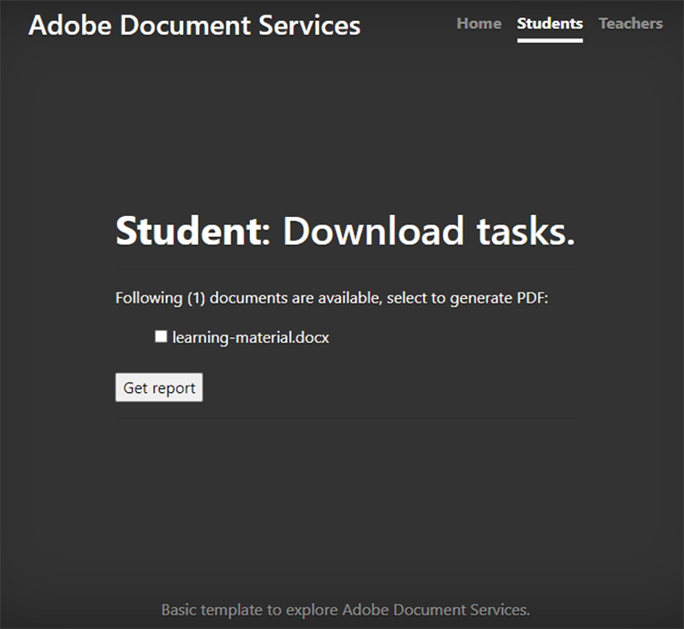

# Collaborazione studente-docente


Gli istituti di istruzione utilizzano i documenti PDF per condividere il materiale didattico con gli studenti. I PDF forniscono ai docenti un formato di documento intercambiabile.

L&#39;integrazione di [Adobe PDF Services API](https://developer.adobe.com/document-services/apis/pdf-services) e [Adobe PDF Embed API](https://developer.adobe.com/document-services/apis/pdf-embed) in un&#39;app offre a docenti e studenti un&#39;unica piattaforma su cui insegnare e apprendere. Ad esempio, l’app può consentire agli studenti di porre domande sui propri compiti e di creare report sui propri biglietti e di collaborare alle assegnazioni di gruppo.

Esiste un SDK ufficiale per le applicazioni Node.js per accedere all&#39;API di PDF Services. Ciò consente di convertire documenti come Microsoft Word o Microsoft Excel in
PDF. Inoltre, puoi eseguire operazioni più avanzate, come la combinazione di più report, la ridisposizione delle pagine e la protezione dei PDF. Per ulteriori dettagli, consulta la [documentazione del prodotto](https://developer.adobe.com/document-services/homepage/).

## Cosa puoi imparare

In questa esercitazione pratica impara a creare una piattaforma di apprendimento online che [consente a docenti e studenti di condividere facilmente le risorse](https://developer.adobe.com/document-services/use-cases/collaboration/student-teacher-collaboration) in PDF. Questa esercitazione utilizza un [portale di apprendimento](https://github.com/afzaal-ahmad-zeeshan/adobe-pdf-tools-for-teachers) creato utilizzando Node.js JavaScript runtime (Node.js) e PDF Services.

Il portale di apprendimento presenta le seguenti funzionalità:

* Consente ai docenti di caricare risorse

* Consente agli studenti di selezionare più documenti da convertire in PDF

* Conversione dei documenti in PDF

* Fornisce un&#39;anteprima PDF per gli studenti in un browser Web e consente loro di annotare i documenti senza software aggiuntivo

* Consente agli studenti di lasciare commenti e scaricarli nei computer

Scopri come [!DNL Adobe Acrobat Services] offre agli studenti un&#39;esperienza ricca di PDF. Le API di [!DNL Acrobat Services] si integrano perfettamente nelle applicazioni esistenti, in modo che gli studenti possano caricare, convertire e visualizzare i file, quindi creare e salvare commenti, il tutto all&#39;interno della configurazione corrente.

## API e risorse pertinenti

* [API di incorporamento PDF](https://www.adobe.com/devnet-docs/dcsdk_io/viewSDK/index.html)

* [API dei servizi PDF](https://opensource.adobe.com/pdftools-sdk-docs/release/latest/index.html)

* [Codice progetto](https://github.com/afzaal-ahmad-zeeshan/adobe-pdf-tools-for-teachers)

## Caricamento di risorse nel portale di apprendimento

Nella sezione dei docenti del portale di apprendimento, i docenti possono caricare documenti quali compiti e test. I documenti possono essere in qualsiasi formato, ad esempio Microsoft Word, Microsoft Excel, HTML, vari formati di immagine e così via.


I documenti caricati vengono archiviati e presentati agli studenti quando aprono la loro pagina Web.

Per scoprire come l&#39;applicazione carica i file, consulta il [codice progetto](https://github.com/afzaal-ahmad-zeeshan/adobe-pdf-tools-for-teachers).

## Conversione di documenti in PDF

Gli studenti possono convertire uno o più documenti di qualsiasi tipo in PDF, come Microsoft Word, Excel e PowerPoint, così come altri tipi di file di testo e immagini popolari. Il portale di apprendimento utilizza PDF Services per eseguire la conversione dei file in PDF.

Per creare il tuo portale di apprendimento, devi prima creare le tue credenziali. [Registrati](https://www.adobe.io/apis/documentcloud/dcsdk/gettingstarted.html) a
utilizza gratuitamente API di PDF Services per sei mesi e fino a 1.000 transazioni di documenti. Dopodiché, [paga in base al consumo](https://developer.adobe.com/document-services/pricing/main) a soli \$0,05 per transazione documento mentre la classe aumenta le proprie assegnazioni.

Quando uno studente seleziona un documento dal dashboard, viene visualizzato quanto segue:



Lo studente seleziona semplicemente i documenti per la conversione e fa clic su **Scarica report**.

Il portale di apprendimento converte i documenti in PDF e visualizza una pagina di report, insieme a un’anteprima del file PDF.

Di seguito è riportato il codice di esempio per questo passaggio:

```
async function createPdf(rawFile, outputPdf) {
    try {
            // configurations
            const credentials =  adobe.Credentials
            .serviceAccountCredentialsBuilder()
            .fromFile("./src/pdftools-api-credentials.json")
            .build();
 
            // Capture the credential from app and show create the context
            const executionContext = adobe.ExecutionContext.create(credentials),
            operation = adobe.CreatePDF.Operation.createNew();
 
            // Pass the content as input (stream)
            const input = adobe.FileRef.createFromLocalFile(rawFile);
            operation.setInput(input);
 
            // Async create the PDF
            let result = await operation.execute(executionContext);
            await result.saveAsFile(outputPdf);
    } catch (err) {
            console.log('Exception encountered while executing operation', err);
    }
}
```

Il codice di esempio chiama il metodo `createPdf` all&#39;interno del gestore di route Express per generare il PDF.

Per sapere come viene chiamato questo metodo, consulta [il codice del progetto](https://github.com/afzaal-ahmad-zeeshan/adobe-pdf-tools-for-teachers/blob/master/src/helpers/pdf.js).

## Anteprima delle risorse di apprendimento

L’interfaccia utente utilizza l’API PDF Embed per eseguire il rendering dei PDF in un browser web. Questa API è disponibile per l&#39;uso gratuito.

L&#39;API PDF Embed utilizza credenziali diverse dall&#39;API PDF Services, pertanto è necessario [creare una credenziale](https://www.adobe.io/apis/documentcloud/dcsdk/gettingstarted.html)
prima di poterlo utilizzare. Puoi quindi utilizzare PDF Embed in modo completamente gratuito.

Assicurati di inserire l’URL del sito Web corretto nel token. In caso contrario, potrebbe non essere possibile eseguire il rendering dei PDF con il token.

L&#39;interfaccia utente utilizza il linguaggio dei modelli [Handlebars](https://handlebarsjs.com/). Il PDF viene visualizzato in un browser Web.

Di seguito è riportato il codice di questo passaggio:

```
<div id="adobe-dc-view" style="height: 750px; width: 700px;"></div>
<script src="https://documentcloud.adobe.com/view-sdk/main.js"></script>
<script type="text/javascript">
    document.addEventListener("adobe_dc_view_sdk.ready", function () {
        var adobeDCView = new AdobeDC.View({ clientId: "<your-credentials-here>", divId: "adobe-dc-view" });
        adobeDCView.previewFile(
            {
                content: {
                    location: { url: "<file-url>" }
                },
                    metaData: { fileName: "<file-name>" }
            },
           );
    });
</script>
 
<p>Material has been generated, <a href="/students/download/{{filename}}" target="_blank">click here</a> to download it.
</p>
```

Questo codice visualizza l’output PDF e il collegamento per scaricare il report PDF, come illustrato nell’acquisizione schermo seguente:


Gli studenti dovrebbero essere in grado di scaricare il rapporto o lavorare sul materiale qui.

## Creazione di annotazioni sui documenti PDF

Una piattaforma di apprendimento deve supportare annotazioni di base, commenti e discussioni nei PDF. L’API PDF Embed offre tutte queste funzioni. Attiva il supporto delle annotazioni utilizzando `showAnnotationTools`, consentendo a docenti e studenti di commentare i documenti e archiviare i commenti come parte del PDF.

Per abilitare le annotazioni nei documenti PDF, è sufficiente passare l&#39;argomento `showAnnotationTools` : true al metodo `previewFile`. In questo modo viene visualizzato lo strumento Anteprima PDF. Accedete a questo strumento dal menu con i tre punti in alto a destra nell’anteprima.


Nei documenti caricati dai docenti, gli studenti possono evidenziare il testo, aggiungere commenti e così via.


Nell’acquisizione della schermata precedente, l’utente è etichettato come &quot;Guest&quot;, ma è possibile configurare i profili per gli utenti, ad esempio studenti e docenti.

Quando uno studente applica un&#39;annotazione, l&#39;API PDF Embed visualizza un pulsante **Salva** lungo il banner superiore. Quando si salva, le annotazioni vengono aggiunte al file. Prova a fare clic su **Salva** per vedere come viene salvato il file con l&#39;annotazione incorporata nel report.

Gli studenti possono utilizzare le annotazioni per porre domande o condividere i propri commenti sul materiale di apprendimento.

## Tracciamento dell’utilizzo del documento

È importante che i docenti e le scuole vedano come gli studenti utilizzano le piattaforme online. Questo aiuta i docenti a supportare gli studenti con risorse che li aiutano a svolgere meglio i loro compiti. L’API PDF Embed si integra con le analisi che puoi utilizzare per misurare tutti gli eventi in corso, ad esempio quando gli utenti aprono, leggono e chiudono documenti. Con l&#39;API di PDF Services, i docenti possono anche disabilitare la stampa, il download e la modifica dei file per mantenere l&#39;integrità accademica.

Se disponi di una licenza di [Adobe Analytics](https://developer.adobe.com/analytics-apis/docs/2.0/), puoi utilizzare la relativa [integrazione predefinita](https://experienceleague.adobe.com/it/docs/acrobat-services-learn/tutorials/pdfembed/controlpdfexperience#adobe-analytics). In caso contrario, utilizza i callback per integrare i Servizi PDF con altri provider di analisi, ad esempio [Google](https://experienceleague.adobe.com/it/docs/acrobat-services-learn/tutorials/pdfembed/controlpdfexperience#google-analytics).

Per attivare la misurazione degli eventi del documento, collegare i gestori eventi utilizzando il metodo `registerCallback` con l&#39;istanza Vista Adobe DC. Sulla console è possibile visualizzare le metriche di base, ad esempio l&#39;apertura di un documento o la lettura di una pagina. È inoltre possibile salvare le metriche in un registro o pubblicarle in altri archivi di analisi.

Di seguito è riportato il codice di esempio per allegare i gestori eventi:

```
adobeDCView.registerCallback(
    AdobeDC.View.Enum.CallbackType.EVENT_LISTENER,
    function(event) {
           console.log(event);
    },
    {
           enablePDFAnalytics: true
    }
);
```

I docenti possono vedere quanti studenti hanno visto il compito, quanti sono passati attraverso tutte le pagine dei loro appunti e altri dettagli preziosi.

Ecco un&#39;immagine della console del browser Web:


Questa schermata mostra che lo studente ha aperto il file di assegnazione, ha letto la prima pagina - o non ha fatto scorrere le pagine aggiuntive o il documento aveva una sola pagina - poi ha scaricato il file. Puoi raccogliere queste metriche per eseguire analisi e studiare il comportamento degli studenti.

Inoltre, [Adobe Analytics](https://business.adobe.com/it/products/adobe-analytics.html) è integrato con PDF Embed API. Pertanto, se disponi di un abbonamento alla suite Adobe Analytics, puoi pubblicare le metriche nel tuo abbonamento. Per pubblicare le metriche in Adobe Analytics, è sufficiente passare l’ID suite al costruttore PDF Embed API. (Si noti che è necessario utilizzare le credenziali API di PDF Embed e non le credenziali API di PDF Services).

Di seguito è riportato un codice di esempio che mostra come passare l&#39;ID suite al costruttore API PDF Embed:

```
var adobeDCView = new AdobeDC.View({
    clientId: "<your-adobe-dc-credential>",
    divId: "<#element>"
    reportSuiteId: <your-id-here>,
}); 
```

## Fasi seguenti

In questa esercitazione pratica è stato esaminato come utilizzare l&#39;API di PDF Services e l&#39;API di PDF Embed per creare un portale di apprendimento, in modo da facilitare un&#39;efficace [collaborazione tra studenti e docenti](https://developer.adobe.com/document-services/use-cases/collaboration/student-teacher-collaboration). Utilizzando questo portale, i docenti possono caricare materiale didattico in qualsiasi formato e convertirlo in PDF utilizzando l’API di PDF Services. Gli studenti possono quindi visualizzare in anteprima questi PDF utilizzando l’API PDF Embed.

Ora che sai come annotare i report PDF, archiviare le annotazioni e tenere traccia dell’utilizzo dei report PDF, puoi iniziare ad implementare queste soluzioni nei tuoi progetti.

Puoi utilizzare le API [!DNL Adobe Acrobat Services] per creare esperienze di PDF interattive e di facile utilizzo sul tuo sito Web. Prova gratis l&#39;API di Adobe PDF Services per sei mesi e poi a soli [pagare in base al consumo](https://developer.adobe.com/document-services/pricing/main) (tramite AWS o un contratto diretto) per soli \$0,05 per transazione documento. Utilizza Adobe PDF Embed gratis senza limiti di tempo. Crea un account gratuito per [iniziare](https://www.adobe.com/go/dcsdks_credentials) oggi stesso.
