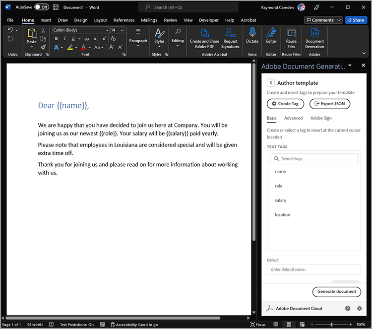
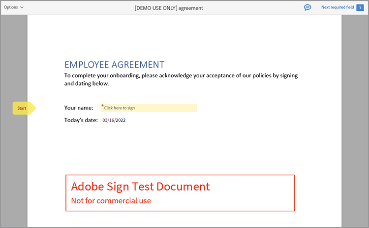

# Modernizzazione dell&#39;inserimento dei dipendenti


In una grande organizzazione, l&#39;inserimento dei dipendenti può essere un processo lungo e di grandi dimensioni. In genere, esiste una combinazione di documentazione personalizzata e materiale standard che deve essere presentato e firmato da un nuovo dipendente. Questa combinazione di materiale personalizzato e standard richiede più passaggi, sottraendo tempo prezioso alle persone coinvolte nel processo. [!DNL Adobe Acrobat Services] e Acrobat Sign possono modernizzare e automatizzare questo approccio, liberando il personale HR per attività più importanti. Vediamo come si ottiene.

## Cosa sono [!DNL Adobe Acrobat Services]?

[[!DNL Adobe Acrobat Services]](https://developer.adobe.com/document-services/homepage) sono un set di API correlate all&#39;utilizzo dei documenti (e non solo PDF). In generale, questa gamma di servizi si suddivide in tre categorie principali:

* Il primo è il set di strumenti [PDF Services](https://developer.adobe.com/document-services/apis/pdf-services/). Questi sono metodi di &quot;utilità&quot; per lavorare con PDF e altri documenti. I servizi includono funzioni quali la conversione da e verso PDF, l’esecuzione di OCR e ottimizzazione, l’unione e la divisione di PDF e così via. È la casella degli strumenti per le funzioni di elaborazione dei documenti.
* L&#39;API [PDF Extract](https://developer.adobe.com/document-services/apis/pdf-extract/) utilizza potenti tecniche di intelligenza artificiale/ML per analizzare un PDF e restituire un&#39;incredibile quantità di dettagli sui contenuti. Ciò include il testo, lo stile e le informazioni sulla posizione, e può anche restituire dati tabulari in formato CSV/XLS e recuperare immagini.
* Infine, l&#39;[API di Document Generation](https://developer.adobe.com/document-services/apis/doc-generation/) consente agli sviluppatori di utilizzare Microsoft Word come &quot;modello&quot;, di combinare i dati (provenienti da qualsiasi origine) e di generare documenti personalizzati dinamici (PDF e Word).

Gli sviluppatori possono [registrarsi](https://documentcloud.adobe.com/dc-integration-creation-app-cdn/main.html) e provare tutti questi servizi con una versione di prova gratuita. La piattaforma [!DNL Acrobat Services] utilizza un&#39;API basata su REST, ma supporta anche gli SDK per Node, Java, .NET e Python (solo per il momento, Extract).

Sebbene non si tratti di un&#39;API, gli sviluppatori possono anche utilizzare l&#39;API gratuita [PDF Embed](https://developer.adobe.com/document-services/apis/pdf-embed/), che fornisce un&#39;esperienza di visualizzazione coerente e flessibile dei documenti con le pagine Web.

## Che cos’è Acrobat Sign?

[Acrobat Sign](https://www.adobe.com/it/sign.html) è il leader mondiale nei servizi di firma elettronica. È possibile inviare documenti da firmare utilizzando diversi flussi di lavoro, incluse più firme. Acrobat Sign supporta anche i flussi di lavoro che richiedono firme e informazioni aggiuntive. Tutte queste funzionalità sono supportate da un dashboard potente con un sistema di authoring flessibile.

Come per [!DNL Acrobat Services], Acrobat Sign dispone di una [versione di prova gratuita](https://www.adobe.com/sign.html#sign_free_trial) che consente agli sviluppatori di testare il processo di firma sia tramite il dashboard che con un&#39;API basata su REST di facile utilizzo.

## Uno scenario di onboarding

Consideriamo uno scenario reale che dimostra come i servizi di Adobe possono essere d&#39;aiuto. Quando un nuovo dipendente entra a far parte di un&#39;azienda, necessita di informazioni personalizzate in base al suo ruolo. Inoltre, hanno bisogno di materiale a livello aziendale. Infine, devono dimostrare di accettare le politiche aziendali firmando i documenti. Dividiamola in passi concreti:

* In primo luogo, è necessaria una lettera di presentazione personalizzata che saluti il nuovo dipendente per nome. La lettera deve contenere informazioni sul nome, il ruolo, lo stipendio e l&#39;ubicazione del dipendente.
* La lettera personalizzata deve essere combinata con un PDF che contenga informazioni di base a livello aziendale (si pensi a varie politiche delle risorse umane, vantaggi, ecc.)
* È necessario includere un documento finale che richieda la firma e la data del dipendente.
* Tutti i documenti precedenti devono essere presentati come un unico documento inviato al dipendente per la firma.

Entriamo nei dettagli su come farlo.

## Generazione di documenti dinamici

L&#39;API [Document Generation](https://developer.adobe.com/document-services/apis/doc-generation/) di Adobe consente agli sviluppatori di creare documenti dinamici utilizzando Microsoft Word e un semplice linguaggio di creazione di modelli, come base per la generazione di PDF e documenti di Word. Ecco un esempio di come funziona.

Iniziamo con un documento di Word che ha valori hardcoded. È possibile applicare al documento uno stile qualsiasi, includendo elementi grafici, tabelle e così via. Ecco il documento iniziale.


Document Generation funziona aggiungendo &quot;token&quot; a un documento Word che vengono sostituiti con i tuoi dati. Anche se questi token possono essere immessi manualmente, un [componente aggiuntivo di Microsoft Word](https://developer.adobe.com/document-services/docs/overview/document-generation-api/wordaddin/) semplifica questa operazione. La sua apertura fornisce agli autori uno strumento per definire tag, o set di dati, che possono essere utilizzati nel documento.


Puoi caricare le informazioni JSON da un file locale, copiarle in testo JSON o scegliere di continuare con i dati iniziali. Questa operazione consente di definire i tag in modo ad hoc in base alle esigenze specifiche. In questo esempio, è necessario solo un tag per nome, ruolo, stipendio e ubicazione. A tale scopo, utilizzare il pulsante **Crea tag**:


Dopo aver definito il primo tag, potete continuare a definirne tutti gli elementi necessari:


Una volta definiti i tag, selezionate il testo nel documento e sostituitelo con i tag, se necessario. In questo esempio, i tag vengono aggiunti per nome, ruolo e stipendio.



Document Generation non supporta solo i tag semplici, ma anche le espressioni logiche. Il secondo paragrafo del documento contiene un testo che si applica solo alle persone in Louisiana. È possibile aggiungere un&#39;espressione condizionale accedendo alla scheda Avanzate di Document Tagger e definendo una condizione. Di seguito viene descritto come definire una condizione di uguaglianza semplice, ma si noti che sono supportati anche i confronti numerici e altri tipi di confronto.


Questo può quindi essere inserito e disposto attorno al paragrafo:


Per verificare come funziona, seleziona **Genera documento**. La prima volta che si esegue questa operazione, è necessario accedere con un Adobe ID. Dopo l’accesso, viene presentato il JSON predefinito che può essere modificato manualmente.


Viene generato un PDF che può essere visualizzato o scaricato.


Sebbene Document Tagger consenta di progettare e testare rapidamente, al termine e in fase di produzione, è possibile utilizzare uno degli SDK per automatizzare questo processo. Sebbene il codice effettivo differisca in base alle esigenze specifiche, di seguito è riportato un esempio dell&#39;aspetto di questo codice in Node.js:

```js
 const PDFServicesSdk = require('@adobe/pdfservices-node-sdk');

const credentials =  PDFServicesSdk.Credentials
    .serviceAccountCredentialsBuilder()
    .fromFile("pdfservices-api-credentials.json")
    .build();

// Data would be dynamic...
let data = {
    "name":"Raymond Camden",
    "role":"Lead Developer",
    "salary":9000,
    "location":"Louisiana"
}

// Create an ExecutionContext using credentials.
const executionContext = PDFServicesSdk.ExecutionContext.create(credentials);

// Create a new DocumentMerge options instance.
const documentMerge = PDFServicesSdk.DocumentMerge,
    documentMergeOptions = documentMerge.options,
    options = new documentMergeOptions.DocumentMergeOptions(jsonDataForMerge, documentMergeOptions.OutputFormat.PDF);

// Create a new operation instance using the options instance.
const documentMergeOperation = documentMerge.Operation.createNew(options);

// Set operation input document template from a source file.
const input = PDFServicesSdk.FileRef.createFromLocalFile('documentMergeTemplate.docx');
documentMergeOperation.setInput(input);

// Execute the operation and Save the result to the specified location.
documentMergeOperation.execute(executionContext)
    .then(result => result.saveAsFile('documentOutput.pdf'))
    .catch(err => {
        if(err instanceof PDFServicesSdk.Error.ServiceApiError
            || err instanceof PDFServicesSdk.Error.ServiceUsageError) {
            console.log('Exception encountered while executing operation', err);
        } else {
            console.log('Exception encountered while executing operation', err);
        }
    });
```

In breve, il codice imposta le credenziali, crea un oggetto operazione, imposta l&#39;input e le opzioni, quindi chiama l&#39;operazione. Infine, il risultato viene salvato come PDF. I risultati possono essere generati anche in Word.

Document Generation supporta casi d&#39;uso molto più complessi, inclusa la possibilità di disporre di tabelle e immagini completamente dinamiche. Per ulteriori dettagli, consulta la [documentazione](https://developer.adobe.com/document-services/docs/overview/document-generation-api/).

## Esecuzione delle operazioni PDF

L&#39;API [PDF Services](https://developer.adobe.com/document-services/apis/pdf-services/) fornisce un ampio set di operazioni di &quot;utilità&quot; per l&#39;utilizzo dei PDF. Tali operazioni comprendono:

* Creazione di PDF dai documenti di Office
* Esportazione di PDF in documenti di Office
* Combinazione e divisione di PDF
* Applicazione dell’OCR ai PDF
* Impostazione, rimozione e modifica della protezione dei PDF
* Eliminazione, inserimento, riordinamento e rotazione delle pagine
* Ottimizzazione dei PDF tramite compressione o linearizzazione
* Recupero delle proprietà PDF

Per questo scenario, il risultato della chiamata di Document Generation deve essere unito a un PDF standard. Questa operazione è abbastanza semplice con gli SDK. Di seguito è riportato un esempio di in Node.js:

```js
const PDFServicesSdk = require('@adobe/pdfservices-node-sdk');
 
// Initial setup, create credentials instance.
const credentials = PDFServicesSdk.Credentials
    .serviceAccountCredentialsBuilder()
    .fromFile("pdfservices-api-credentials.json")
    .build();
 
// Create an ExecutionContext using credentials and create a new operation instance.
const executionContext = PDFServicesSdk.ExecutionContext.create(credentials),
    combineFilesOperation = PDFServicesSdk.CombineFiles.Operation.createNew();
 
// Set operation input from a source file.
const combineSource1 = PDFServicesSdk.FileRef.createFromLocalFile('documentOutput.pdf'),
      combineSource2 = PDFServicesSdk.FileRef.createFromLocalFile('standardCorporate.pdf');

combineFilesOperation.addInput(combineSource1);
combineFilesOperation.addInput(combineSource2);
 
// Execute the operation and Save the result to the specified location.
combineFilesOperation.execute(executionContext)
    .then(result => result.saveAsFile('combineFilesOutput.pdf'))
    .catch(err => {
        if (err instanceof PDFServicesSdk.Error.ServiceApiError
            || err instanceof PDFServicesSdk.Error.ServiceUsageError) {
            console.log('Exception encountered while executing operation', err);
        } else {
            console.log('Exception encountered while executing operation', err);
        }
    });
```

Questo codice prende i due PDF, li unisce e salva il risultato in un nuovo PDF. Semplice e facile! Consulta i [documenti](https://developer.adobe.com/document-services/docs/overview/pdf-services-api/) per esempi su cosa è possibile fare.

## Il processo di firma

Nella fase finale del processo di inserimento, il dipendente deve firmare un accordo che attesti di aver letto e di accettare tutte le politiche definite in. [Acrobat Sign](https://www.adobe.com/it/sign.html) supporta molti flussi di lavoro e integrazioni diversi, tra cui uno automatizzato tramite [API](https://opensource.adobe.com/acrobat-sign/developer_guide/index.html). In generale, la parte finale dello scenario può essere completata come segue:

Innanzitutto, progetta il documento che include il modulo da firmare. Questa operazione può essere eseguita in diversi modi, incluso un elemento visivo progettato nel dashboard utente di Adobe Sign. Un’altra opzione è quella di utilizzare il componente aggiuntivo Document Generation Word per inserire automaticamente i tag. In questo esempio vengono richieste la firma e la data.


Questo documento può essere salvato come PDF e, utilizzando lo stesso metodo descritto in precedenza, unito a tutti i documenti. Questo processo crea un pacchetto coerente che contiene un messaggio di saluto personalizzato, una documentazione aziendale standard e una pagina finale adatta per la firma.

Il modello può essere caricato nel dashboard di Acrobat Sign e quindi utilizzato per i nuovi accordi. Utilizzando le API REST, questo documento può quindi essere inviato al potenziale dipendente per richiedere la sua firma.



## Sperimentalo da solo

Tutto ciò che viene descritto in questo articolo può essere testato in questo momento. La [versione di prova gratuita](https://documentcloud.adobe.com/dc-integration-creation-app-cdn/main.html) dell&#39;API [!DNL Adobe Acrobat Services] offre attualmente 1.000 richieste gratuite in un periodo di sei mesi. La [versione di prova gratuita](https://www.adobe.com/sign.html#sign_free_trial) di Acrobat Sign consente di inviare accordi con filigrana a scopo di test.

Hai domande? Il [forum di supporto](https://community.adobe.com/t5/document-services-apis/ct-p/ct-Document-Cloud-SDK) viene monitorato quotidianamente dagli sviluppatori e dal personale di supporto Adobe. Infine, per trovare l&#39;ispirazione, assicuratevi di prendere il prossimo episodio di [ritagli di carta](https://www.youtube.com/playlist?list=PLcVEYUqU7VRe4sT-Bf8flvRz1XXUyGmtF). Incontri regolari e in diretta con notizie, demo e colloqui con i clienti.
