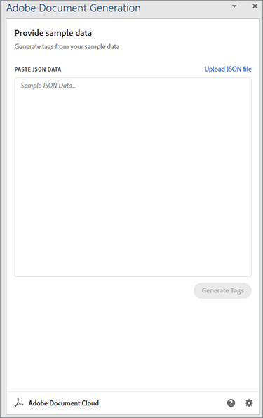

# Gestione delle fatture


È fantastico quando il business è in crescita, ma la produttività ne risente quando si tratta di preparare tutte quelle fatture. La generazione manuale delle fatture è un&#39;operazione lunga che comporta inoltre il rischio di commettere errori, di perdere denaro o di indurre in errore un cliente con un importo errato.

Pensa ad esempio a Danielle che lavora nel [reparto contabilità](https://www.adobe.io/apis/documentcloud/dcsdk/invoices.html) [di un&#39;azienda di forniture mediche](https://www.adobe.io/apis/documentcloud/dcsdk/invoices.html). È la fine del mese, quindi sta estraendo informazioni da diversi sistemi, verificandone la precisione e formattando le fatture. Dopo tutto questo lavoro, è finalmente pronta a convertire i documenti in PDF (in modo che chiunque può visualizzarli senza acquistare software specifico) e inviare a ogni cliente la propria fattura personalizzata.

Anche quando la fatturazione mensile è completa, Danielle non può proprio sfuggire a quelle fatture. Alcuni clienti hanno cicli di fatturazione non mensili, quindi crea sempre una fattura per qualcuno. A volte, un cliente modifica la propria fattura e paga in difetto. Danielle quindi passa del tempo a risolvere questo problema di mancata corrispondenza della fattura. A questo ritmo, ha bisogno di assumere un assistente per tenere il passo con tutto il lavoro!

Quello di cui Danielle ha bisogno è un modo per generare fatture in modo rapido e preciso, sia in batch alla fine del mese che ad hoc in altri momenti. Idealmente, se potesse proteggere queste fatture dalle modifiche, non dovrebbe preoccuparsi di risolvere i problemi relativi agli importi non corrispondenti.

## Cosa puoi imparare

In questo tutorial pratico scopri come utilizzare l’API di Document Generation di Adobe per generare automaticamente fatture, proteggere con password i PDF e fornire una fattura a ciascun cliente. È sufficiente conoscere Node.js, JavaScript, Express.js, HTML e CSS.

Il codice completo per questo progetto è [disponibile su GitHub](https://github.com/afzaal-ahmad-zeeshan/adobe-pdf-invoice-generation). È necessario impostare la directory pubblica con il modello e le cartelle dei dati non elaborati. In produzione, è necessario recuperare i dati da un’API esterna. Puoi anche esplorare questa versione archiviata dell&#39;applicazione che contiene le risorse del modello.

## API e risorse pertinenti

* [API dei servizi PDF](https://opensource.adobe.com/pdftools-sdk-docs/release/latest/index.html)

* [Adobe dell&#39;API di Document Generation](https://www.adobe.io/apis/documentcloud/dcsdk/doc-generation.html)

* [API Adobe Sign](https://www.adobe.io/apis/documentcloud/sign.html)

* [Codice progetto](https://github.com/afzaal-ahmad-zeeshan/adobe-pdf-invoice-generation)

## Preparazione dei dati

In questo tutorial non viene illustrato come importare i dati dai data warehouse. Gli ordini dei clienti possono essere presenti in un database, in un&#39;API esterna o in un software personalizzato. L’API di generazione del documento di Adobe prevede un documento JSON contenente i dati di fatturazione, ad esempio le informazioni provenienti dalla piattaforma CRM (Customer Relationship Management) o e-Commerce. Questo tutorial presuppone che i dati siano già in formato JSON.

Per semplicità, utilizza la seguente struttura JSON per la fatturazione:

```
{ 
    "customerName": "John Doe", 
    "customerEmail": "john-doe@example.com", 
    "order": [ 
        { 
            "productId": 26, 
            "productTitle": "Bandages", 
            "price": 15.82 
        }, 
        { 
            "productId": 54, 
            "productTitle": "Masks", 
            "price": 25 
        }, 
        { 
            "productId": 76, 
            "productTitle": "Gloves", 
            "price": 7.59 
        } 
    ] 
} 
```

Il documento JSON contiene i dettagli del cliente e le informazioni sull&#39;ordine. Utilizzare questo documento strutturato per creare la fattura e visualizzare gli elementi in formato PDF.

## Creazione di un modello di fattura

L’API di Document Generation di Adobe prevede che un modello basato su Microsoft Word e un documento JSON creino un documento PDF o Word dinamico. Crea un modello Microsoft Word per l&#39;applicazione di fatturazione e utilizza il componente aggiuntivo gratuito [Document Generation Tagger](https://opensource.adobe.com/pdftools-sdk-docs/docgen/latest/wordaddin.html#add-in-demo) per generare i tag del modello. Installa il componente aggiuntivo e apri la scheda in Microsoft Word.



Una volta incollato il contenuto JSON nel componente aggiuntivo, come mostrato sopra, fai clic su Genera tag. Ora questo plug-in mostra il formato dell&#39;oggetto. Il modello di base può utilizzare il nome e l&#39;indirizzo e-mail del cliente, ma non mostra le informazioni sull&#39;ordine. Le informazioni sull&#39;ordine sono discusse più avanti in questo tutorial.


Inizia a scrivere il modello di fattura nel tuo documento Microsoft Word. Lasciare il cursore nel punto in cui è necessario inserire i dati dinamici, quindi selezionare il tag dalla finestra del componente aggiuntivo di Adobe. Adobe Fai clic su **Inserisci testo** in modo che il componente aggiuntivo Document Generation Tagger possa generare e inserire i tag. Per la personalizzazione, inseriamo il nome e l&#39;e-mail del cliente.

Ora passa ai dati che cambiano con ogni nuova fattura. Selezionare la scheda **Avanzate** del componente aggiuntivo. Per visualizzare le opzioni disponibili per generare una tabella dinamica in base ai prodotti ordinati da un cliente, fare clic su **Tabelle ed elenchi** .

Seleziona **Ordine** dal primo menu a discesa. Nel secondo menu a discesa selezionare le colonne per questa tabella. In questo tutorial, selezionate tutte e tre le colonne per l’oggetto di cui eseguire il rendering della tabella.


L’API di Document Generation può anche eseguire operazioni complesse come l’aggregazione di elementi all’interno di un array. Nella scheda **Avanzate**, selezionare **Calcoli numerici** e nella scheda **Aggregazione** selezionare il campo in cui si desidera applicare il calcolo.


Fare clic sul pulsante **Inserisci calcolo** per inserire il tag dove necessario all&#39;interno del documento. Nel file Microsoft Word viene ora visualizzato il testo seguente:


Questo esempio di fattura contiene le informazioni sul cliente, i prodotti ordinati e l&#39;importo totale dovuto.

## Generazione di una fattura utilizzando l’API di generazione del documento di Adobe

Utilizza il kit di sviluppo software (SDK) Adobe PDF Services Node.js per combinare i documenti Microsoft Word e JSON. Crea un’applicazione Node.js per creare la fattura utilizzando l’API di Document Generation.

L’API di Servizi PDF include il servizio Document Generation, che consente di utilizzare le stesse credenziali per entrambi. Prova gratis per [sei mesi](https://www.adobe.io/apis/documentcloud/dcsdk/pdf-pricing.html), poi paga solo $ 0,05 per ogni transazione di documenti.

Ecco il codice per unire il PDF:

```
async function compileDocFile(json, inputFile, outputPdf) { 
    try { 
        // configurations 
        const credentials =  adobe.Credentials 
            .serviceAccountCredentialsBuilder() 
            .fromFile("./src/pdftools-api-credentials.json") 
            .build(); 

        // Capture the credential from app and show create the context 
        const executionContext = adobe.ExecutionContext.create(credentials); 
  
        // create the operation 
        const documentMerge = adobe.DocumentMerge, 
            documentMergeOptions = documentMerge.options, 
            options = new documentMergeOptions.DocumentMergeOptions(json, documentMergeOptions.OutputFormat.PDF);

        const operation = documentMerge.Operation.createNew(options); 
  
        // Pass the content as input (stream) 
        const input = adobe.FileRef.createFromLocalFile(inputFile); 
        operation.setInput(input); 
  
        // Async create the PDF 
        let result = await operation.execute(executionContext); 
        await result.saveAsFile(outputPdf); 
    } catch (err) { 
        console.log('Exception encountered while executing operation', err); 
    } 
} 
```

Questo codice prende le informazioni dal documento JSON di input e dal file del modello di input. Viene quindi creata un’operazione di unione dei documenti per combinare i file in un unico report PDF. Infine, esegue l’operazione con le tue credenziali API. Se non sono già disponibili, [creare le credenziali](https://opensource.adobe.com/pdftools-sdk-docs/release/latest/index.html#getting-credentials) (l&#39;API di Document Generation e PDF Services utilizza le stesse credenziali).

Utilizzare questo codice all&#39;interno del router Express per gestire la richiesta di documento:

```
// Create one report and send it back
try {
    console.log(\`[INFO] generating the report...\`);
    const fileContent = fs.readFileSync(\`./public/documents/raw/\${vendor}\`,
    'utf-8');
    const parsedObject = JSON.parse(fileContent);

    await pdf.compileDocFile(parsedObject,
    \`./public/documents/template/Adobe-Invoice-Sample.docx\`,
    \`./public/documents/processed/output.pdf\`);

    await pdf.applyPassword("p@55w0rd", './public/documents/processed/output.pdf',
    './public/documents/processed/output-secured.pdf');

    console.log(\`[INFO] sending the report...\`);
    res.status(200).render("preview", { page: 'invoice', filename: 'output.pdf' });
} catch(error) {
    console.log(\`[ERROR] \${JSON.stringify(error)}\`);
    res.status(500).render("crash", { error: error });
}
```

Una volta eseguito, questo codice fornisce un documento PDF contenente la fattura generata dinamicamente in base ai dati forniti. Con i dati JSON di esempio (forniti sopra), l&#39;output di questo codice è:


Questa fattura include i dati dinamici dal documento JSON.

## Protezione delle fatture tramite password

Dal momento che Danielle la ragioneria è preoccupata che i clienti alterino la fattura, applica una password per limitare la modifica. L&#39;API [PDF Services](https://opensource.adobe.com/pdftools-sdk-docs/release/latest/index.html) può applicare automaticamente una password ai documenti. In questo caso, per proteggere i documenti con una password si utilizza Adobe PDF Services SDK. Il codice è:

```
async function applyPassword(password, inputFile, outputFile) {
    try {
        // Initial setup, create credentials instance.
        const credentials = adobe.Credentials
        .serviceAccountCredentialsBuilder()
        .fromFile("./src/pdftools-api-credentials.json")
        .build();

        // Create an ExecutionContext using credentials
        const executionContext = adobe.ExecutionContext.create(credentials);
        // Create new permissions instance and add the required permissions
        const protectPDF = adobe.ProtectPDF,
        protectPDFOptions = protectPDF.options;
        // Build ProtectPDF options by setting an Owner/Permissions Password, Permissions,
        // Encryption Algorithm (used for encrypting the PDF file) and specifying the type of content to encrypt.
        const options = new protectPDFOptions.PasswordProtectOptions.Builder()
        .setOwnerPassword(password)
        .setEncryptionAlgorithm(protectPDFOptions.EncryptionAlgorithm.AES_256)
        .build();

        // Create a new operation instance.
        const protectPDFOperation = protectPDF.Operation.createNew(options);

        // Set operation input from a source file.
        const input = adobe.FileRef.createFromLocalFile(inputFile);
        protectPDFOperation.setInput(input);

        // Execute the operation and Save the result to the specified location.
        let result = await protectPDFOperation.execute(executionContext);

        result.saveAsFile(outputFile);
    } catch (err) {
        console.log('Exception encountered while executing operation', err);
    }
}
```

Quando utilizzi questo codice, protegge il documento con una password e carica una nuova fattura nel sistema. Per ulteriori informazioni sull&#39;utilizzo di questo codice o per provarlo, vedere [esempio di codice](https://github.com/afzaal-ahmad-zeeshan/adobe-pdf-invoice-generation).

Una volta completata la fattura, potresti voler inviare automaticamente via e-mail al cliente. Esistono alcuni modi per inviare automaticamente un&#39;e-mail ai clienti. Il modo più rapido è utilizzare un&#39;API di posta elettronica di terze parti insieme a una libreria di supporto come [sendgrid-nodejs](https://github.com/sendgrid/sendgrid-nodejs). In alternativa, se hai già accesso a un server SMTP, puoi utilizzare [nodemailer](https://www.npmjs.com/package/nodemailer) per inviare e-mail tramite SMTP.

## Fasi seguenti

In questo tutorial pratico hai creato una semplice app per aiutare Danielle nell&#39;accounting con [la fatturazione](https://www.adobe.io/apis/documentcloud/dcsdk/invoices.html). Utilizzando l’API di PDF Services e l’SDK di generazione del documento, è stato compilato un modello Microsoft Word con le informazioni sull’ordine dei clienti da un documento JSON, creando una fattura PDF. Quindi, ogni documento è protetto da password utilizzando i servizi di protezione con password dell&#39;API [PDF Services](https://opensource.adobe.com/pdftools-sdk-docs/release/latest/index.html).

Dal momento che Danielle può generare fatture automaticamente e non deve preoccuparsi che i clienti modifichino le loro fatture, non dovrà assumere un assistente che le aiuti a svolgere tutto il lavoro manuale. Può utilizzare il suo tempo extra per trovare risparmi sui costi nei file di contabilità fornitori.

Ora che hai visto quanto è facile, puoi espandere questa semplice app utilizzando altri strumenti di Adobe per incorporare le fatture sul tuo sito Web. Ad esempio, in modo che i clienti possano visualizzare le fatture o il saldo in qualsiasi momento. [Adobe PDF Embed API](https://www.adobe.io/apis/documentcloud/dcsdk/pdf-embed.html) può essere utilizzato gratuitamente. Puoi anche passare al reparto Risorse umane o vendite, automatizzando gli accordi e raccogliendo firme elettroniche.

Per esplorare tutte le possibilità e iniziare a creare la tua pratica applicazione, crea un account [[!DNL Adobe Acrobat Services]](https://www.adobe.io/apis/documentcloud/dcsdk/gettingstarted.html) gratuito per iniziare oggi stesso. Prova gratis per sei mesi e poi [paga in base al consumo](https://www.adobe.io/apis/documentcloud/dcsdk/pdf-pricing.html)
a soli $ 0,05 per ogni transazione di documenti in base al ridimensionamento dell&#39;azienda.
