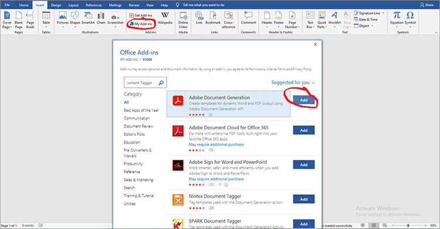

# Gestione dei contratti legali


La digitalizzazione è una sfida. Oggi, la maggior parte delle organizzazioni ha molti tipi di [contratti legali](https://www.adobe.io/apis/documentcloud/dcsdk/legal-contracts.html) che devono creare, modificare, approvare e firmare da parti diverse. Questi contratti legali spesso richiedono una personalizzazione e un branding univoci. Una volta firmati, le organizzazioni potrebbero anche dover salvarli in un formato protetto per garantirne la sicurezza. Per fare tutte queste cose, hanno bisogno di una solida soluzione per la generazione e la gestione dei documenti.

Molte soluzioni offrono una certa generazione di documenti, ma non possono personalizzare gli input di dati e la logica condizionale, come le clausole che si applicano solo a scenari specifici. L&#39;aggiornamento manuale dei modelli legali di un&#39;azienda è problematico e rischioso a causa dell&#39;estensione di questi documenti. La necessità di automatizzare questi processi è considerevole.

## Cosa puoi imparare

In questa esercitazione pratica, scopri le funzioni di [[!DNL Adobe Acrobat Services] API](https://www.adobe.io/apis/documentcloud/dcsdk/doc-generation.html) nella generazione di campi di input personalizzati nei documenti. Inoltre, scopri come convertire facilmente questi documenti generati in un formato di documento portatile protetto (PDF) per impedire la manipolazione dei dati.

Questa esercitazione prevede un po&#39; di programmazione quando si esplora la conversione dei contratti in PDF. Per procedere in modo efficace, [Microsoft Word](https://www.microsoft.com/en-us/download/office.aspx) e [Node.js](https://nodejs.org/) devono essere installati sul PC. Node.js e [Sintassi ES6](https://www.w3schools.com/js/js_es6.asp) è consigliato.

## API e risorse pertinenti

* [Adobe API di generazione documenti](https://www.adobe.io/apis/documentcloud/dcsdk/doc-generation.html)

* [API di incorporamento PDF](https://www.adobe.com/devnet-docs/dcsdk_io/viewSDK/index.html)

* [API Adobe Sign](https://www.adobe.io/apis/documentcloud/sign.html)

* [Codice progetto](https://github.com/agavitalis/adobe_legal_contracts.git)

## Creazione di un documento modello

È possibile creare documenti legali utilizzando l&#39;applicazione Microsoft Adobe Word o scaricando le [esempi di modelli Word](https://www.adobe.io/apis/documentcloud/dcsdk/doc-generation.html#sample-blade). Tuttavia, non è facile personalizzare gli input e firmare digitalmente questi documenti senza utilizzare alcuni strumenti di supporto come [Adobe componente aggiuntivo Tag generazione documento](https://www.adobe.io/apis/documentcloud/dcsdk/docs.html?view=docgen-addin) per Microsoft Word.

Il tag Generazione documento è un componente aggiuntivo di Microsoft Word, creato per semplificare la personalizzazione del documento mediante i tag. Consente la creazione di campi dinamici nei modelli di documento che si riempiono dinamicamente utilizzando i dati JSON.



Per illustrare l&#39;uso di Document Generation Tagger, installa questo componente aggiuntivo e crea un modello di dati JSON, che viene utilizzato per l&#39;assegnazione di tag a un documento di un contratto legale semplice.

Installa il tag Generazione documento in Word facendo clic sul **Inserisci** , quindi nel gruppo Componenti aggiuntivi, fare clic su **I miei componenti aggiuntivi**. Nel menu Componenti aggiuntivi di Office, cerca &quot;Adobe generazione documento&quot;, quindi fai clic su **Aggiungi** e segui il processo. Questi passaggi sono illustrati nella schermata di acquisizione qui sopra.

Dopo aver installato il componente aggiuntivo Document Generation Tagger for Word, create un semplice modello di dati JSON per applicare i tag al documento legale.

Per continuare, apri un editor a scelta, crea un file denominato Agreement.json, quindi incolla lo snippet di codice sottostante nel file JSON creato.

```
{
"Agreement": {
"Date": "1/24/2021",
"Prime Contractor Name": "Ogbonna Vitalis Corp",
"Prime State": "Lagos",
"Address": "Maryland Ave, Lagos State, Ng",
"Sub Contractor Name": "Vivvaa Soln",
"Sub Contractor State": "California",
"Sub Contractor Address": "Molusi Avenue, Dallas Texas, CA",
"Agreement Date": "1/24/2021",
"Length": 5
}
}
```

Dopo aver salvato questo documento JSON, importatelo nel componente aggiuntivo Tag generazione documento. Importare il documento facendo clic su **Generazione documento** nel gruppo di Adobi in alto a destra nella schermata Word, come illustrato nella schermata di acquisizione riportata di seguito.


Viene visualizzato un video di guida. Puoi guardarlo o passare direttamente al campo Applicazione tag facendo clic su **Introduzione**. Dopo aver fatto clic **Introduzione**, viene visualizzato un modulo di caricamento. Fai clic su **Carica file JSON** e seleziona il file JSON appena creato. Al termine dell’importazione, fai clic su **Genera tag** per generare i tag.

Dopo aver importato e generato i tag, potete aggiungerli al documento. Per aggiungerli, posizionate il cursore nel punto esatto in cui desiderate inserire il tag. Quindi selezionate un tag dall&#39;API di generazione del documento e fate clic su **Inserisci testo**. La schermata di seguito illustra questa procedura.


Oltre ai tag di base creati con il modello di dati JSON importato, potete anche utilizzare le funzioni avanzate per ulteriori opzioni quali immagini, logica condizionale, calcoli, elementi ripetuti e frasi condizionali. Per accedere a queste funzioni, fai clic su **Avanzate** nel pannello Tag generazione documento. Lo potete vedere nella schermata di acquisizione sottostante.


Queste funzioni avanzate non sono diverse dai tag di base. Per includere la logica condizionale, selezionate la parte del documento da compilare. Quindi, configurate la regola che determina l&#39;inserimento del tag.

Per illustrare ulteriormente, ad esempio nell’accordo, è disponibile una sezione da includere, solo a determinate condizioni. Nel campo Seleziona tipo di contenuto, seleziona **Sezione.** Nel campo Seleziona record , seleziona l’opzione che determina se viene visualizzata la sezione condizionale. Selezionare l&#39;operatore condizionale desiderato e impostare il valore da verificare nel campo Valore. Quindi fai clic su **Inserisci condizione.** La schermata di seguito illustra questo processo.


Per i calcoli, selezionate Aritmetica o Aggregazione, quindi includete il primo record, l&#39;operatore e il secondo record da utilizzare in base ai tag di modello disponibili. Quindi fai clic su **Inserisci calcolo**.

Inoltre, i contratti legali spesso richiedono la firma delle parti coinvolte. Puoi inserire una firma elettronica utilizzando i tag di testo di Adobe Sign che si trovano sotto la sezione &quot;Calcoli numerici&quot;. Per includere la firma elettronica, è necessario specificare il numero di destinatari, selezionare **Firmatario** e il tipo di campo dagli elenchi a discesa, di conseguenza. Al termine, fai clic su **Inserisci tag di testo Adobe Sign** per completare il processo.

Per garantire l&#39;integrità dei dati, salvate i documenti legali in un formato protetto. Con [!DNL Acrobat Services] API, puoi trasformare rapidamente i documenti in formato PDF. È possibile creare una semplice applicazione Express Node.js, integrarvi l&#39;API di generazione dei documenti e utilizzare questa semplice applicazione per convertire il documento con tag dal formato Word a PDF.

## Impostazione del progetto

Innanzitutto, è stata impostata la struttura di cartelle per l&#39;applicazione Node.js. In questo esempio, chiamate questa semplice applicazione AdobeLegalContractAPI. Potete recuperare il codice sorgente [qui](https://github.com/agavitalis/adobe_legal_contracts.git).

### Struttura della directory

Crea una cartella denominata AdobeLegalContractAPI e aprila in un editor di tua scelta. Creare un&#39;applicazione Node.js di base con il metodo ```npm init``` utilizzando la struttura di cartelle seguente:

```
###Directory Structure
AdobeLegalContractAPI
-----config
----------default.json
-----controllers
----------createPDFController.js
----------previewController.js
-----models
----------document.js
-----routes
----------web.js
-----services
-----------upload.js
-----uploads
-----views
-----index.js
```

Di seguito è riportata una semplice struttura di applicazione Node.js per l&#39;applicazione. Ora procedete con l&#39;installazione dei pacchetti npm necessari.

### Installazione del pacchetto

Installa i pacchetti richiesti utilizzando il comando di installazione npm, come illustrato nello snippet di codice riportato di seguito:

```
npm install express body-parser morgan multer hbs path config mongoose
```

Dopo aver installato i pacchetti, assicurati che il contenuto del file package.json sia simile allo snippet di codice seguente:

```
###package.json
{
"name": "adobelegalcontractapi",
"version": "1.0.0",
"description": "",
"main": "index.js",
"directories": {
"test": "test"
},
"dependencies": {
"body-parser": "^1.19.0",
"config": "^3.3.6",
"express": "^4.17.1",
"hbs": "^4.1.1",
"mongoose": "^5.12.1",
"morgan": "^1.10.0",
"multer": "^1.4.2",
"path": "^0.12.7"
},
"devDependencies": {},
"scripts": {
"start": "node index.js"
},
"repository": {
"type": "git",
"url": "https://github.com/agavitalis/adobe_legal_contracts.git"
},
"author": "Ogbonna Vitalis",
"license": "ISC",
"bugs": {
"url": "https://github.com/agavitalis/adobe_legal_contracts/issues"
},
"homepage": "https://github.com/agavitalis/adobe_legal_contracts#readme"
}
```

In questi snippet di codice, sono state installate le dipendenze dell&#39;applicazione, compreso il motore di creazione modelli Handlebars per la vista.

L&#39;obiettivo principale di questa esercitazione è l&#39;utilizzo [[!DNL Acrobat Services] API](https://www.adobe.io/apis/documentcloud/dcsdk/) per convertire i documenti in PDF. Di conseguenza, non esiste un processo passo-passo per la creazione di questa applicazione Node.js. Tuttavia, è possibile recuperare il codice completo dell&#39;applicazione Node.js in [GitHub](https://github.com/agavitalis/adobe_legal_contracts.git).

## Integrazione [!DNL Adobe Acrobat Services] API in un&#39;applicazione Node.js

[!DNL Adobe Acrobat Services] Le API sono servizi affidabili basati su cloud progettati per la manipolazione senza soluzione di continuità dei documenti. Offre tre API:

* API dei servizi Adobe PDF

* API di incorporamento di Adobe PDF

* Adobe API di generazione documenti

È necessario disporre delle credenziali per utilizzare [!DNL Acrobat Services] API (diverse dalle credenziali API di incorporamento PDF). Se non disponi di credenziali valide, [registrare](https://www.adobe.com/go/dcsdks_credentials?ref=getStartedWithServicesSDK) e completare il flusso di lavoro come illustrato nella schermata di acquisizione riportata di seguito. Godetevi una [versione di prova gratuita di sei mesi e pagamento in contanti](https://www.adobe.io/apis/documentcloud/dcsdk/pdf-pricing.html), solo 0,05 dollari per transazione documentale.


Una volta completato il processo di registrazione, un esempio di codice viene scaricato automaticamente sul PC per aiutarvi a iniziare. Potete estrarre questo esempio di codice e seguirlo. Non dimenticare di copiare i file pdftools-api-credentials.json e private.key dal codice estratto nell&#39;esempio di codice alla directory principale del progetto Node.js. Le credenziali sono necessarie prima di poter accedere [!DNL Acrobat Services] Endpoint API. È inoltre possibile scaricare gli esempi di SDK con credenziali personalizzate, in modo da non dover aggiornare la chiave nel codice di esempio.

A questo punto, installa Adobe PDF Services Node SDK eseguendo ```npm install \--save @adobe/documentservices-pdftools-node-sdk``` utilizzando il terminale nella directory principale dell&#39;applicazione. Una volta installata correttamente, è possibile utilizzare [!DNL Acrobat Services] API per manipolare i documenti nell&#39;applicazione.

## Creazione di un documento PDF

[!DNL Acrobat Services] Le API supportano la creazione di PDF dai documenti di Microsoft Office (Word, Excel e PowerPoint) e altri [formati di file supportati](https://opensource.adobe.com/pdftools-sdk-docs/release/latest/howtos.html#create-a-pdf) come .txt, .rtf, .bmp, .jpeg, gif, .tiff e .png. Puoi convertire facilmente i contratti legali da qualsiasi altro formato di file a PDF utilizzando le API di Acrobat Service.

Adobe API di generazione documenti consente la conversione in un file Word o PDF. Ad esempio, puoi utilizzare un modello Word per generare un contratto, inclusa la ridefinizione per contrassegnare il testo modificato. Quindi, convertilo in un PDF e utilizzate l’API Servizi PDF per proteggere il documento con una password, inviarlo per la firma e altro ancora.

Per implementare la creazione di documenti PDF dai formati di file supportati disponibili, è disponibile un modulo per caricare un documento per la trasformazione utilizzando [!DNL Acrobat Services].

Il modulo di caricamento progettato viene visualizzato nella schermata di seguito e potete accedere ai file HTML e CSS su [GitHub](https://github.com/agavitalis/adobe_legal_contracts.git).


Ora, aggiungete i seguenti snippet di codice al file controller /createPDFController.js. Questo codice recupera il documento caricato e lo trasforma in PDF. [!DNL Acrobat Services] salva il file caricato originale e il file trasformato in cartelle diverse.

```
###controllers/createPDFController.js
const PDFToolsSdk = require('@adobe/documentservices-pdftools-node-sdk');
const Document = require('../models/document');
/*
* GET / route to show the createPDF form.
*/
function createPDF(req, res) {
//catch any response on the url
let response = req.query.response
res.render('index', { response })
}
/*
* POST /createPDF to create a new PDF File.
*/
function createPDFPost(req, res) {
let filePath = req.file.path;
let fileName = req.file.filename;
try {
// Initial setup, create credentials instance.
const credentials = PDFToolsSdk.Credentials
.serviceAccountCredentialsBuilder()
.fromFile("pdftools-api-credentials.json")
.build();
// Create an ExecutionContext using credentials and create a new operation instance.
const executionContext = PDFToolsSdk.ExecutionContext.create(credentials),
createPdfOperation = PDFToolsSdk.CreatePDF.Operation.createNew();
// Set operation input from a source file.
const input = PDFToolsSdk.FileRef.createFromLocalFile(filePath);
createPdfOperation.setInput(input);
// Execute the operation and Save the result to the specified location.
createPdfOperation.execute(executionContext)
.then(async(result) => {
let newFileName = `createPDFFromDOCX-${Math.random() * 171}.pdf`
let newFilePath = require('path').resolve('./') + `\\output\\${newFileName}`
await result.saveAsFile(`views/output/${newFileName}`)
//Creates a new document
let newDocument = new Document({
documentName: newFileName,
url: newFilePath
});
//Save it into the DB.
newDocument.save((err, docs) => {
if (err) {
res.send(err);
}
else {
res.redirect('/?response=PDF Successfully created')
}
});
})
.catch(err => {
if (err instanceof PDFToolsSdk.Error.ServiceApiError
|| err instanceof PDFToolsSdk.Error.ServiceUsageError) {
console.log('Exception encountered while executing operation', err);
} else {
console.log('Exception encountered while executing operation', err);
}
});
} catch (err) {
console.log('Exception encountered while executing operation', err);
}
}
//export all the functions
module.exports = { createPDF, createPDFPost };
```

Lo snippet di codice sopra riportato richiede il modello del documento e [!DNL Acrobat Services] Node SDK installato in precedenza. Sono disponibili due funzioni:

* createPDF visualizza il modulo del documento di caricamento.

* createPDFPost trasforma il documento caricato in un PDF.

Le funzioni consentono di salvare i documenti PDF trasformati nella directory views/output, in cui è possibile scaricarli sul PC.

Potete anche visualizzare in anteprima il file PDF trasformato utilizzando l’API PDF Embed gratuita. Utilizzando l’API di incorporamento PDF, puoi generare credenziali di Adobe [qui](https://www.adobe.com/go/dcsdks_credentials) (diverso dal [!DNL Acrobat Services] ) e di registrare i domini consentiti per accedere all&#39;API. Seguite l&#39;elaborazione e generate le credenziali API di incorporamento PDF per l&#39;applicazione. Puoi anche vedere la dimostrazione [qui](https://documentcloud.adobe.com/view-sdk-demo/index.html#/view/FULL_WINDOW/Bodea%20Brochure.pdf), da cui è possibile generare facilmente codici per iniziare rapidamente.

Tornando all&#39;applicazione, create i file list.hbs e preview.hbs nella cartella di visualizzazione dell&#39;applicazione e incollate lo snippet di codice seguente rispettivamente nei file list.hbs e preview.hbs.

```
###views/list.hbs
<!DOCTYPE html>
<html lang="en">
<head>
<title>Adobe Legal Contract</title>
<!-- Meta tags -->
<meta charset="UTF-8">
<meta name="viewport" content="width=device-width,
initial-scale=1.0">
<meta http-equiv="X-UA-Compatible" content="ie=edge">
<!-- //Meta tags -->
<link
href=".min.css" rel="stylesheet" integrity="sha384-eOJMYsd53ii+scO/
bJGFsiCZc+5NDVN2yr8+0RDqr0Ql0h+rP48ckxlpbzKgwra6" crossorigin="anonymous">
<link rel="stylesheet" href="css/style.css" type="text/css"
media="all" /><!-- Style-CSS -->
<link href="css/font-awesome.css" rel="stylesheet" /><!--
font-awesome-icons -->
</head>
<body>
<section>
<div class="form-36-mian section-gap">
<div class="wrapper">
<div class="container">
<div class="row">
{{#each documents}}
<div class="col-md-4 mb-2">
<div class="card" style="width:
18rem;">

<div class="card-body">
<h5
class="card-title">{{documentName}}</h5>
<a
href="/downloadPDF/{{_id}}" class="btn btn-primary"><i class="fa
fa-download" aria-hidden="true"></i> Download</a>
<a
href="/previewPDF/{{_id}}" class="btn btn-info"><i class="fa fa-eye"
aria-hidden="true"></i> Preview</a>
</div>
</div>
</div>
{{/each}}
</div>
</div>
<!-- copyright -->
<div class="copy-right">
<p>(c) 2021 Vitalis</p>
</div>
<!-- //copyright -->
</div>
</div>
</section>
</body>
</html>
###views/preview.hbs
<!DOCTYPE html>
<html lang="en">
<head>
<title>[!DNL Adobe Acrobat Services] PDF Embed API</title>
<meta charset="utf-8" />
<meta http-equiv="X-UA-Compatible" content="IE=edge,chrome=1" />
<meta id="viewport" name="viewport" content="width=device-width,
initial-scale=1" />
</head>
<body style="margin: 0px">
<input type="hidden" id="pdfDocumentName"
value={{document.documentName}} />
<input type="hidden" id="pdfDocumentUrl" value={{document.url}} />
<div id="adobe-dc-view"></div>
<script
src="https://documentcloud.adobe.com/view-sdk/main.js"></script>
<script type="text/javascript">
let pdfDocumentName =
document.getElementById("pdfDocumentName").value;
let pdfDocumentUrl =
document.getElementById("pdfDocumentUrl").value;
document.addEventListener("adobe_dc_view_sdk.ready", function
() {
var adobeDCView = new AdobeDC.View({ clientId:
"XXXXXXXXXXXXXXXX", divId: "adobe-dc-view" });
adobeDCView.previewFile({
content: { location: { url:
`http://localhost:5000/output/${pdfDocumentName}` } },
metaData: { fileName: pdfDocumentName }
}, {});
});
</script>
</body>
</html>
```

Inoltre, create un file controller/previewController.js e incollate gli snippet di codice sottostanti.

```
const Document = require('../models/document');
/*
* GET /listFiles route to show PDF file lists.
*/
async function listFiles(req, res) {
let documents = await Document.find({});
res.render('lists', { documents })
}
/*
* GET /previewPDF route to show PDF file in AdobeEmbedAPI.
*/
async function previewPDF(req, res) {
//catch any response on the url
let documentId = req.params.documentId
let document = await Document.findOne({_id:documentId});
res.render('preview', { document })
}
/*
* GET /downloadPDF To Download PDF Documents.
*/
async function downloadPDF(req, res) {
let documentId = req.params.documentId
let document = await Document.findOne({_id:documentId});
res.download(document.url);
}
//export all the functions
module.exports = {listFiles, previewPDF, downloadPDF };
```

Nel file controller di cui sopra, sono disponibili tre funzioni: listFiles, previewPDF e downloadPDF. La funzione listFiles elenca tutti i file PDF finora generati utilizzando [!DNL Acrobat Services] API. La funzione previewPDF consente di visualizzare in anteprima i file PDF mediante l&#39;API PDF Embed, mentre la funzione downloadPDF consente di scaricare il file PDF generato sul PC. La schermata di seguito mostra un esempio dell’anteprima PDF mediante l’API di incorporamento PDF.


## Riepilogo

In questa esercitazione pratica, è possibile aggiungere tag a un documento utilizzando il componente aggiuntivo Microsoft Word per tag Generazione documento. Quindi, integrato [!DNL Acrobat Services] API in un&#39;applicazione Node.js e convertite un documento con tag in un formato di PDF scaricabile, anche se avreste potuto anche creare il contratto legale direttamente in PDF. Infine, hai utilizzato l’API di incorporamento di Adobe PDF per visualizzare in anteprima il PDF generato per la verifica e la firma.

L&#39;applicazione completa semplifica notevolmente il tag [modelli di contratti legali](https://www.adobe.io/apis/documentcloud/dcsdk/legal-contracts.html) con i campi dinamici, convertili in PDF, visualizzali in anteprima e firmarli utilizzando [!DNL Acrobat Services] API. Invece di dedicare tempo alla creazione di un contratto univoco, il tuo team può inviare automaticamente il contratto corretto a ciascun cliente e dedicare più tempo alla crescita del tuo business.

Le organizzazioni utilizzano [!DNL Adobe Acrobat Services] API per completezza e facilità di utilizzo. La cosa migliore è godersi una [versione di prova gratuita di sei mesi e pagamento in contanti](https://www.adobe.io/apis/documentcloud/dcsdk/pdf-pricing.html). Paghi solo per quello che usi. Inoltre, l’API di incorporamento di PDF è sempre gratuita.

Pronti a incrementare la produttività migliorando il flusso dei documenti? [Inizia](https://www.adobe.io/apis/documentcloud/dcsdk/gettingstarted.html) oggi.
