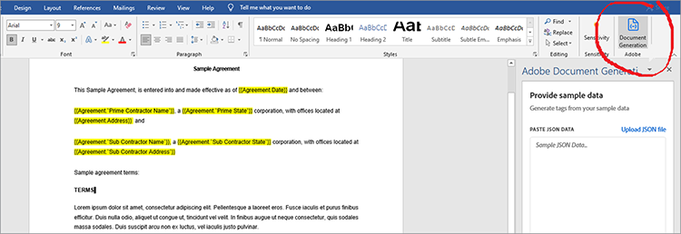
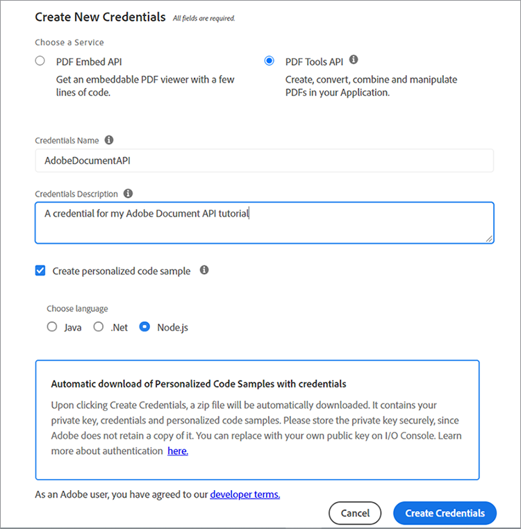

# Gestione dei contratti legali


Con la digitalizzazione, le sfide sono tutte. Oggi, la maggior parte delle organizzazioni ha molti tipi di [contratti legali](https://www.adobe.io/apis/documentcloud/dcsdk/legal-contracts.html) devono creare, modificare, approvare e far firmare da parti diverse. Questi contratti legali spesso richiedono personalizzazioni e branding esclusivi. Una volta firmato, le organizzazioni potrebbero anche dover salvare in un formato protetto per proteggerle. Per svolgere tutte queste attività, è necessario disporre di una solida soluzione di gestione e generazione dei documenti.

Molte soluzioni offrono la generazione di documenti, ma non consentono di personalizzare l&#39;input dei dati e la logica condizionale, ad esempio clausole applicabili solo a scenari specifici. L&#39;aggiornamento manuale dei modelli legali di un&#39;azienda è complesso e soggetto a errori, poiché questi documenti sono sempre più completi. La necessità di automatizzare questi processi è notevole.

## Cosa puoi imparare

In questo tutorial pratico, esplora le funzioni di [[!DNL Adobe Acrobat Services] API](https://www.adobe.io/apis/documentcloud/dcsdk/doc-generation.html) nella generazione di campi di input personalizzati nei documenti. Inoltre, scoprite come convertire facilmente questi documenti generati in un formato di documento portatile protetto (PDF) per evitare la manipolazione dei dati.

Questo tutorial richiede un po&#39; di programmazione quando si esplora la conversione dei contratti in PDF. Per seguirmi in modo efficace, [Microsoft Word](https://www.microsoft.com/en-us/download/office.aspx) e [Node.js](https://nodejs.org/) dovrebbe essere installato sul PC. Node.js e [Sintassi ES6](https://www.w3schools.com/js/js_es6.asp) è inoltre consigliato.

## API e risorse pertinenti

* [Adobe dell’API di Document Generation](https://www.adobe.io/apis/documentcloud/dcsdk/doc-generation.html)

* [API PDF Embed](https://www.adobe.com/devnet-docs/dcsdk_io/viewSDK/index.html)

* [API Adobe Sign](https://www.adobe.io/apis/documentcloud/sign.html)

* [Codice progetto](https://github.com/agavitalis/adobe_legal_contracts.git)

## Creazione di un documento modello

È possibile creare documenti legali utilizzando l&#39;applicazione Microsoft Word o scaricando gli Adobi [modelli Word di esempio](https://www.adobe.io/apis/documentcloud/dcsdk/doc-generation.html#sample-blade). Tuttavia, non è facile personalizzare gli input e firmare digitalmente questi documenti senza utilizzare alcuni strumenti di supporto, come [Adobe del componente aggiuntivo Document Generation Tagger](https://www.adobe.io/apis/documentcloud/dcsdk/docs.html?view=docgen-addin) per Microsoft Word.

Document Generation Tagger è un componente aggiuntivo di Microsoft Word, creato per semplificare la personalizzazione dei documenti tramite i tag. Consente la creazione di campi dinamici nei modelli di documento che si riempiono dinamicamente utilizzando i dati JSON.


Per illustrare l’utilizzo di Document Generation Tagger, installa questo componente aggiuntivo e quindi crea un modello di dati JSON, che viene utilizzato per l’assegnazione di tag a un semplice documento di contratto legale.

Installa Document Generation Tagger in Word facendo clic sul pulsante **Inserisci** , quindi nel gruppo Componenti aggiuntivi fare clic su **I miei componenti aggiuntivi**. Nel menu Componenti aggiuntivi di Office, cerca &quot;Adobe generazione documento&quot; e quindi fai clic su **Aggiungi** e segui il processo. È possibile visualizzare questi passaggi nell&#39;immagine precedente.

Dopo aver installato il componente aggiuntivo Document Generation Tagger per Word, crea un semplice modello di dati JSON per assegnare tag al documento legale.

Per procedere, apri un editor di tua scelta, crea un file denominato Agreement.json, quindi incolla lo snippet di codice di seguito nel file JSON creato.

```
{
"Agreement": {
"Date": "1/24/2021",
"Prime Contractor Name": "Ogbonna Vitalis Corp",
"Prime State": "Lagos",
"Address": "Maryland Ave, Lagos State, Ng",
"Sub Contractor Name": "Vivvaa Soln",
"Sub Contractor State": "California",
"Sub Contractor Address": "Molusi Avenue, Dallas Texas, CA",
"Agreement Date": "1/24/2021",
"Length": 5
}
}
```

Dopo aver salvato il documento JSON, importalo nel componente aggiuntivo Document Generation Tagger. Importa il documento facendo clic su **Document Generation** nell&#39;Adobe in alto a destra della schermata di Word, come illustrato nell&#39;immagine seguente.



In questo modo viene visualizzato un video che ti guida. Puoi guardarlo o passare direttamente al campo di tag facendo clic su **Introduzione**. Dopo aver fatto clic **Introduzione**, viene visualizzato un modulo di caricamento. Fai clic **Carica file JSON** e seleziona il file JSON appena creato. Al termine dell&#39;importazione, fare clic su **Genera tag** per generare i tag.

Dopo aver importato e generato i tag, potete aggiungere questi tag al documento. Per aggiungerli, posiziona il cursore nel punto esatto in cui desideri che il tag venga visualizzato. Seleziona quindi un tag dall’API di Document Generation e fai clic su **Inserisci testo**. L&#39;acquisizione dello schermo riportata di seguito illustra questa procedura.


Oltre ai tag di base creati utilizzando il modello di dati JSON importato, puoi anche utilizzare le funzioni avanzate per ulteriori opzioni, come immagini, logica condizionale, calcoli, elementi ripetuti e frasi condizionali. Per accedere a queste funzioni, fare clic su **Avanzate** nel pannello Tagger Document Generation. Lo puoi vedere nell’acquisizione dello schermo qui sotto.


Queste funzioni avanzate non sono diverse dai tag di base. Per includere la logica condizionale, selezionate la parte del documento da riempire. Configurare quindi la regola che determina l&#39;inserimento del tag.

Per illustrare ulteriormente, ad esempio nell’accordo, una sezione che desideri includere, solo condizionale. Nel campo Seleziona tipo di contenuto selezionare **Sezione.** Nel campo Seleziona record selezionare l&#39;opzione che determina se viene visualizzata la sezione condizionale. Selezionate l’operatore condizionale desiderato e impostate il valore da testare nel campo Valore. Quindi fai clic su **Inserisci condizione.** L’acquisizione dello schermo riportata di seguito illustra questo processo.


Per i calcoli, selezionare Aritmetica o Aggregazione, quindi includere il primo record, l&#39;operatore e il secondo record da utilizzare in base ai tag di modello disponibili. Quindi fai clic su **Inserisci calcolo**.

Inoltre, i contratti legali spesso richiedono la firma delle parti coinvolte. Puoi inserire una firma elettronica utilizzando i tag di testo di Adobe Sign che si trovano direttamente sotto la sezione &quot;Calcoli numerici&quot;. Per includere la firma elettronica, è necessario specificare il numero di destinatari, selezionare **Firmatario** e il tipo di campo dagli elenchi a discesa. Al termine, fai clic su **Inserisci tag di testo di Adobe Sign** per completare il processo.

Per garantire l&#39;integrità dei dati, salvare i documenti legali in un formato protetto. Con [!DNL Acrobat Services] Con le API, puoi trasformare rapidamente i documenti in formato PDF. Puoi creare una semplice applicazione express Node.js, integrare l’API di Document Generation in questa applicazione e utilizzare questa semplice applicazione per convertire il documento con tag da Word a PDF.

## Impostazione del progetto

Innanzitutto, è necessario impostare la struttura di cartelle per l&#39;applicazione Node.js. In questo esempio, chiamare questa semplice applicazione AdobeLegalContractAPI. È possibile recuperare il codice sorgente [qui](https://github.com/agavitalis/adobe_legal_contracts.git).

### Struttura della directory

Crea una cartella denominata AdobeLegalContractAPI e aprila in un editor di tua scelta. Creare un&#39;applicazione Node.js di base con ```npm init``` utilizzando la struttura di cartelle riportata di seguito:

```
###Directory Structure
AdobeLegalContractAPI
-----config
----------default.json
-----controllers
----------createPDFController.js
----------previewController.js
-----models
----------document.js
-----routes
----------web.js
-----services
-----------upload.js
-----uploads
-----views
-----index.js
```

In alto è presente una semplice struttura di applicazione Node.js per l&#39;applicazione. Ora procedere con l&#39;installazione dei pacchetti npm necessari.

### Installazione del pacchetto

Installa i pacchetti richiesti utilizzando il comando npm install, come illustrato nello snippet di codice seguente:

```
npm install express body-parser morgan multer hbs path config mongoose
```

Dopo aver installato i pacchetti, assicurati che il contenuto del file package.json sia simile al frammento di codice seguente:

```
###package.json
{
"name": "adobelegalcontractapi",
"version": "1.0.0",
"description": "",
"main": "index.js",
"directories": {
"test": "test"
},
"dependencies": {
"body-parser": "^1.19.0",
"config": "^3.3.6",
"express": "^4.17.1",
"hbs": "^4.1.1",
"mongoose": "^5.12.1",
"morgan": "^1.10.0",
"multer": "^1.4.2",
"path": "^0.12.7"
},
"devDependencies": {},
"scripts": {
"start": "node index.js"
},
"repository": {
"type": "git",
"url": "https://github.com/agavitalis/adobe_legal_contracts.git"
},
"author": "Ogbonna Vitalis",
"license": "ISC",
"bugs": {
"url": "https://github.com/agavitalis/adobe_legal_contracts/issues"
},
"homepage": "https://github.com/agavitalis/adobe_legal_contracts#readme"
}
```

In questi frammenti di codice sono state installate le dipendenze dell&#39;applicazione, incluso il motore di creazione dei modelli Handlebars per la visualizzazione.

In questo tutorial, l’attenzione principale è sull’utilizzo [[!DNL Acrobat Services] API](https://www.adobe.io/apis/documentcloud/dcsdk/) per convertire documenti in PDF. Di conseguenza, non esiste un processo passo-passo per la creazione di questa applicazione Node.js. Tuttavia, potete recuperare il codice completo dell&#39;applicazione Node.js funzionante su [GitHub](https://github.com/agavitalis/adobe_legal_contracts.git).

## Integrazione [!DNL Adobe Acrobat Services] API in un&#39;applicazione Node.js

[!DNL Adobe Acrobat Services] Le API sono servizi affidabili basati sul cloud progettati per la manipolazione diretta dei documenti. Offre tre API:

* API dei servizi Adobe PDF

* API di Adobe PDF Embed

* Adobe dell’API di Document Generation

Per utilizzare le credenziali è necessario disporre di [!DNL Acrobat Services] API (diverse dalle credenziali API di PDF Embed). Se non si dispone di credenziali valide, [registrare](https://www.adobe.com/go/dcsdks_credentials?ref=getStartedWithServicesSDK) e completa il flusso di lavoro come illustrato nell’acquisizione schermo di seguito. Apprezzate [versione di prova gratuita per sei mesi con pagamento in base al consumo](https://www.adobe.io/apis/documentcloud/dcsdk/pdf-pricing.html), solo $ 0,05 per transazione documento.



Una volta completato il processo di registrazione, viene scaricato automaticamente un codice di esempio nel PC per aiutarti a iniziare. È possibile estrarre questo esempio di codice e seguire le istruzioni. Non dimenticare di copiare i file pdftools-api-credentials.json e private.key dall&#39;esempio di codice estratto nella directory principale del progetto Node.js. Le credenziali sono necessarie prima di poter accedere [!DNL Acrobat Services] Endpoint API. Puoi anche scaricare gli esempi SDK con le tue credenziali personalizzate, in modo da non dover aggiornare la chiave nel codice di esempio.

Installare Adobe PDF Services Node SDK eseguendo il comando ```npm install \--save @adobe/documentservices-pdftools-node-sdk``` utilizzando il terminale nella directory principale dell&#39;applicazione. Una volta completata l&#39;installazione, è possibile utilizzare [!DNL Acrobat Services] API per manipolare i documenti nell’applicazione.

## Creazione di un documento PDF

[!DNL Acrobat Services] Le API supportano la creazione di PDF da documenti di Microsoft Office (Word, Excel e PowerPoint) e altri [formati di file supportati](https://opensource.adobe.com/pdftools-sdk-docs/release/latest/howtos.html#create-a-pdf) come .txt, .rtf, .bmp, .jpeg, gif, .tiff e .png. È possibile convertire facilmente in PDF i contratti legali da qualsiasi altro formato di file utilizzando le API dei servizi Acrobat.

L’API di Document Generation di Adobe consente la conversione in un file Word o PDF. Ad esempio, puoi utilizzare un modello Word per generare un contratto, inclusa la rilegatura per contrassegnare il testo modificato. Quindi, convertilo in PDF e utilizza l’API di PDF Services per proteggere il documento con una password, inviarlo per la firma e altro ancora.

Per implementare la creazione di documenti PDF dai formati di file supportati disponibili, è disponibile un modulo per caricare un documento per la trasformazione utilizzando [!DNL Acrobat Services].

Il modulo di caricamento progettato viene visualizzato nell’acquisizione dello schermo seguente ed è possibile accedere ai file HTML e CSS su [GitHub](https://github.com/agavitalis/adobe_legal_contracts.git).


Ora aggiungere i seguenti snippet di codice al file /createPDFController.js dei controller. Questo codice recupera il documento caricato e lo trasforma in PDF. [!DNL Acrobat Services] salva il file caricato originale e il file trasformato in cartelle diverse.

```
###controllers/createPDFController.js
const PDFToolsSdk = require('@adobe/documentservices-pdftools-node-sdk');
const Document = require('../models/document');
/*
* GET / route to show the createPDF form.
*/
function createPDF(req, res) {
//catch any response on the url
let response = req.query.response
res.render('index', { response })
}
/*
* POST /createPDF to create a new PDF File.
*/
function createPDFPost(req, res) {
let filePath = req.file.path;
let fileName = req.file.filename;
try {
// Initial setup, create credentials instance.
const credentials = PDFToolsSdk.Credentials
.serviceAccountCredentialsBuilder()
.fromFile("pdftools-api-credentials.json")
.build();
// Create an ExecutionContext using credentials and create a new operation instance.
const executionContext = PDFToolsSdk.ExecutionContext.create(credentials),
createPdfOperation = PDFToolsSdk.CreatePDF.Operation.createNew();
// Set operation input from a source file.
const input = PDFToolsSdk.FileRef.createFromLocalFile(filePath);
createPdfOperation.setInput(input);
// Execute the operation and Save the result to the specified location.
createPdfOperation.execute(executionContext)
.then(async(result) => {
let newFileName = `createPDFFromDOCX-${Math.random() * 171}.pdf`
let newFilePath = require('path').resolve('./') + `\\output\\${newFileName}`
await result.saveAsFile(`views/output/${newFileName}`)
//Creates a new document
let newDocument = new Document({
documentName: newFileName,
url: newFilePath
});
//Save it into the DB.
newDocument.save((err, docs) => {
if (err) {
res.send(err);
}
else {
res.redirect('/?response=PDF Successfully created')
}
});
})
.catch(err => {
if (err instanceof PDFToolsSdk.Error.ServiceApiError
|| err instanceof PDFToolsSdk.Error.ServiceUsageError) {
console.log('Exception encountered while executing operation', err);
} else {
console.log('Exception encountered while executing operation', err);
}
});
} catch (err) {
console.log('Exception encountered while executing operation', err);
}
}
//export all the functions
module.exports = { createPDF, createPDFPost };
```

Lo snippet di codice precedente richiedeva il modello del documento e [!DNL Acrobat Services] SDK del nodo installato in precedenza. Sono disponibili due funzioni:

* createPDF visualizza il modulo per il caricamento del documento.

* createPDFPost trasforma il documento caricato in un PDF.

Le funzioni consentono di salvare i documenti PDF trasformati nella directory views/output, dove è possibile scaricarli sul computer.

Puoi anche visualizzare in anteprima il file di PDF trasformato utilizzando l’API Free PDF Embed. Utilizzando l’API PDF Embed, puoi generare credenziali di Adobe [qui](https://www.adobe.com/go/dcsdks_credentials) (diverso dal tuo [!DNL Acrobat Services] e registrare i domini autorizzati ad accedere all’API. Segui il processo e genera le credenziali API PDF Embed per l’applicazione. Potete anche consultare la dimostrazione [qui](https://documentcloud.adobe.com/view-sdk-demo/index.html#/view/FULL_WINDOW/Bodea%20Brochure.pdf), da cui è possibile generare facilmente codici per iniziare rapidamente.

Torna all&#39;applicazione, crea i file list.hbs e preview.hbs nella cartella di visualizzazione dell&#39;applicazione e incolla lo snippet di codice sottostante nei file list.hbs e preview.hbs, rispettivamente.

```
###views/list.hbs
<!DOCTYPE html>
<html lang="en">
<head>
<title>Adobe Legal Contract</title>
<!-- Meta tags -->
<meta charset="UTF-8">
<meta name="viewport" content="width=device-width,
initial-scale=1.0">
<meta http-equiv="X-UA-Compatible" content="ie=edge">
<!-- //Meta tags -->
<link
href=".min.css" rel="stylesheet" integrity="sha384-eOJMYsd53ii+scO/
bJGFsiCZc+5NDVN2yr8+0RDqr0Ql0h+rP48ckxlpbzKgwra6" crossorigin="anonymous">
<link rel="stylesheet" href="css/style.css" type="text/css"
media="all" /><!-- Style-CSS -->
<link href="css/font-awesome.css" rel="stylesheet" /><!--
font-awesome-icons -->
</head>
<body>
<section>
<div class="form-36-mian section-gap">
<div class="wrapper">
<div class="container">
<div class="row">
{{#each documents}}
<div class="col-md-4 mb-2">
<div class="card" style="width:
18rem;">

<div class="card-body">
<h5
class="card-title">{{documentName}}</h5>
<a
href="/downloadPDF/{{_id}}" class="btn btn-primary"><i class="fa
fa-download" aria-hidden="true"></i> Download</a>
<a
href="/previewPDF/{{_id}}" class="btn btn-info"><i class="fa fa-eye"
aria-hidden="true"></i> Preview</a>
</div>
</div>
</div>
{{/each}}
</div>
</div>
<!-- copyright -->
<div class="copy-right">
<p>(c) 2021 Vitalis</p>
</div>
<!-- //copyright -->
</div>
</div>
</section>
</body>
</html>
###views/preview.hbs
<!DOCTYPE html>
<html lang="en">
<head>
<title>[!DNL Adobe Acrobat Services] PDF Embed API</title>
<meta charset="utf-8" />
<meta http-equiv="X-UA-Compatible" content="IE=edge,chrome=1" />
<meta id="viewport" name="viewport" content="width=device-width,
initial-scale=1" />
</head>
<body style="margin: 0px">
<input type="hidden" id="pdfDocumentName"
value={{document.documentName}} />
<input type="hidden" id="pdfDocumentUrl" value={{document.url}} />
<div id="adobe-dc-view"></div>
<script
src="https://documentcloud.adobe.com/view-sdk/main.js"></script>
<script type="text/javascript">
let pdfDocumentName =
document.getElementById("pdfDocumentName").value;
let pdfDocumentUrl =
document.getElementById("pdfDocumentUrl").value;
document.addEventListener("adobe_dc_view_sdk.ready", function
() {
var adobeDCView = new AdobeDC.View({ clientId:
"XXXXXXXXXXXXXXXX", divId: "adobe-dc-view" });
adobeDCView.previewFile({
content: { location: { url:
`http://localhost:5000/output/${pdfDocumentName}` } },
metaData: { fileName: pdfDocumentName }
}, {});
});
</script>
</body>
</html>
```

Inoltre, crea un file controller/previewController.js e incolla gli snippet di codice sottostanti.

```
const Document = require('../models/document');
/*
* GET /listFiles route to show PDF file lists.
*/
async function listFiles(req, res) {
let documents = await Document.find({});
res.render('lists', { documents })
}
/*
* GET /previewPDF route to show PDF file in AdobeEmbedAPI.
*/
async function previewPDF(req, res) {
//catch any response on the url
let documentId = req.params.documentId
let document = await Document.findOne({_id:documentId});
res.render('preview', { document })
}
/*
* GET /downloadPDF To Download PDF Documents.
*/
async function downloadPDF(req, res) {
let documentId = req.params.documentId
let document = await Document.findOne({_id:documentId});
res.download(document.url);
}
//export all the functions
module.exports = {listFiles, previewPDF, downloadPDF };
```

Nel file del controller precedente, sono disponibili tre funzioni: listFiles, previewPDF e downloadPDF. La funzione listFiles elenca tutti i file PDF generati finora utilizzando [!DNL Acrobat Services] API. La funzione previewPDF consente di visualizzare in anteprima i file PDF utilizzando l&#39;API PDF Embed, mentre la funzione downloadPDF consente di scaricare il file PDF generato nel PC. L’acquisizione dello schermo di seguito mostra un esempio dell’anteprima di PDF tramite l’API PDF Embed.


## Riepilogo

In questo tutorial pratico, hai aggiunto i tag a un documento utilizzando il componente aggiuntivo Document Generation Tagger Microsoft Word. Quindi, integrato [!DNL Acrobat Services] API in un&#39;applicazione Node.js e ha convertito un documento con tag in un formato PDF scaricabile, anche se potresti aver creato il contratto legale direttamente in PDF. Infine, hai utilizzato Adobe PDF Embed API per visualizzare in anteprima le PDF generate per la verifica e la firma.

L’applicazione completata semplifica notevolmente l’aggiunta di tag [modelli di contratto legali](https://www.adobe.io/apis/documentcloud/dcsdk/legal-contracts.html) con i campi dinamici, convertili in PDF, visualizzali in anteprima e firmalo con [!DNL Acrobat Services] API. Anziché dedicare tempo alla creazione di un contratto univoco, il team può inviare automaticamente il contratto corretto a ciascun cliente, quindi dedicare più tempo alla crescita dell&#39;azienda.

Le organizzazioni utilizzano [!DNL Adobe Acrobat Services] API per completezza e facilità d&#39;uso. Ma soprattutto, puoi goderti un [versione di prova gratuita per sei mesi e pagamento in base al consumo](https://www.adobe.io/apis/documentcloud/dcsdk/pdf-pricing.html). Paghi solo per quello che usi. Inoltre, l’API PDF Embed è sempre gratuita.

Pronto a incrementare la produttività migliorando il flusso dei documenti? [Introduzione](https://www.adobe.io/apis/documentcloud/dcsdk/gettingstarted.html) oggi.
