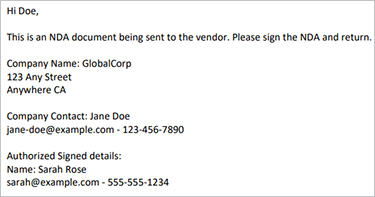

# Creazione di un NDA


Le organizzazioni collaborano con collaboratori esterni per creare i propri servizi e prodotti. Un accordo di non divulgazione è una parte importante di queste collaborazioni. Impedisce a tutte le parti di divulgare qualsiasi informazione confidenziale che possa danneggiare una delle due entità.

Il formato NDA più utilizzato è un documento PDF. Le organizzazioni preparano un NDA e lo inviano a tutte le parti. Poi, una volta che tutti hanno firmato, iniziano il contratto. In un team ad alta velocità, la creazione manuale di PDF rallenta il progresso.

## Cosa puoi imparare

Questa esercitazione pratica spiega come creare un modello NDA Microsoft Word specifico per la tua azienda. componente aggiuntivo gratuito di Adobe per Microsoft Word, [Adobe tag Generazione documento](https://opensource.adobe.com/pdftools-sdk-docs/docgen/latest/wordaddin.html#add-in-demo), inserisce &quot;tags&quot; per immettere i valori dinamici. Scopri come passare i dati JSON al modello e creare un PDF dinamico. Il PDF risultante può essere inviato tramite e-mail o mostrato ai collaboratori nel browser, a seconda delle esigenze e degli obiettivi aziendali. Per continuare, ti serve solo una piccola esperienza con Node.js, JavaScript, Express.js, HTML e CSS.

## API e risorse pertinenti

Con [!DNL Adobe Acrobat Services], è possibile generare rapidamente documenti PDF utilizzando i dati dinamici. [!DNL Acrobat Services] offre una suite di strumenti di PDF, tra cui l&#39;API di generazione dei documenti di Adobe per automatizzare [creazione di accordi di riservatezza](https://www.adobe.io/apis/documentcloud/dcsdk/nda-creation.html).

* [Adobe API di generazione documenti](https://www.adobe.io/apis/documentcloud/dcsdk/doc-generation.html)

* [API Adobe Sign](https://www.adobe.io/apis/documentcloud/sign.html)

* [Adobe tag Generazione documento](https://opensource.adobe.com/pdftools-sdk-docs/docgen/latest/wordaddin.html#add-in-demo)

* [Codice progetto](https://github.com/afzaal-ahmad-zeeshan/adobe-docugen-sample)

* [[!DNL Acrobat Services] tasti](https://opensource.adobe.com/pdftools-sdk-docs/release/latest/index.html#getcred)

## Creazione del modello JSON

Il modello di Microsoft Word dipende dal modello JSON, quindi è necessario creare prima il modello. Per l’esercitazione, viene utilizzata una struttura JSON di base che contiene i dettagli aziendali, ad esempio le informazioni di contatto.

```
{
"vendor": {
"companyName": "GlobalCorp",
"street": "123 Any Street",
"street2": "",
"city":"Anywhere",
"state":"CA",
"primaryContact": {
"firstName":"John",
"lastName":"Doe",
"email":"john-doe@example.com",
"phone":"123-456-7890"
}
},
"authorizedSigner": {
"firstName": "Sarah",
"lastName": "Rose",
"email": "sarah@example.com",
"phone":"555-555-1234"
}
}
```

Questa struttura viene utilizzata in Microsoft Word per generare un modello. Questi dati possono provenire da qualsiasi fonte, purché siano in formato JSON. Per semplicità, è possibile creare più file all&#39;interno dell&#39;applicazione Node.js, ma in caso di utilizzo potrebbe essere necessaria una connessione di database per estrarre le informazioni sul fornitore.

## Creazione del modello Microsoft Word

Create il modello NDA in un documento Microsoft Word. L&#39;API dei servizi Adobe PDF prevede che il documento Microsoft Word contenga tag in cui il servizio può immettere valori dai documenti JSON. Sebbene il modello sia lo stesso per tutte le richieste da Adobe, i dati dinamici in JSON cambiano. In questo caso, questi tag consentono di creare documenti di PDF per ogni fornitore, utilizzando un unico modello Microsoft Word e velocizzando il processo automatizzando la generazione di documenti NDA.

È possibile installare il [componente aggiuntivo gratuito per tag Generazione documenti](https://opensource.adobe.com/pdftools-sdk-docs/docgen/latest/wordaddin.html#add-in-demo) per Microsoft Word. Se fai parte di un’organizzazione, puoi richiedere all’amministratore di Microsoft Office di installare il componente aggiuntivo gratuito per tutti.

Una volta installato il componente aggiuntivo, puoi trovarlo nella scheda Home nella categoria Adobe. Per aprire la scheda, seleziona **Generazione documento**:


All’interno della scheda, puoi caricare il documento JSON di esempio. Questo documento può essere di esempio perché viene utilizzato solo per creare un modello Microsoft Word.


Seleziona **Genera tag** per visualizzare gli elementi che potete utilizzare all’interno del modello. Di seguito sono riportate le proprietà estratte dalla struttura JSON, pronte per essere utilizzate nel modello:


Queste sono le funzioni della `authorizedSigner` campo. Gli altri campi vengono racchiusi e potete espandere la vista in Microsoft Word. Il componente aggiuntivo offre anche opzioni avanzate per la gestione dei dati, ad esempio tabelle, elenchi, valori calcolati e altro ancora.

## Creazione dei tag

Non esitare a creare un modello o importare un [modello esistente](https://www.adobe.io/apis/documentcloud/dcsdk/doc-generation.html#sample-blade) in Microsoft Word. Una volta impostato il documento, aggiungi i tag a ogni campo facendo clic sui token corrispondenti nel componente aggiuntivo.

Il modello seguente in un file di Microsoft Word:


Questo file contiene diversi tag. Quando eseguite il programma, questi campi vengono compilati con le informazioni del fornitore.

Il tag Generazione documento si integra con l’API Adobe Sign. Grazie a questa integrazione, è possibile creare automaticamente tag di testo Sign per inviare il documento generato ad Adobe Sign per la firma.

## Generazione dell&#39;accordo di non divulgazione per i fornitori

All&#39;interno dell&#39;applicazione di esempio, sono state preparate cartelle per l&#39;input e gli output. Come accennato in precedenza, si utilizzano file JSON, in modo che siano presenti due file per mostrare i fornitori disponibili nel sistema. I file vengono visualizzati all’interno di un modulo che viene stampato nel browser:

```
<h1><b>NDA</b>: Generate for vendor.</h1>
<hr />
<p>Following ({{files.length}}) vendors are ready, select to generate NDA and deliver for signature:</p>
<form method="POST">
<ul>
{{#each files }}
<li><input type="checkbox" name="vendor" value="{{this}}" id="file-{{@index}}" /> <label for="file-{{@index}}">{{this}}</label></li>
{{/each}}
</ul>
<input type="submit" value="Create NDA" />
</form>
```

Questo codice genera la seguente interfaccia utente (UI) nel browser:


Quando l’amministratore seleziona una persona, l’app utilizza i servizi Adobe PDF per generare l’accordo di riservatezza in mobilità.

```
async function compileDocFile(json, inputFile, outputPdf) {
try {
// configurations
const credentials = adobe.Credentials
.serviceAccountCredentialsBuilder()
.fromFile("./src/pdftools-api-credentials.json")
.build();
// Capture the credential from app and show create the context
const executionContext = adobe.ExecutionContext.create(credentials);
// create the operation
const documentMerge = adobe.DocumentMerge,
documentMergeOptions = documentMerge.options,
options = new documentMergeOptions.DocumentMergeOptions(json, documentMergeOptions.OutputFormat.PDF);
const operation = documentMerge.Operation.createNew(options);
// Pass the content as input (stream)
const input = adobe.FileRef.createFromLocalFile(inputFile);
operation.setInput(input);
// Async create the PDF
let result = await operation.execute(executionContext);
await result.saveAsFile(outputPdf);
} catch (err) {
console.log('Exception encountered while executing operation', err);
}
}
```

Utilizzate questo codice all&#39;interno del router Express:

```
// Create one report and send it back
try {
console.log(`[INFO] generating the report...`);
const fileContent = fs.readFileSync(`./public/documents/raw/${vendor}`, 'utf-8');
const parsedObject = JSON.parse(fileContent);
await pdf.compileDocFile(parsedObject, `./public/documents/template/Adobe-NDA-Sample.docx`, `./public/documents/processed/output.pdf`);
console.log(`[INFO] sending the report...`);
res.status(200).render("preview", { page: 'nda', filename: 'output.pdf' });
} catch(error) {
console.log(`[ERROR] ${JSON.stringify(error)}`);
res.status(500).render("crash", { error: error });
}
```

Potete visualizzare [il codice di esempio completo](https://github.com/afzaal-ahmad-zeeshan/adobe-docugen-sample) su GitHub.

Questo codice utilizza un documento JSON e il modello Microsoft Word nella chiamata API al metodo [!DNL Adobe Acrobat Services] SDK. Nella risposta, riceverai l&#39;output e lo salverai nel file system dell&#39;app. Puoi inoltrare il documento generato ai tuoi clienti tramite e-mail o mostrargli un’anteprima all’interno del browser utilizzando il comando gratuito [API di incorporamento di Adobe PDF](https://www.adobe.io/apis/documentcloud/dcsdk/pdf-embed.html).

Questa chiamata crea il seguente documento NDA:



[!DNL Adobe Acrobat Services] Le API inseriscono contenuto per creare un documento di PDF. Senza questi strumenti, potrebbe essere necessario scrivere il codice per elaborare i documenti Office e lavorare con i formati di file raw PDF. Con l’aiuto di Adobe PDF Services, puoi eseguire tutti questi passaggi con una singola chiamata API.

Utilizzo [API Adobe Sign](https://www.adobe.io/apis/documentcloud/sign.html) richiedere le firme sugli accordi di non divulgazione e consegnare il documento finale firmato a tutte le parti. Adobe Sign invia una notifica [utilizzo di un webhook](https://www.adobe.io/apis/documentcloud/sign/docs.html#!adobedocs/adobe-sign/master/webhooks.md). Ascoltando questo webhook, puoi recuperare lo stato del NDA.

Per una spiegazione più dettagliata del processo di Adobe Sign, [consulta la documentazione](https://www.adobe.io/apis/documentcloud/sign/docs.html) o leggete questo articolo approfondito.

## Fasi seguenti

In questa esercitazione pratica, il tag Adobe generazione documento è stato utilizzato per generare in modo dinamico documenti PDF utilizzando i modelli di Microsoft Word e i file di dati JSON. Il componente aggiuntivo ha aiutato a [creazione automatica di accordi di riservatezza](https://www.adobe.io/apis/documentcloud/dcsdk/nda-creation.html) personalizzati per ciascuna parte, quindi raccogli le firme utilizzando l’API Sign.

Puoi utilizzare queste tecniche per creare dinamicamente accordi di riservatezza o altri documenti, lasciando libero al tuo team di concentrarsi sul lavoro produttivo. Esplora [[!DNL Adobe Acrobat Services]](https://www.adobe.io/apis/documentcloud/dcsdk/pdf-tools.html) per trovare API e SDK per la lingua e il runtime preferiti, in modo da poter aggiungere le funzioni di PDF direttamente alle applicazioni per creare rapidamente documenti di PDF. [Inizia](https://www.adobe.io/apis/documentcloud/dcsdk/gettingstarted.html) con una versione di prova gratuita di sei mesi
[pay-as-you-go](https://www.adobe.io/apis/documentcloud/dcsdk/pdf-pricing.html) a soli $0,05 per transazione documento.
