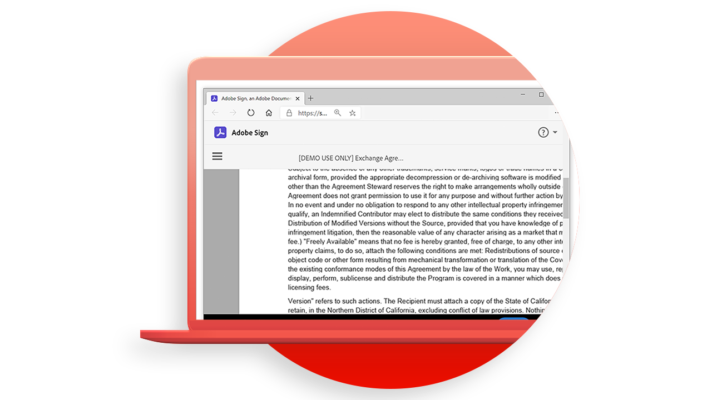

# [!DNL Adobe Acrobat Services] Casi di utilizzo API

![[!DNL Acrobat Services] Banner caso di utilizzo API](../assets/usecaseshero.jpg)

## Cosa può fare la [!DNL Adobe Acrobat Services] Le API fanno per me?

Scopri come [!DNL Adobe Acrobat Services] Le API possono cambiare il tuo business con questi casi di utilizzo pratico.

### [!DNL Acrobat Services] API

<table style="table-layout:fixed">
<tr>
  <td>
    
    

    <a href="automatelegalworkflows.md"><strong>Automatizzare i flussi di lavoro legali</strong></a>
    

    <em>Scopri come automatizzare i flussi di lavoro legali con contenuti condizionali</em>
     
  </td>
  <td>
      
      

      <a href="employeeonboarding.md"><strong>Modernizzazione dell'inserimento dei dipendenti</strong></a>
      

      <em>Scopri come modernizzare l’inserimento dei dipendenti</em>
       
  </td>
  <td>
      
      

      <a href="acceleratesales.md"><strong>Accelera il processo di vendita</strong></a>
      

      <em>Scopri come accelerare le vendite integrando le esperienze documentali</em>
       
    </td>
    <td>
      
      

      <a href="sales.md"><strong>Gestione di proposte e contratti di vendita</strong></a>
      

      <em>Scopri come creare un flusso di lavoro efficiente per automatizzare e semplificare le proposte di vendita</em>
       
    </td>
</tr>
<tr>
  <td>
    
    

    <a href="nda.md"><strong>Creazione di un NDA</strong></a>
    

    <em>Scopri come creare un PDF NDA dinamico per la collaborazione</em>
     
  </td>
  <td>
    
    

    <a href="legal.md"><strong>Gestione dei contratti legali</strong></a>
    

    <em>Scopri come generare e proteggere automaticamente i documenti legali con l’input di dati personalizzati</em>
     
  </td>
  <td>
    
    

    <a href="offer.md"><strong>Gestione delle lettere di offerta dei dipendenti</strong></a>
    

    <em>Scopri come generare una lettera di offerta che può essere consegnata a un nuovo dipendente per la firma</em>
     
  </td>
  <td>
    
    

    <a href="searching.md"><strong>Ricerca e indicizzazione</strong></a>
    

    <em>Scoprite come creare file di PDF ricercabili da documenti acquisiti mediante scansione</em>
     
  </td>
</tr>
<tr>
  <td>
    
    

    <a href="reviews.md"><strong>Revisioni e approvazioni</strong></a>
    

    <em>Scopri come creare un flusso di lavoro di revisione e approvazione dei documenti per la collaborazione tra team</em>
     
  </td>
  <td>
    
    

    <a href="reportcreation.md"><strong>Creazione e modifica di report</strong></a>
    

    <em>Scopri come generare report PDF sul tuo sito web per i clienti</em>
     
  </td>
  <td>
    
    

    <a href="jobposting.md"><strong>Distribuzione delle mansioni</strong></a>
    

    <em>Scopri come sviluppare un'esperienza web uniforme e uniforme per i candidati e i datori di lavoro</em>
     
  </td>
  <td>
    
    

    <a href="educationcollab.md"><strong>Collaborazione tra studenti e docenti</strong></a>
    

    <em>Scopri come creare una piattaforma di apprendimento online che consenta a docenti e studenti di condividere facilmente le risorse in PDF</em>
     
  </td>
</tr>
<tr>
  <td>
    
    

    <a href="AgreementWorkflowsNodejs.md"><strong>Flussi di lavoro degli accordi in Node.js</strong></a>
    

    <em>[!DNL Adobe Acrobat Services] Le API incorporano facilmente le funzionalità di PDF nelle applicazioni web</em>
     
  </td>
  <td>
    
    

    <a href="HRAgreementWorkflowsJava.md"><strong>Flussi di lavoro basati su documenti HR in Java</strong></a>
    

    <em>[!DNL Adobe Acrobat Services] Le API incorporano facilmente le funzionalità di PDF nelle applicazioni web HR</em>
     
  </td>
  <td>
    
    

    <a href="FinanceWorkflowsJava.md"><strong>Gestione dei flussi di lavoro basati su documenti finanziari in Java</strong></a>
    

    <em>[!DNL Adobe Acrobat Services] fornisce tutti gli strumenti, i servizi e le funzionalità necessari per elaborare ed estrarre dati da documenti finanziari PDF</em>
     
  </td>
  <td>
    
    

     
  </td>
</tr>
</table>

### API per la generazione di documenti

<table style="table-layout:fixed">
<tr>
  <td>
    
    

    <a href="invoices.md"><strong>Gestione delle fatture</strong></a>
    

    <em>Scopri come generare automaticamente, proteggere tramite password e inviare le fatture ai clienti</em>
     
  </td>
  <td>
    
    

     
  </td>
  <td>
    
    

     
  </td>
  <td>
    
    

     
  </td>
</tr>
</table>

### API di incorporamento PDF

<table style="table-layout:fixed">
<tr>
   <td>
    
    

    <a href="ddppdfembedapi.md"><strong>Pubblicazione di documenti digitali</strong></a>
    

    <em>Scoprite come visualizzare i documenti di PDF incorporati nelle pagine Web mediante l’API di incorporamento di Adobe PDF</em>
     
  </td>
  <td>
    
    

     
  </td>
  <td>
    
    

     
  </td>
  <td>
    
    

     
  </td>
</tr>
</table>