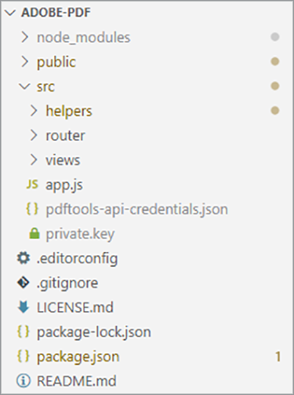

# Creazione e modifica di report


Finanza, istruzione, marketing e altri settori utilizzano i PDF per condividere i dati con i propri clienti e stakeholder. I PDF semplificano la condivisione di documenti complessi, con tabelle, grafica e contenuti interattivi, in un formato visualizzabile da tutti. [!DNL Adobe Acrobat Services] Le API consentono a queste aziende di generare report PDF condivisibili da Microsoft Word, Microsoft Excel, grafica e altri diversi formati di documenti.

Ditelo [dirigere un&#39;azienda di monitoraggio dei social media](https://www.adobe.io/apis/documentcloud/dcsdk/on-demand-report-creation.html). I clienti accedono a una parte del sito protetta da password per visualizzare le analisi delle campagne. Spesso, vogliono condividere queste statistiche con i loro dirigenti, azionisti, donatori o altri stakeholder. I documenti PDF scaricabili sono un ottimo modo per consentire ai clienti di condividere numeri, grafici e altro ancora.

Incorporando [API dei servizi PDF](https://www.adobe.io/apis/documentcloud/dcsdk/pdf-tools.html) nel tuo sito web, puoi generare report di PDF in mobilità per ogni cliente. Puoi creare PDF e quindi combinarli in un unico report pratico che i tuoi clienti potranno scaricare e trasmettere ai loro stakeholder.

## Cosa puoi imparare

In questa esercitazione pratica, scopri come utilizzare PDF Services SDK in un ambiente Node.js ed Express.js (con solo alcuni JavaScript, HTML e CSS) per aggiungere in modo semplice e veloce funzionalità orientate ai PDF a un sito Web esistente. Questo sito Web contiene una pagina in cui gli amministratori caricano i report, un&#39;area in cui i clienti visualizzano un elenco di report disponibili e selezionano i documenti da convertire in PDF e utili endpoint per scaricare i PDF generati dal sistema.

## API e risorse pertinenti

* [API dei servizi PDF](https://opensource.adobe.com/pdftools-sdk-docs/release/latest/index.html)

* [API di incorporamento PDF](https://www.adobe.com/devnet-docs/dcsdk_io/viewSDK/index.html)

## Dashboard dei report sulle campagne per i clienti

>[!NOTE]
>
>Questa esercitazione non riguarda le procedure consigliate di Node.js o la protezione delle applicazioni Web. Alcune aree del sito Web sono esposte per l&#39;uso pubblico e la denominazione dei documenti potrebbe non essere adatta alla produzione. Per discutere il miglior approccio possibile per progettare un sistema come questo, consulta i tuoi architetti e ingegneri.

Qui puoi trovare un’applicazione Web Express.js di base con un’area di report clienti e una sezione amministratore. Questa applicazione può presentare report per le campagne sui social media. Ad esempio, può dimostrare il numero di clic su un annuncio pubblicitario.


Puoi scaricare questo progetto dal [repository GitHub](https://github.com/afzaal-ahmad-zeeshan/express-adobe-pdf-tools).

Esaminiamo ora come pubblicare i report.

## Caricamento di rapporti

Per semplificare il processo, utilizzate solo il caricamento e l&#39;elaborazione basati su file system. In Express.js, potete utilizzare il modulo fs per elencare tutti i file disponibili in una directory.

Nella stessa pagina, attiva l’amministratore per caricare i file di report sul server affinché i clienti possano visualizzarli. Questi file possono essere in diversi formati, ad esempio Microsoft Word, Microsoft Excel, HTML e [altri formati di dati]https://opensource.adobe.com/pdftools-sdk-docs/release/latest/howtos.html#create-a-pdf) compresi i file grafici. La pagina di amministrazione è simile alla seguente:


>[!NOTE]
>
>Proteggi con password gli URL o usa il pacchetto del passaporto di npm per proteggere l&#39;applicazione dietro il livello di autenticazione e autorizzazione.

Quando l’amministratore seleziona e carica un file, questo viene spostato in un repository pubblico a cui altri utenti possono accedere. Lo stesso repository consente di pubblicare i documenti dalla pagina di amministrazione ed elencare i report di marketing disponibili per i clienti. Questo codice è:

```
router.get('/', (req, res) => {
try {
let files = fs.readdirSync('./public/documents/raw') // read the files
res.status(200).render("reports", { page: 'reports', files: files });
} catch (error) {
res.status(500).render("crash", { error: error });
}
});
```

Questo codice elenca tutti i file ed esegue il rendering di una vista dell&#39;elenco dei file.

## Selezione dei rapporti

Per quanto riguarda gli utenti, è disponibile un modulo che consente ai clienti di selezionare i documenti da includere nel report della campagna sui social media. Per semplicità, nella pagina di esempio vengono visualizzati solo il nome del documento e una casella di controllo per selezionarlo. I clienti possono selezionare uno o più report da combinare in un unico documento PDF.

Per un’interfaccia utente più avanzata, puoi anche visualizzare un’anteprima del report qui.


## Generazione di un rapporto PDF

Utilizzate PDF Services SDK per creare i report di PDF a partire dagli input di dati. I dati (come mostrato nelle schermate precedenti) possono provenire da vari formati di dati come Microsoft Word, Microsoft Excel, HTML, grafica e altro ancora. Iniziare installando il pacchetto npm per PDF Services SDK.

```
$ npm install --save @adobe/documentservices-pdftools-node-sdk
```

Prima di iniziare, è necessario disporre di credenziali API, [senza Adobi](https://opensource.adobe.com/pdftools-sdk-docs/release/latest/index.html#getcred). Usa il tuo [!DNL Acrobat Services] account [gratis per sei mesi, poi paghi come sei](https://www.adobe.io/apis/documentcloud/dcsdk/pdf-pricing.html) a soli \$0,05 per transazione documento.

Scarica il file di archivio ed estrai il file JSON per le credenziali e la chiave privata. Nel progetto di esempio, il file viene inserito nella directory src.



Ora che hai configurato le credenziali, puoi scrivere l’attività di conversione PDF. Per questa dimostrazione, sono necessarie due operazioni nell&#39;applicazione:

* Convertire documenti raw in file PDF

* Combinare più file PDF in un unico report

La procedura generale è simile per eseguire qualsiasi operazione. L&#39;unica differenza è il servizio utilizzato. Nel codice seguente, il documento raw viene convertito in un file PDF:

```
async function createPdf(rawFile, outputPdf) {
try {
// configurations
const credentials = adobe.Credentials
.serviceAccountCredentialsBuilder()
.fromFile("./src/pdftools-api-credentials.json")
.build();
// Capture the credential from app and show create the context
const executionContext = adobe.ExecutionContext.create(credentials),
operation = adobe.CreatePDF.Operation.createNew();
// Pass the content as input (stream)
const input = adobe.FileRef.createFromLocalFile(rawFile);
operation.setInput(input);
// Async create the PDF
let result = await operation.execute(executionContext);
await result.saveAsFile(outputPdf);
} catch (err) {
console.log('Exception encountered while executing operation', err);
}
}
```

Nel codice riportato sopra, leggete le credenziali e create il contesto di esecuzione. PDF Services SDK richiede il contesto di esecuzione per autenticare le richieste.

Quindi, eseguite l&#39;operazione Create PDF che converte i documenti raw in formato PDF. Infine, si utilizza il metodo `outputPdf` per copiare il rapporto PDF. Nell&#39;esempio di codice, questo codice si trova nel src/helpers/pdf.js file. Più avanti in questa esercitazione, importate il modulo PDF e chiamate questo metodo.

Come illustrato nella sezione precedente, i clienti possono accedere alla pagina seguente per selezionare i report da convertire in PDF:


Quando un cliente seleziona uno o più di questi rapporti, viene creato il file PDF.

Per prima cosa, vediamo un singolo file PDF in azione. Quando l’utente seleziona un singolo report, è sufficiente convertirlo in PDF e fornire il collegamento per il download.

```
try {
console.log(`[INFO] generating the report...`);
await pdf.createPdf(`./public/documents/raw/${reports}`, `./public/documents/processed/output.pdf`);
console.log(`[INFO] sending the report...`);
res.status(200).render("download", { page: 'reports', filename: 'output.pdf' });
} catch(error) {
console.log(`[ERROR] ${JSON.stringify(error)}`);
res.status(500).render("crash", { error: error });
}
```

Questo codice crea un report e condivide l&#39;URL di download con il cliente. Di seguito è riportata la pagina Web di output:


Ecco il PDF di output:


I clienti possono selezionare più file per generare un report combinato. Quando il cliente seleziona più di un documento, vengono eseguite due operazioni: il primo crea un PDF parziale per ogni documento e il secondo li combina in un unico report PDF.

```
async function combinePdf(pdfs, outputPdf) {
try {
// configurations
const credentials = adobe.Credentials
.serviceAccountCredentialsBuilder()
.fromFile("./src/pdftools-api-credentials.json")
.build();
// Capture the credential from app and show create the context
const executionContext = adobe.ExecutionContext.create(credentials),
operation = adobe.CombineFiles.Operation.createNew();
// Pass the PDF content as input (stream)
for (let pdf of pdfs) {
const source = adobe.FileRef.createFromLocalFile(pdf);
operation.addInput(source);
}
// Async create the PDF
let result = await operation.execute(executionContext);
await result.saveAsFile(outputPdf);
} catch (err) {
console.log('Exception encountered while executing operation', err);
}
}
```

Questo metodo è disponibile nel file src/helpers/pdf.js ed è esposto come parte dell’esportazione del modulo.

```
try {
console.log(`[INFO] creating a batch report...`);
// Create a batch report and send it back
let partials = [];
for (let index in reports) {
const name = `partial-${index}-${reports[index]}`;
await pdf.createPdf(`./public/documents/raw/${reports[index]}`, `./public/documents/processed/${name}`);
partials.push(`./public/documents/processed/${name.replace('docx', 'pdf').replace('xlsx', 'pdf')}`);
}
await pdf.combinePdf(partials, `./public/documents/processed/output.pdf`);
console.log(`[INFO] sending the combined report...`);
res.status(200).render("download", { page: 'reports', filename: 'output.pdf' });
} catch(error) {
console.log(`[ERROR] ${JSON.stringify(error)}`);
res.status(500).render("crash", { error: error });
}
```

Questo codice genera un rapporto compilato per più documenti di input. L&#39;unica funzione aggiunta è la `combinePdf` che accetta un elenco di nomi di percorso del file PDF e restituisce un singolo PDF di output.

Ora i clienti del dashboard dei social media possono selezionare i report pertinenti dal proprio account e scaricarli come un unico pratico PDF. Questa dashboard consente loro di mostrare il successo delle loro campagne con dati, tabelle e grafici in un formato universalmente facile da aprire.

## Fasi seguenti

Questa esercitazione hands=on spiega come utilizzare l&#39;API dei servizi di PDF per aiutare i clienti a scaricare report pertinenti come PDF facili da condividere. È stata creata un&#39;applicazione Node.js per mostrare le potenzialità delle API dei servizi PDF per i servizi di reporting e lettura PDF. L’applicazione ha dimostrato come i clienti possono scaricare un singolo documento report o combinare e unire più documenti in un unico report PDF.

Questa applicazione basata sull&#39;Adobe consente di [clienti del dashboard dei social media](https://www.adobe.io/apis/documentcloud/dcsdk/on-demand-report-creation.html) ottieni e condividi i report di cui hanno bisogno, senza preoccuparti se tutti i destinatari dispongono di Microsoft Office o altro software installato sul loro dispositivo. Potete utilizzare le stesse tecniche nell&#39;applicazione per consentire agli utenti di visualizzare, combinare e scaricare i documenti. In alternativa, consulta le molte altre API di Adobe per aggiungere e monitorare le firme e molto altro.

Per iniziare, richiedi il tuo [[!DNL Adobe Acrobat Services]](https://www.adobe.io/apis/documentcloud/dcsdk/gettingstarted.html) crea esperienze di reporting coinvolgenti per i tuoi dipendenti e clienti. Acquista un account gratuito per sei mesi [pay-as-you-go](https://www.adobe.io/apis/documentcloud/dcsdk/pdf-pricing.html) man mano che le tue iniziative di marketing si espandono, solo \$0,05 per transazione documentale.
