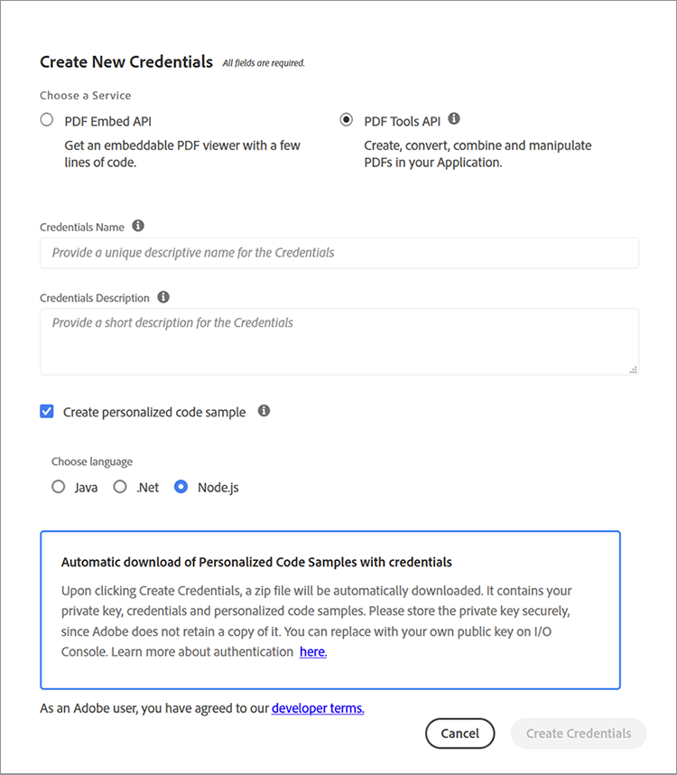

# Gestione di proposte e contratti di vendita


Le proposte di vendita sono il primo passo nel percorso di un&#39;azienda verso l&#39;acquisizione di nuovi clienti. Come per tutto, le prime impressioni durano. La prima interazione con i clienti determina quindi le aspettative per il tuo business. La tua proposta deve essere concisa, precisa e conveniente.

I contratti e le proposte contengono diversi tipi di dati all&#39;interno della loro struttura di documenti. Contengono sia dati dinamici (nome client, quantità di virgolette e così via) che dati statici (testo standard come le funzioni fisse, i profili team e i termini standard SOW). La creazione di documenti modello, come le proposte di vendita, spesso comporta attività monotone, come la sostituzione manuale dei dettagli del progetto in un modello standard. In questa esercitazione vengono utilizzati dati e flussi di lavoro dinamici per creare un processo efficiente per [creazione di proposte di vendita](https://www.adobe.io/apis/documentcloud/dcsdk/sales-proposals-and-contracts.html).

## Cosa puoi imparare

In questa esercitazione pratica, scopri come implementare i dati e i flussi di lavoro dinamici utilizzando diversi strumenti, i più importanti dei quali sono [!DNL Adobe Acrobat Services] API. Queste API vengono utilizzate per rendere più comode le proposte di vendita e i contratti per te e la tua azienda. Questa esercitazione illustra le tecniche pratiche per mostrare come creare, unire e visualizzare automaticamente i documenti di PDF. L&#39;esecuzione manuale di queste operazioni richiede molto tempo e noia. Sfruttando [!DNL Acrobat Services] API, puoi ridurre il tempo dedicato a queste attività.

## API e risorse pertinenti

* [Microsoft Word](https://www.office.com/)

* [Node.js](https://nodejs.org/en/)

* [npm](https://www.npmjs.com/get-npm)

* [[!DNL Acrobat Services] API](https://www.adobe.io/apis/documentcloud/dcsdk/)

* [Adobe API di generazione documenti](https://www.adobe.io/apis/documentcloud/dcsdk/doc-generation.html)

* [API Adobe Sign](https://www.adobe.io/apis/documentcloud/sign.html)

* [Adobe tag Generazione documento](https://opensource.adobe.com/pdftools-sdk-docs/docgen/latest/wordaddin.html#add-in-demo)

## Risolvere il problema

Ora che hai installato gli strumenti, puoi iniziare a risolvere il problema. Le proposte presentano sia contenuti statici che contenuti dinamici specifici per ciascun cliente. I colli di bottiglia si verificano perché entrambi i tipi di dati sono necessari ogni volta che si fa una proposta. L&#39;immissione del testo statico richiede molto tempo, quindi è necessario automatizzarlo e gestire solo manualmente i dati dinamici di ogni client.

Innanzitutto, creare un modulo di acquisizione dati [Forms Microsoft](https://www.office.com/launch/forms?auth=1) (o il generatore di moduli preferito). Questo modulo è per i dati dinamici dei clienti aggiunti a una proposta di vendita. Compila questo modulo con domande per ottenere i dettagli necessari dai clienti, ad esempio, nome dell&#39;azienda, data, indirizzo, ambito del progetto, prezzi e altri commenti. Per crearne uno personalizzato, utilizza questa [modulo](https://forms.office.com/Pages/ShareFormPage.aspx id=DQSIkWdsW0yxEjajBLZtrQAAAAAAAAAAN__rtiGj5UNElTR0pCQ09ZNkJRUlowSjVQWDNYUEg2RC4u&amp;sharetoken=1AJeMavBAzzxuISRKmUy). L’obiettivo è che i potenziali clienti compilino il modulo, quindi esportino le loro risposte come file JSON, che vengono passati alla parte successiva del flusso di lavoro.

Alcuni generatori di moduli consentono solo di esportare i dati come file CSV. Pertanto, potrebbe risultare utile [convertito](http://csvjson.com/csv2json) il file CSV generato in un file JSON.

I dati statici vengono riutilizzati in ogni proposta di vendita. Pertanto, è possibile utilizzare un modello di proposta di vendita in Microsoft Word per fornire il testo statico. Puoi utilizzare questo [modello](https://1drv.ms/w/s!AiqaN2pp7giKkmhVu2_2pId9MiPa?e=oeqoQ2), ma puoi crearne di nuovi o utilizzare un [modello di Adobe](https://www.adobe.io/apis/documentcloud/dcsdk/doc-generation.html).

Ora hai bisogno di qualcosa che raccolga i dati dinamici dei clienti in formato JSON e il testo statico nel modello di Microsoft Word per fare una proposta di vendita unica per un cliente. Il [!DNL Acrobat Services] Le API vengono utilizzate per unire i due e generare un PDF che può essere firmato.

Per farlo funzionare, si utilizzano i tag. I tag sono stringhe di facile utilizzo che possono rappresentare numeri, parole, array o persino oggetti complessi. I tag fungono da segnaposto per i dati dinamici, che in questo caso sono dati client inseriti nel modulo. Dopo aver inserito i tag nel modello, puoi mappare i campi modulo dal file JSON al modello Word.

## Uso dei tag

Apri il modello di una proposta di vendita e seleziona **Inserisci** tab. Nel **Componenti aggiuntivi** gruppo, seleziona **Richiedi componenti aggiuntivi**. Quindi seleziona **Adobe componente aggiuntivo Generazione documento** per aggiungerlo. Una volta aggiunto, il tag Generazione documento viene visualizzato sul **Home** nella **Adobe** gruppo.

Sulla **Home** nella **Adobe** gruppo, seleziona **Generazione documento** per iniziare a applicare tag al documento. Un utile video dimostrativo viene visualizzato in un pannello sul lato destro della finestra.


Seleziona **Introduzione**. Viene quindi richiesto di fornire dati di esempio. Incolla o carica il file JSON di risposta al modulo come illustrato di seguito.


Seleziona **Genera tag** per ottenere un elenco di campi dal file JSON incollato o caricato. I tag sono riportati di seguito, sulla barra laterale destra.


Dopo aver generato i tag, potete inserirli nel documento. I tag vengono aggiunti al documento nella posizione del cursore. Come mostrato sopra, è necessario aggiungere la proprietà **Ambito del progetto** sotto il tag **Ambito del progetto** sottotitoli. In questo modo, quando un cliente entra nel campo di applicazione del progetto nel modulo, la sua risposta è al di sotto del **Ambito del progetto** sottotitolo, sostituzione del tag appena aggiunto. Dopo aver aggiunto i tag, una parte del documento dovrebbe essere simile all’acquisizione dello schermo sottostante.


## Uso delle API

Vai alla [!DNL Acrobat Services] API [homepage](https://www.adobe.io/apis/documentcloud/dcsdk/doc-generation.html). Per iniziare a utilizzare [!DNL Acrobat Services] API, sono necessarie credenziali per l&#39;applicazione. Scorri verso il basso e seleziona **Attiva versione di prova** per creare le credenziali. È possibile utilizzare questi servizi [gratis per sei mesi, poi paghi come vuoi](https://www.adobe.io/apis/documentcloud/dcsdk/pdf-pricing.html) a soli 0,05 dollari per transazione documentale, quindi paghi solo per quello che ti serve.

Seleziona **API dei servizi PDF** come servizio di tua scelta e compila gli altri dettagli come mostrato di seguito.



Una volta create le credenziali, potete ottenere alcuni esempi di codice. Selezionate la lingua desiderata (questa esercitazione utilizza Node.js). Le tue credenziali API si trovano in un file zip. Estrarre i file in PDFToolsSDK-Node.jsSamples.

Per iniziare, creare una cartella vuota denominata auto-doc\*\*.\*\* Nella cartella, eseguire il comando seguente per inizializzare un progetto Node.js: `npm init`. Assegnare al progetto il nome di &quot;doc automatico&quot;*.*

Nella cartella ./PDFToolsSDK-Node.jsSamples/adobe-dc-pdf-tools-sdk-node-samples, there è un file denominato pdftools-api-credentials.json. Spostare it e private.key nella cartella del doc automatico. Contiene le credenziali API. Inoltre, nella cartella di doc automatico, crea una sottocartella denominata &quot;resources&quot;. Contiene i dati in formato JSON ricevuti dai clienti ogni volta che generate una proposta di vendita. Nella stessa cartella, salva il modello di proposta di vendita da Microsoft Word.

Ora sei pronto a fare un po&#39; di magia! Dato che utilizzi Node.js in questa esercitazione, devi installare Node.js [!DNL Acrobat Services] SDK. A tale scopo, nella cartella auto-doc, esegui yarn add @adobe/documentservices-pdftools-node-sdk.

A questo punto, creare un file denominato merge.js e incollarvi il codice seguente.

```
javascript
const PDFToolsSdk = require('@adobe/documentservices-pdftools-node-sdk'),
fs = require('fs');
try {
// Initial setup, create credentials instance.
const credentials = PDFToolsSdk.Credentials
.serviceAccountCredentialsBuilder()
.fromFile("pdftools-api-credentials.json")
.build();
// Setup input data for the document merge process
const jsonString = fs.readFileSync('resources/Proposal.json'),
jsonDataForMerge = JSON.parse(jsonString);
// Create an ExecutionContext using credentials
const executionContext = PDFToolsSdk.ExecutionContext.create(credentials);
// Create a new DocumentMerge options instance
const documentMerge = PDFToolsSdk.DocumentMerge,
documentMergeOptions = documentMerge.options,
options = new documentMergeOptions.DocumentMergeOptions(jsonDataForMerge, documentMergeOptions.OutputFormat.PDF);
// Create a new operation instance using the options instance
const documentMergeOperation = documentMerge.Operation.createNew(options)
// Set operation input document template from a source file.
const input = PDFToolsSdk.FileRef.createFromLocalFile('resources/Proposal.docx');
documentMergeOperation.setInput(input);
// Execute the operation and Save the result to the specified location.
documentMergeOperation.execute(executionContext)
.then(result => result.saveAsFile('output/Proposal.pdf'))
.catch(err => {
if (err instanceof PDFToolsSdk.Error.ServiceApiError
|| err instanceof PDFToolsSdk.Error.ServiceUsageError) {
console.log('Exception encountered while executing operation', err);
} else {
console.log('Exception encountered while executing operation', err);
}
});
} catch (err) {
console.log('Exception encountered while executing operation', err);
}
```

Questo codice ottiene il file JSON dal modulo Microsoft con l’aiuto dei tag creati utilizzando [!DNL Acrobat Services]. Unisce quindi i dati con il modello di proposta di vendita creato in Microsoft Word per generare un nuovo PDF. Il PDF viene salvato nel nuovo file creato ./output.

Inoltre, il codice utilizza [API Adobe Sign](https://www.adobe.io/apis/documentcloud/sign.html) chiedere ad entrambe le aziende di firmare la proposta di vendita generata. Consultate questo articolo di blog per una spiegazione dettagliata di questa API.

## Fasi seguenti

Hai iniziato con un processo inefficiente e noioso che richiedeva automazione. Sei passato dalla creazione manuale di documenti per ogni cliente alla creazione di un flusso di lavoro ottimizzato per automatizzare e semplificare [processo delle proposte di vendita](https://www.adobe.io/apis/documentcloud/dcsdk/sales-proposals-and-contracts.html).

Utilizzando Microsoft Forms, hai ottenuto dai clienti dati fondamentali che sarebbero poi confluiti nelle loro proposte esclusive. È stato creato un modello di proposta di vendita in Microsoft Word per fornire il testo statico che non si desidera ricreare ogni volta. Hai quindi utilizzato [!DNL Acrobat Services] API per unire i dati del modulo e del modello per creare un PDF di proposte di vendita per i clienti in modo più efficiente.

Questa esercitazione pratica è solo uno sguardo a ciò che è possibile con queste API. Per scoprire altre soluzioni, visita il sito [[!DNL Adobe Acrobat Services]](https://www.adobe.io/apis/documentcloud/dcsdk/gettingstarted.html) pagina delle API. Tutti questi strumenti sono gratuiti per sei mesi. Paga quindi solo 0,05 dollari per transazione documentale sul [pay-as-you-go](https://www.adobe.io/apis/documentcloud/dcsdk/pdf-pricing.html) in modo che tu paghi solo in quanto il tuo team aggiunge più potenziali clienti alla tua pipeline di vendita.
